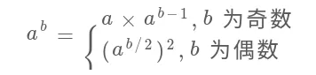
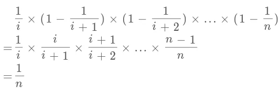

# 0.基础知识

## string 

```cpp
string s;

s.erase(0,1);//删除第0个元素及其后面的共1个元素

s.insert(s.begin(),'1');//在第0个元素插入字符'1'

s.substr(int pos,int num);//pos是位置，num是从这个位置开始的数量

reverse(s.begin(),s.end());//反转字符串
```

## unordered_map

```cpp
unordered_map<int,int> memo;

memo.erase(key);
```

## priority_queue

```cpp
#include<priority_queu>

priority_queue<int,vector<int>,less<int>> q; //大顶堆，根节点比子树大

priority_queue<int,vector<int>,greater<int>> q;//小顶堆，根节点比子树小
empty、size、front、push_back、pop_back
```

```cpp
less<int> l;
l(int a,int b){return a<b;}//满足小于符号返回true
```

## vector

```cpp
vector<int> vec;
vec.erase(vec.begin());
vec.insert(vec.begin()+1,1);
```


# 1.双指针

# 2.动态规划

# 3. 回溯算法

求子集、求排列、求组合

穷举则用回溯。

回溯三要素：记录路径，选择列表，结束条件。

框架：结束条件--选择列表做选择，去递归，撤销选择

## 1.全排列

### 1.一个字符串/整数的全排列

程序运行的结果是比所给整数大的最小的数字，使用的方法是全排列

```CPP
#include<iostream>
#include<unordered_map>
#include<vector>
#include<sstream>
#include<algorithm>
using namespace std;
int res=INT_MAX;
int num;
void getRes(string s,string trace){
    if(s.size()==0){
        int ans=0;
        for(int i=0;i<trace.size();i++){
            ans=ans*10+trace[i]-'0';
        }
        if(ans>num&&ans<res) res=ans;
        return ;
    }
    for(int i=0;i<s.size();i++){
        char t=s[i];
        s.erase(i,1);
        getRes(s,trace+t);
        s.insert(s.begin()+i,t);
    }
}
int main()
{
    stringstream st;
    string s="112131321";
    st<<s;st>>num;
    getRes(s,"");
    cout<<res;
}

```

### 2.正确答案：从后往前找，找到后面的某个数字比前面大的相差最小的那一个，并将后面的数字从小到大排列

```cpp
int res2;
auto cmp=[](const pair<char,int> &a,const pair<char,int> &b){return a.first<b.first;};
string getRes2(string& s){
    string res=s;
    int index;
    priority_queue<pair<char,int>,vector<pair<char,int>>,decltype(cmp)> q(cmp);
    for(int i=res.size();i>=0;i--){
        if(!q.empty()&&q.top().first>res[i]){
            index=i;
            int temp;
            while(!q.empty()&&q.top().first>s[i]){
                temp=q.top().second;
                q.pop();
            }
            char t=res[temp];
            res[temp]=res[index];
            res[index]=t;
            break;
        }
        q.push({s[i],i});
    }
    sort(res.begin()+index+1,res.end());
    return res;
}
int main()
{
    string s="112131321";
    cout<<getRes2(s);
}
```

### 3.返回一个数组的全排列

```cpp
#include<iostream>
#include<vector>
using namespace std;
vector<vector<int>> res;
void getRes(vector<int> &nums,vector<int>& ans)
{
    if(nums.size()==0)
    {
        res.push_back(ans);
    }
    for(int i=0; i<nums.size(); i++)
    {
        int t=nums[i];
        nums.erase(nums.begin()+i);
        ans.push_back(t);
        getRes(nums,ans);
        ans.pop_back();
        nums.insert(nums.begin()+i,t);
    }
}
int main()
{
    vector<int> ans;
    vector<int> nums= {1,2,3};
    getRes(nums,ans);
    for(int i=0; i<res.size(); i++)
    {
        for(int j=0; j<res[i].size(); j++)
        {
            cout<<res[i][j];
        }
        cout<<endl;
    }
}

```


## 2.子集

一个数组的全部子集。leetcode-76

描述：返回数组中所有的子集

输入：nums = [1,2,3]，输出：[[],[1],[2],[1,2],[3],[1,3],[2,3],[1,2,3]]

思路1：回溯，选择不选择

```cpp
#include<iostream>
#include<vector>
using namespace std;
vector<vector<int>> res;
void getRes(int index,vector<int> &nums,vector<int> ans){
    if(index==nums.size()){
        res.push_back(ans);
        return ;
    }
    getRes(index+1,nums,ans);
    ans.push_back(nums[index]);
    getRes(index+1,nums,ans);
}
int main(){
    res.clear();
    vector<int> nums{1,2,3};
    getRes(0,nums,{});
    for(int i=0;i<res.size();i++){
        for(int j=0;j<res[i].size();j++){
            cout<<res[i][j]<<" ";
        }
        cout<<endl;
    }
}
```

思路2：递归得到子集。返回的时候要求几个vector就要返回几个中括号。

## 3.组合

leetcode-77

## 4.数独

```cpp
#include<iostream>
#include<vector>
using namespace std;
bool isValid(vector<vector<char>> board,int r,int c,char ch){
    for(int i=0;i<9;i++)
        {

            if(board[i][c]==ch) return false;
            if(board[r][i]==ch) return false;
            if(board[(r/3)*3+i/3][(c/3)*3+i%3]==ch) return false;
    }
    return true;

}
bool getRes(vector<vector<char>> &board,int r,int c){
    int m=9;
    int n=9;
    if(c==n){
        return getRes(board,r+1,0);
    }
    if(r==m){
        return true;
    }
    for(int i=r;i<m;i++)
    for(int j=c;j<n;j++){
        if(board[i][j]!='.')
            return getRes(board,i,j+1);
        for(int ch='1';ch<='9';ch++){
            if(!isValid(board,i,j,ch)){
                continue;
            }
            board[i][j]=ch;
            if(getRes(board,i,j+1)){
                return true;
            }
            board[i][j]='.' ;
        }
        return false;
    }
    return false;
}


int main(int argv,char* argc[]){
    vector<vector<char>> board{{'5','3','.','.','7','.','.','.','.'},{'6','.','.','1','9','5','.',\
    '.','.'},{'.','9','8','.','.','.','.','6','.'},{'8','.','.','.','6','.','.','.','3'},{'4','.',\
    '.','8','.','3','.','.','1'},{'7','.','.','.','2','.','.','.','6'},{'.','6','.','.','.','.','2',\
    '8','.'},{'.','.','.','4','1','9','.','.','5'},{'.','.','.','.','8','.','.','7','9'}};
    getRes(board,0,0);
    for(int i=0;i<board.size();i++)
    {
        for(int j=0;j<board[i].size();j++){
                cout<<board[i][j];
        }
        cout<<endl;
    }
    return 1;


}

```


## leetcode-22.括号生成

描述：给一个数字，返回所有n对括号的有效组合。

输入：n=3，输出：["((()))","(()())","(())()","()(())","()()()"]

方法1：穷举所有组合

方法2：left记录剩余朝向左的括号量，right记录剩余朝向右的括号量。因为右'('剩余的比左')'少，如果right<left就不合法，返回；如果left或right小于0，也不合法，返回；如果left==0&&right==0，合法，添加到res中。

```cpp
class Solution {
public:
    void getRes(int left,int right,string ans,vector<string>& res){
        if(left<right) return ;
        if(left<0||right<0) return ;
        if(left==0&&right==0) {
            res.push_back(ans);
            return ;
        }
        getRes(left-1,right,ans+')',res);
        getRes(left,right-1,ans+'(',res);

    }
    vector<string> generateParenthesis(int n) {
        vector<string> res;
        getRes(n,n,"",res);
        return res;
    }
};
```


# 4.树

# 5.BFS

计算最小步数、最短距离

从一个点开始，向周围扩散。使用队列实现，每次将一个节点附近的节点加入队列。

出现场景：在一幅图中，找到起点start到target的最近距离

框架：

```cpp
int bfs(Node start,Node target){
    queue<Node> q;
    unordered_map<Node> memo;
    
    q.push(start);
    memo[start]=1;
    
    int step=0;
    
    while(!q.empty()){
        int len=q.size();
        for(int i=0;i<len;i++){
            Node cur;
            if(cur==target)
                return step;
            for(Node x:cur.adj()){
                q.push(x);
                memo[x]=1;
            }
        }
        step++;
    }
}//bf就是使用队列实现剥洋葱
//核心：cur.adj();泛指cur相邻的节点，比如说二维数组中，cur上下左右四个点就是相邻节点，memo主要是防止走回头路
```

## leetcode-111 二叉树的最小深度

返回根节点到最近叶子节点的距离

```cpp
class Solution {
public:
    int minDepth(TreeNode* root) {
        if(root==NULL) return 0;
        int step=1;
        queue<TreeNode*> q;
        q.push(root);
        while(!q.empty()){
            int size=q.size();
            for(int i=0;i<size;i++){
                TreeNode* cur=q.front();
                if(!cur->left&&!cur->right) return step;
                if(cur->left) q.push(cur->left);
                if(cur->right) q.push(cur->right);
                q.pop();
            }
            step++;
        }
        return step;
    }
};
```


BFS是集体行动,DFS是单独行动

## leetcode-752 打开转盘锁

```cpp
//要注意在push到队列的时候,添加备忘录
class Solution
{
public:
    vector<int> operation{-1,1};
    int openLock(vector<string>& deadends, string target)
    {
        unordered_map<string,int> memo;
        for(string s:deadends)
        {
            memo[s]=1;
        }
        if(memo.find("0000")!=memo.end()) return -1;
        queue<string> q;
        int step=0;
        q.push("0000");
        memo["0000"]=1;
        while(!q.empty())
        {
            int size=q.size();
            for(int i=0; i<size; i++)
            {
                string cur=q.front();
                q.pop();
                if(cur==target) return step;
                for(int j=0; j<4; j++)
                {
                    for(int k=0; k<operation.size(); k++)
                    {
                        string s=cur;
                        if(s[j]=='0'&&k==0) s[j]='9';
                        else if(s[j]=='9'&&k==1) s[j]='0';
                        else s[j]+=operation[k];
                        if(memo.find(s)==memo.end())
                        {
                            q.push(s);
                            memo[s]=1;
                        }
                    }
                }
            }
            step++;
        }
        return -1;
    }
};

```


# 6.DFS

# 7.哈希表

## leetcode-380. 常数时间插入、删除和获取随即元素

## leetcode-710. 黑名单中的随机数

## leetcode-1. 两数之和

给一个数组，和一个目标值target，返回能组合成target的下标

思路：哈希表，一遍循环，满足条件则返回，不满足条件放入哈希表中

```cpp
#include<iostream>
#include<unordered_map>
#include<vector>
using namespace std;
int main()
{
    vector<int> nums= {2,3,4,5,6};
    int target=10;
    unordered_map<int,int> memo;
    for(int i=0; i<nums.size(); i++)
    {
        if(memo.find(target-nums[i])==memo.end())
        {
            memo[nums[i]]=i;
        }
        else
        {
            cout<<i<<" "<<memo[target-nums[i]];
            return 1;
        }
    }
    return 1;
}
```

两数之和进阶思考

如果每次调用find，要考虑使用哈希map在添加的时候将和进行存储，find的时候时间复杂度就是O(1)。

# 8. 双指针/滑动窗口

## 8.1 二分查找

- 查找一个数[left,right]，left=mid+1,right=mid-1,return mid;
- 查找左边界[left,right)，left=mid+1,right=mid,return left;
- 查找有边界[left,right)，left=mid+1,right=mid.return left-1;


# 其他算法


## 1.前缀和

leetcode-560. 和为K的子数组

适用于原始数组不会修改的情况，频繁查询某个区间的累加和。想求[i,j]的区间，用prefix[J+1]-pre[i]。prefix[i]表示[0,i)之间的元素和。

场景：和为k的子数组的个数

```cpp
class Solution {
public:
    int subarraySum(vector<int>& nums, int k) {
        unordered_map<int,int> memo;
        vector<int> preSum(nums.size()+1,0);
        memo[0]=1;
        int res=0;
        for(int i=0;i<nums.size();i++){
            preSum[i+1]=nums[i]+preSum[i];
            res+=memo[preSum[i+1]-k];
            memo[preSum[i+1]]++;
        }
        return res;
    }
};
```

## 2.差分数组

使用场景是频繁对原始数组的某个区间的元素进行增减。核心：<font color=red>改变区间元素</font>

res[0]=diff[0]

res[i]=res[i-1]+diff[i].

leetcode-1109:航班飞机

依次对航班飞机预定（依次修改数组某个区间中的元素），最后返回预定结果（最后返回数组被修改后的结果）

```cpp
#include<iostream>
#include<vector>
using namespace std;
#define show(a) cout<<a;
int main(){
    vector<vector<int>> bookings = {{1,2,10},{2,3,20},{2,5,25}};
    int n = 5;
    vector<int> diff(n,0);
    vector<int> res(n,0);
    for(int i=0;i<bookings.size();i++){
        int index1=bookings[i][0]-1;
        int index2=bookings[i][1]-1;
        int value=bookings[i][2];
        diff[index1]+=value;
        if(index2+1<n) diff[index2+1]-=value;
    }
    res[0]=diff[0];
    for(int i=1;i<n;i++){
        res[i]=res[i-1]+diff[i];
    }
    for(int i=0;i<res.size();i++){
        cout<<res[i]<<" ";
    }
}
```

## 3. 快速选择算法

给一个无序数组nums，和一个正整数k，返回nums中第k大的数

```cpp
//快速排序
void qsort(vector<int> &nums,int left,int right){
    if(left<right){
        int i=left,j=right;
        int x=nums[left];
        while(i<j){
            while(nums[j]>=x&&i<j){
                j--;
            }
            if(i<j) nums[i]=nums[j];
            while(nums[i]<=x&&i<j){
                i++;
            }
            if(i<j) nums[j]=nums[i];
        }
        nums[i]=x;
        qsort(nums,left,i-1);
        qsort(nums,i+1,right);
    }
}
//保持边界条件，最后把坑填上。left开始，j--。下一次递归式(left,i-1)；(i+1,right)。其实left<=right和left<right都可以

```

```cpp
class Solution {
public:
    int getK(vector<int> &nums,int left,int right,int k){
        if(left<=right){
            int i=left,j=right,x=nums[left];
            while(i<j){
                while(nums[j]<=x&&i<j) j--;
                if(i<j) nums[i++]=nums[j];
                while(nums[i]>=x&&i<j) i++;
                if(i<j) nums[j--]=nums[i];
            }
            nums[i]=x;
            if(i==k-1) return nums[i];
            else if(i<k-1) return getK(nums,i+1,right,k);
            else if(i>k-1) return getK(nums,left,i-1,k);
        }
        return -1;
    }
    int findKthLargest(vector<int>& nums, int k) {
        return getK(nums,0,nums.size()-1,k);   
    }
};
//类似于快排，如果get到i==k-1,直接返回，否则去左边或者右边。注意结束条件是left<=right
```


## 4.分治算法：表达不同的优先级

leetcode-241. 为运算表达式设计优先级

核心思路：遇到+-*，分而治之，相当于二叉树的后序遍历

```cpp
class Solution
{
public:
    vector<int> diffWaysToCompute(string expression)
    {
        vector<int> res;
        for(int i=0; i<expression.size(); i++)
        {
            char ch=expression[i];
            if(ch=='+'||ch=='-'||ch=='*')
            {
                vector<int> left=diffWaysToCompute(expression.substr(0,i));
                vector<int> right=diffWaysToCompute(expression.substr(i+1,expression.size()-i-1));

                for(int j=0; j<left.size(); j++)
                    for(int k=0; k<right.size(); k++)
                    {
                        switch(ch)
                        {
                        case '+':
                            res.push_back(left[j]+right[k]);
                            break;
                        case '-':
                            res.push_back(left[j]-right[k]);
                            break;
                        case '*':
                            res.push_back(left[j]*right[k]);
                            break;
                        default:
                            break;
                        }
                    }
            }
        }
        if(res.size()==0)
        {
            int num;
            stringstream st;
            st<<expression;
            st>>num;
            res.push_back(num);
        }
        return res;
    }
};

```

## 5.数学运算技巧

### 5.1位操作

#### 常用位操作

1. 利用或操作‘|’和空格将英文字母转换为小写

   ```cpp
   ('a' | ' ') = 'a'
   ('A' | ' ') = 'a'
   ```

2. 利用与操作‘&’和下划线将英文字母转化为大写

   ```cpp
   ('b' & '_') = 'B'
   ('B' & '_') = 'B'
   ```

3. 利用异或操作‘^'和空格进行英文字符大小写互换，F=AB'+A'B

   ```cpp
   ('d' ^ ' ') = 'D'
   ('D' ^ ' ') = 'd'
   ```

4. 判断两个数是否异号

   ```cpp
   int x=-1,y=2;
   bool f=((x^y)<0);//true
   int x=3,y=3;
   bool f=((x^y)<0);//false
   利用补码的性质，最高位代表负系数，其他位代表正系数
   因为最高位为1时，是负数的最大值；最高位为0，其他位为1，是正数的最大值。故整数的最大值比负数的最大值少一个。
   ```

5. 不用临时变量交换两个数

   ```cpp
   int a=1,b=2;
   a^=b;
   b^=a;
   a^=b;
   ```

6. 加1

   ```cpp
   int n=1;
   n=-~n;
   ```

7. 减1

   ```cpp
   int n=2;
   n=~-n;
   ```

5、6、7图一乐

#### 算法常用操作

1. n&(n-1)，作用是消除数字n的二进制中的最后一个1

   n-1表示，n从低位开始，第一个为1变为0，后面的变为1。n&(n-1)则消除了二进制中最后的一个1。

2. 计算汉明权重

   leetcode-191.位1的个数，计算一个数中1的个数

   ```cpp
   class Solution {
   public:
       int hammingWeight(uint32_t n) {
           uint32_t temp_n=n;
           int count=0;
           while(temp_n){
               temp_n&=temp_n-1;
               count++;
           }
           return count;
       }
   };
   ```

3. 判断一个数是不是2的指数

   leetcode-231.2的幂

   如果一个数是2的指数，那么他的二进制只含有一个1。小于等于0的负数不是2的指数（幂）。

   ```cpp
   class Solution {
   public:
       bool isPowerOfTwo(int n) {
           if(n<=0) return false;
           return (n&(n-1))==0;
       }
   };
   ```

4. 查找只出现一次的元素

   异或相同位0，不同为1。

   ```cpp
   class Solution {
   public:
       int singleNumber(vector<int>& nums) {
           int res=0;
           for(auto i:nums){
               res^=i;
           }
           return res;
       }
   };
   ```

   

### 5.2 阶乘算法题

#### leetcode-172.阶乘后的零

输入一个非负整数n，请你计算n!的结果末尾有几个0

末尾有几个零，就是有几个2*5的因子，有因为2的数目远远比5的数目多，故就是有多少个5的因子，就是n!每个数可以分解成多少个5。比如说125!，可以分解为125/5+125/25+125/125个5。

```cpp
class Solution {
public:
    int trailingZeroes(int n) {
        int res=0;
        for(int d=n;d/5>0;d/=5){
            res+=d/5;
        }
        return res;
    }
};
```

#### leetcode-793.阶乘后K个零

输入一个非负整数K，请你计算有多少个n，满足n!的结果末尾恰好有K个零

思路：n!对应末尾几个零，n递增，则末尾零递增。在[0,LONG_MAX]中二分查找，查找countZero(n)==target的左边界和右边界，返回右边界-左边界+1。如果没有的话，右边界就会比左边界小1，即返回0。左边界和有边界都要是long，

```cpp
class Solution {
public:
    long countZero(long n){
        long res=0;
        for(long d=n;d/5>0;d/=5){
            res+=d/5;
        }
        return res;
    }
    long preimageSizeFZF(int K) {
        long right=rightbound(K);
        long left=leftbound(K);
        cout<<right<<" "<<left<<endl;
        return rightbound(K)-leftbound(K)+1;
    }
    long leftbound(int target){
        long left=0,right=LONG_MAX;
        while(left<right){
            long mid=left+(right-left)/2;
            long temp=countZero(mid);
            if(temp<target){
                left=mid+1;
            }
            else if(temp==target){
                right=mid;
            }
            else if(temp>target){
                right=mid;
            }
        }
        return left;
    }
    long rightbound(int target){
        long left=0,right=LONG_MAX;
        while(left<right){
            long mid=left+(right-left)/2;
            long temp=countZero(mid);
            if(temp<target){
                left=mid+1;
            }
            else if(temp==target){
                left=mid+1;
            }
            else if(temp>target){
                right=mid;
            }
        }
        return left-1;
    }
};
```

### 5.3 寻找素数

素数也叫质数：只能被1和它本身整除

判断是不是素数，从2到sqrt判断能不能被整除。

leetcode-204.计数质数：小于n的质数有多少。

如果i是质数，那么2\*i，3\*i就不是质数，一次类推，最后判断isPrime[i]==true的个数

```cpp
class Solution {
public:
    int countPrimes(int n) {
        vector<bool> isPrime(n+1,true);
        int res=0;
        for(int i=2;i<n;i++){
            if(isPrime[i])
                for(int j=i*2;j<n;j+=i)
                    isPrime[j]=false;
        }
        for(int i=2;i<n;i++)
        if(isPrime[i]) res++;
        return res;
    }
};
```

## 5.4进行高效的模幂运算

模运算的技巧

对一个乘积求模，等价于对每个因子求模，也等价于对某些个因子求模当作因子相乘再求模。

```cpp
思路：先定义mypow函数，求a的k次方，首先a对base求模，然后res*=a，res%=base,循环k次。

a^[1,2,3]=(a^3)*(a[1,2,0])=(a^3)\*(a^[1,2])^10，逐步弹出最后一个元素，直到b为空，返回1。

part1=mypow(a,*(b.end()-1));

part2=mypow(superPow(a,b),10);//此时b已经弹出了最后一个元素

return (part1*part2)%base;
```

```cpp
(a*b)%k=(a%k)(b%k)%k
```

```cpp
class Solution {
public:
    int base=1337;
    int mypow(int n,int k){
        n%=base;
        int res=1;
        for(int _=0;_<k;_++){
            res*=n;
            res%=base;
        }
        return res;
    }
    int superPow(int a, vector<int>& b) {
        if(b.empty()) return 1;
        int temp=*(b.end()-1);
        b.pop_back();
        int part1=mypow(a,temp);
        int part2=mypow(superPow(a,b),10)%base;
        return (part1*part2)%base;
    }
};
```

快速幂运算：



```cpp
    int mypow(int n,int k){
        n%=base;
        if(k==1) return n;
        if(k==0) return 1;
        if(k%2==1){
            return (n*mypow(n,k-1))%base;
        }
        else if(k%2==0){
            int sub=mypow(n,k/2);
            return (sub*sub)%base;
        }
        return -1;
    }//快速求幂运算
```

## 5.5 寻找缺失的元素

剑指 Offer 53 - II. 0～n-1中缺失的数字

方法：排序（N*logN）、hashset（N+N）、位运算（N）

异或：相同的数字异或为0，任何数和0异或都是其本身，满足交换律

思路：0~n-1、nums[0]~nums[n-1]全部异或以下，得到最后的结果

```cpp
class Solution {
public:
    int missingNumber(vector<int>& nums) {
        int res=0;
        for(int i=0;i<nums.size();i++){
            res^=i;
            res^=nums[i];
        }
        res^=nums.size();
        return res;
    }
};//异或满足交换律和结合率，总是能把成对的数字消去。留下那个确实的数字
```

其他算法：等差数列求和、边求和边减

## 5.6 高效寻找缺失和重复的数字

leetcode-645. 错误的集合

方法：遍历哈希，重复push，在遍历not find则push

其他方法：将下标和内容对应起来，比如说内容时4，就将Nums[3]的数值设为负的。如果本来就是负的，表示4重复了。然后遍历以下看那个内容是正的，表示没有被对应，即缺失这个元素。

```cpp
class Solution {
public:
    vector<int> findErrorNums(vector<int>& nums) {
        vector<int> res;
        for(int i=0;i<nums.size();i++){
            int index=(nums[i]<0?-nums[i]:nums[i])-1;
            if(nums[index]<0) res.push_back(index+1);
            else nums[index]=-nums[index];
        }
        for(int i=0;i<nums.size();i++)
        if(nums[i]>0){
            res.push_back(i+1);
            break;
        }
        return res;
    }
};
```

对于这类的数组问题，关键点在于元素和索引是成对儿出现的，常用的方法就是排序、异或、索引。

## 5.7 随机算法之池塘抽水算法

池塘抽水算法：公平随机概率算法，长度很长，不能用其他空间存储，只能遍历一次，动态变化。如下：

问题描述：链表只能遍历一次，保证随机抽取某个节点。

- 选取一个节点

  思路：遍历第i个节点，抽取这个节点的概率是1/i，保持原来选择的概率是(1-1/i)

  证明：第i个节点被选取的概率是：

  

- 选取k个节点

  如果选取k个元素，就在第i个节点处以(1-k/i)的几率选取该元素，以(1-k/i)的几率保持原有选择。

  随机数j代替第j个元素

leetcode-382. 链表随机节点

```cpp
int getRandom() {
        int res=0,index=1;
        ListNode* p=head;
        while(p){
            if(rand()%index==0){
                res=p->val;
            }
            index++;
            p=p->next;
        }
        return res;
    }
```

leetcode-398. 随机数索引

```cpp
int pick(int target) {
       int res=0,index=1;
       for(int i=0;i<nums.size();i++)
       {
           if(nums[i]==target){
               if(rand()%index==0){
                   res=i;
               }
               index++;
           }
       }
       return res;
    }
```

## 5.8 高效对有序数组去重

双指针：快的在前面探路，找到一个不相同的就让慢的往前走一步，并把元素给慢的。

有序数组、有序链表道理一样。

```cpp
slow=0,fast=0;
if(nums[slow]!=nums[fast])
    nums[++slow]=nums[fast];
fast++;
//有序的
```

### 5.9 一行代码搞定的算法题

### 1.Nim游戏

Nim游戏，拿石头，我第一个拿，每个人最多拿3个，最少拿一个，谁拿到最后一个谁赢。

我如果面对的是4的倍数，必输。如果不是4的倍数，可以让对让面对4的倍数，则对方必输。

### 2.石头游戏

