笔记：https://blog.csdn.net/ncepu_Chen/article/details/114947710

C++标准库不需要带.h，如#include\<vecor>

新式C head file不带.h，如#include\<cstdio>


网站：cplusplus.com   cppreference.com   gcc.gnu.org


C++六大部件：**容器、分配器、算法、迭代器、适配器、仿函数**

分配器支持容器，迭代器（泛化的指针）拿出来容器的元素，算法操作元素，适配器转换，仿函数类似函数。


容器分类：序列式、关联式、无序容器

序列式：array（不能扩充）、vector（成倍扩充）、deqeue（双向扩充）、list（双向不连续）、forward-list（单向不连续）

关联式：set、multiset（key就是value）、map、multimap（key-value式）。底层式红黑树。

无序容器：unordered_set/multiset，unordered_map/multimap。底层式hashtable

容器种类：array、vector、deque、list、set、multiset、map、multimap、unordered_set、unordered_multiset、unordered_map、unordered_multimap


分配器：allocator。

种类：

<ext/array_allocator.h>

<ext/mt_allocator.h> 多线程

<ext/debug_allocator.h> 调试

<ext/pool_allocator.h> 内存池

<ext/bitmap_allocator.h>

<ext/malloc_allocator.h>

<ext/new_allocator.h>

在命名空间__gun_cxx里面，如list\<string,\_\_gun_cxx::malloc_allocator\<string>> lis;


sort的条件：需要传入随机指针，即可以加减

list不能使用全局的sort，所以他有自己的sort


泛化 

```cpp
templete <typename T>
class _type_traits{
    
};
```

特化

```cpp
templete<> class type_traits<int>{
    
};
```

前闭后开区间：begin指向第一个起点，end指向最后一个元素的下一个位置。容器不一定是连续区间。

```cpp
Container<T> c;
Container<T>::iterator ite=c.begin();
for(;ite!=c.end();++ite) ...
ite可以做* ->符号
```

```cpp
for(decl:coll){
    statement;
}
for(int i:{2,3,4,5,6})
    std::cout<<i<<endl;
for(auto elem:vec){}
for(auto& elem:vec){elem*=3;}
```

```cpp
auto ite=::find(c.begin(),c.end(),target);
```

# 1. 容器、迭代器

分类：序列式、关联式（key-value）、unordered Containers（不定序容器，hash_table）

## 1.1 序列式，按放进去的次序排列

### 1.1.1 Array


连续的空间，没办法扩充

```cpp
array<tyep,size> a;
array<int,asize> c;
c.front();//第一个元素
c.back();//最后一个元素
```


### 1.1.2 vector

连续空间，可以自动扩充

```cpp
vector<type> v;

vector<int> v;
cout<<v.capcity();//输出容量，扩容的时候两倍增长。寻找两倍的空间，然后把元素搬过去。
v.data();//vector的起始点
```


### 1.1.3 Deque

连续空间，双向队列，两端可进出，双向扩充，每次扩充一个buffer

有多个buffer，在push_front或者push_back的时候，如果buffer用完了，就在申请一个buffer放在前面或者后面。

### 1.1.4 List

链表，双向链表，双向环状链表。每次扩充一个结点。

list有一个sort函数

``` cpp
list<type> l;
```


### 1.1.5 Forward-List

每次扩充一个结点，单向链表

```cpp
forward_list<type> fl;
fl.push_front();//只有push_front，没有push_back 	
```

### 1.1.6 queue、stack

技术上叫做容器适配器

底层都是deque实现的


## 1.2 关联式

不能用下标操作符[]取元素

### 1.2.1 set/multiset

底部是红黑树，高度平衡红黑树，key就是value

set不能重复

Multiset元素可以重复

```cpp
set<int> s;
s.insert(1);
s.size();
if(s.find(1)!=s.end()) cout<<"found"<<endl;
```


### 1.2.2 map/multimap

key-value，底层是红黑树

Map不能重复

Multimap能重复

```cpp
map<long,string> memo;
memo.insert(pair<long,string>(1,"2"));
auto item=memo.find(1);
if(item!=memo.end())
{
    cout<<item->first<<" "<<item->second<<endl;
}

//map可以用[]赋值
//multimap不可以用[]赋值
```


## 1.3 Unordered Containers，也相当于是关联式

分为：Unordered Set/Multiset、Unordered Map/Multimap

元素分散，hashtable实现，hashtable的Separate Chaining，即碰撞之后放一个篮子里面，篮子是一个链表。    


 clock()，程序运行开始到现在开始的ms数

vector的的空间不够是两倍增长  

deque两边扩充，每次扩充一个buffer 

deque支持queue、stack

### 1.3.1 unordered_set/unordered_multiset

```cpp
unordered_multiset<string> c;
c.insert("hello");
c.bucker.size(1);//第1个篮子有多少个元素
//如果元素的个数大于等于篮子的个数，篮子就要重新扩充，大约两倍
auto item=c.find("hello");
if(item!=c.end()){
    cout<<*item<<endl;
}
```


### 1.3.2 unordered_map/unordered_multimap

```cpp
可以用[]赋值，也可以insert插入
```

## 其他

```cpp
priority_queue<int,vector<int>,less<int>> q;//优先队列，大根堆
```

**分配器**的类型有哪些：

```cpp
#include<ext\array_allocator.h>
array_allocator;
mt_allocator;//多线程
debug_alloctor;
pool_allocator;//内存池
bitmap_allocator;
malloc_allocator;
new_allocator;
list<string,allocator<string>> c1;
list<string,__gun_cxx::malloc_allocator<string>> c2;
```

# 2.STL

先观察数据

源代码：gun c++ 2.9

#include<bits/stdc++.h>

随机访问迭代器

泛化、特化。

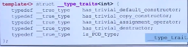

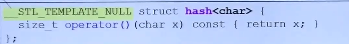

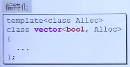

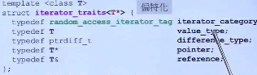

## 分配器

所有的分配动作最后都会调用malloc()函数

operator new()

分配器allocator分配内存的时候调用operator new()，deallocator调用operator delete()；没有任何其他设计。

G2.9 STL对allocator的使用：默认分配器时alloc，设计了16条单向链表，每一条链表负责特定大小的区块，第一条链表管理8个字节的区块，依次到16条链表，管理的是16*8字节大小的区块。这样cookie就会少很多。容器的元素的大小会被调整到8的倍数。类似于内存块。

## 2.1序列式容器 

### 2.1.1 list

list里面每一个元素要消耗两个指针、一个data

i++重载有个int参数，但是没有实际意义。

++i重载没有参数

++i返回i本身。

i++返回一个临时变量。++i返回对象本身。

```cpp
self operator++(int){self temp=*this;++*this;return temp;}
//先调用拷贝构造函数，然后调用*重载，然后++，操作，然后返回temp临时变量
```

### 2.1.2 Iterator的设计原则

trait 特征

迭代器是算法和容器之间的桥梁，一般是传入begin()和end()

设计的原则：萃取类型（只能往后移动一个或者可以随机访问）、iterator指向元素的类型、两个之间的距离应该用什么来表现、指针和引用（没使用过）。

### 2.1.3 vector

类似于数组，如果空间不够的话，就在其他地方申请二倍的空间，把原来的数据拷贝到这个空间。

begin(){return start;}

end(){return finish;}

size_type size(){return size_type(end()-begin());}

size_type capacity(){return end_of_storage-begin();}

bool empty(){return end()==begin();}

### 2.1.4 array

如果定义数组的大小是0，就指定为1，如果不是0，就是原来的大小

### 2.1.5 deque

双向开头的一个空间，多个buffer，缓冲区

支持随机访问，即中括号。

iterator具有的内容是：cur、first、last、node

迭代器的大小是16byte

BufSiz=0，默认值，如果不是0，就是指定的，默认512个字节+，一个元素大于512字节，就是元素的大小，如果小于512字节，大小就是512/SZ。

insert的时候很聪明：是否插入头部？是否插入尾部？看往哪边推动进？ 

离哪边进的判断方法：index=pos-start；index<size()/2 靠头部进，否则，靠尾端近

**如何模拟连续空间**

finish-start的实现：查看中间有多少个缓冲区，缓冲区的个数*缓冲区的元素数+两端的偏移量。模拟连续都是deque::iterator的功劳  

（两个node在控制中心的位置相减-1）*缓冲区元素的个数+当前node的cur-first+被减node的last-cur

在++或者--的时候，要判断是否在边界上。

重载+=操作符的时候，需要判断有无在一个缓冲区内，如果在一个缓冲区内，直接加，不在一个缓冲区内需要却换到正确的缓冲区。

重载-=相当于，+=-n

deque有4个变量：控制中心（控制一个个的缓冲区，用vector实现，扩充缓冲区是copy到中段，这样可以向右扩充缓冲区，也可以向左扩充缓冲区）、大小、头指针、尾指针

stack和queue可以使用list、deque实现的。

stack和queue都不允许遍历，也不提供iterator

### 2.1.6 forward_list

单向链表

## 2.2 关联式容器 

### 2.2.1 rb_tree

红黑树是一种高度平衡二分查找树，没有结点太深。

红黑树的迭代器++是一个排列的状态，不应该使用红黑树的iterator的值去赋值，意味着可以更改value，不能更改key。

提供两种操作：insert_unique(),insert_equal()。

仿函数的大小是0，创造出的对象是1。

仿函数：一个类重载小括号，这样使得这个类的使用就像一个函数。

indetity\<T>表示两者是同一个东西。gun独有的。

### 2.2.2 set和multiset

set和multiset是以红黑树为基础的。key和value合二为一。提供遍历操作，即迭代器，按正常规则++遍历，便能获得排序状态。不能通过迭代器赋值(迭代器是const_iteratot)。

set的key是独一无二的，调用insert_unique()

multiset的key是可以重复的，调用insert_equal()

### 2.2.3 map和multimap

可以++遍历，可以通过迭代器改变value，但是不能改变key的值，将user_key设置为const。

map可以使用中括号，multimap不可以使用中括号。如果中括号里的key不存在，则将key设置为默认值。

lower_bound()，存在返回左边界，不存在返回适合插入这个值的那个点。中括号要先调用lower_bound(),在调用insert，insert直接调用insert

## 2.3 hashtable

碰撞：不同的对象通过哈希函数得到相同的哈希值。

- 解决哈希冲突的办法

  开放定址法：线性探测再散列、二次探测再散列、伪随机探测再散列。Hi=（H（key）+di）mod m。

  再哈希法：产生冲突后再计算另一个哈希函数的地址，直到不冲突。

  链地址法：把冲突的元素排成一个链表。链表太长（元素的个数大于元素的个数）就将他打散（篮子增加两倍  ）。

  建立一个公共溢出区：冲突的元素放在这个公共溢出区中

vc是双向链表，gnu是单向链表

hash函数：如果是数组就当作编号；如果是字符串对每个字符进行操作。没有提供现成的hash\<std::string>

unordered的概念：无序

篮子永远大于元素的个数，篮子的个数两倍扩容

# 3.算法

容器是类模板

算法是函数模板

迭代器是类模板

仿函数是类模板

适配器是类模板

分配器是类模板

- 适配器

  将一个class的接口转换为另一个class的接口。

  容器适配器：比如说堆队列就是容器适配器，是使用deque的接口呈现出的另一种容器风貌。

  迭代器适配器：insert iterator，将一般迭代器的赋值操作转变为插入操作。reverse iterator是operator++操作符转变为后退操作。iostream iterator，将某个迭代器绑定到ostram对象身上，称为ostream_iterator，拥有输出功能。

  仿函数适配器

算法的形式

```cpp
template<typename Iterator>
Algorithm(Iterator itr1,Iterator itr2)
{
    ...
}
template<typename Iterator,typename Cmp>
Altorithm(Iterator itr1,Iterator itr2,Cmp comp)
{
    ...
}
```

算法和容器之间的关联是通过迭代器实现的

迭代器分类：随机、双向、单向、input_iterator_tag、output_iterator_tag

分类不用12345分类，而用class，可以实现重载，显示相应的类型

```cpp
template<class InputIterator>
distance(InputIterator first,InputIterator last){
    先问一下萃取机迭代器是什么类型
    //相减，连续空间，random_iterator_tag
    //从头走到尾巴，看看走了几步，input_iterator_tag
}
advance(InputIterator& i,Distance n){
    先问萃取机是什么类型的
    //直接加n
    //一步步的走
}
函数中没有子类的重载，调用父类的重载，即派生类转基类，派生类的部分被切掉。
```

## 3.1 算法源码剖析

### 1.accumulate

对区间的元素“累计算”到init上

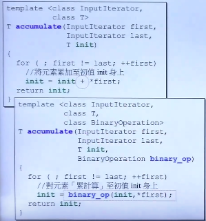

### 2. for_each

对区间的每一个元素做运算

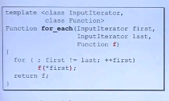

```cpp
for(decl:coll)
{
    statement;
}
```

### 3.replace, replace if, replace_copy

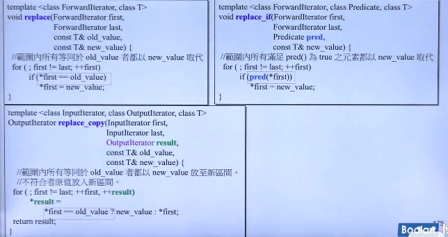

 replace_copy： 范围内等于旧值得都已新值防止新区见，不符合的原值放到新区间。

### 4.count，count_if


容器不带成员函数count、count_if的：array、vector、list、forward_list、deque

容器带有成员函数count：

set/multiset、map/multimap、unordered_set/unordered_multiset、unordered_map/unordered_multimap

### 5.find,find_if

 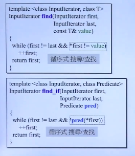

容器不带成员函数count、count_if的：array、vector、list、forward_list、deque

容器带有成员函数count：

set/multiset、map/multimap、unordered_set/unordered_multiset、unordered_map/unordered_multimap

### 6.sort

要求random，就是可以跳。

```cpp
void sort(v.begin(),v.end(),myfun);
v.rbegin();//逆向头
```


```cpp
revece_iterator  rbegin(){	
	return reverse_iterator(end());
}//reverse_iterator适配器，改变一下end()的行为，rend()同理
```

排序方法是快排， 时间复杂度是O(nlogn)

容器不带成员函数count、count_if的：array、vector、list、forward_list、deque

容器没有sort：

set/multiset、map/multimap、unordered_set/unordered_multiset、unordered_map/unordered_multimap

容器中带有sort：list、forward_list

### 7.binary_serch

二分查找，使用之前一定要排序

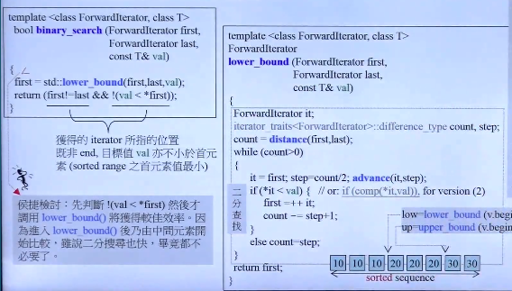

# 4.仿函数 functors

可以尝试融入到STL中，是最简单的

仿函数只为算法服务。

重载小括号（）

算术类、逻辑运算类、相对比较类

gnuc++独有的：identity、select1st、select2nd

没有继承public binary_function<T,T,bool>就是没有融入STL中。

仿函数的可适配条件（可以被调整、修改）：STL规定每个适配仿函数，都应该挑选unary_function或者binary_function来继承。因为Function Adaptor会提出红色问题。

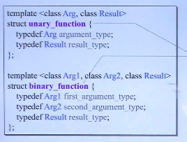

适配器要问问题、仿函数要回答问题，这样就可以被适配器修饰或者改造，所以要继承上面两个适当的类。

# 5.适配器

改一下接口，适用于另外一个场景。

仿函数适配器、迭代器适配器、容器适配器

共性：适配器改造某个东西后，比如说将B改造成A，A是面向用户的，但是是B去实现的功能。方式：继承B，内含B。STL中都是使用内含的。

容器适配器：stack、queue内含一个deque。

函数适配器：binder2nd，把第二参数绑定为40。

```cpp
cout<<count_if(v.begin(),v.end(),
              not1(bind2nd(less<int>(),40)));
```

## 5.1仿函数适配器

bind1st、bind2nd、not1、not2

**binder2nd**

bind2nd是一个类，返回一个binder2nd对象，把操作和参数记录下来，使用的时候直接使用。

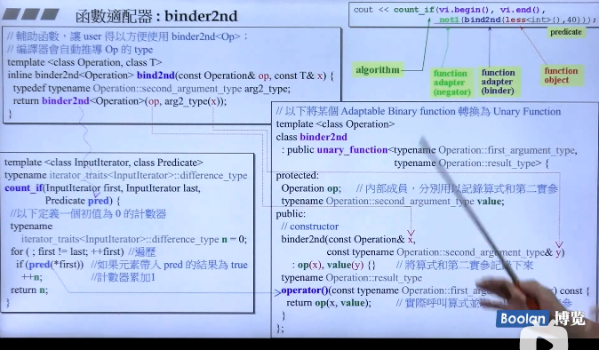

operation::second_argument_type会问x是什么类型。

问三个问题：第一个实参type、第二个实参type、返回参数type

如果能回答就是可被适配的。如上一个图，继承两个class。

新型适配器：bind

**not1**

不，取非

**bind**

```cpp
std::bind可以绑定：
1. function;
2. function objuect;
3. memeber functions,_1必须是某个object的地址
4. data memeber,_1必须是某个object的地址

using namespace std::placeholder;
double myfun(double x,double y){
    return x/y;
}
//1.绑定函数
auto fn_five=std::bind(myfun,10,2);
cout<<fn_five()<<endl;//5

auto fn_half=std::bind(myfun,_1,2);//将第一个参数绑定为2
cout<<fn_half(10)<<endl;//5

auto fn_invert=std::bind(myfun,_2,_1);
cout<<fn_invert(10,2);//0.2

auto fn_rounding=std::bind<int>(myfun,_1,_2);//绑定返回类型
cout<<fn_rounding(10,3)<<endl;//3

//2.绑定成员
class Mypair{
    int a;int b;
    int multiply(){return a*b;}
};
Mypair ten_two{10,2};
auto bound_memfn=bind(&Mypair::mutliply,_1);
cout<<bound_memfn(ten_two)<<endl;//20
auto bound_memdata=bind(&Mypair::a,ten_two);
cout<<bound_memdata()<<endl;//10
auto bound_memdata2=bin(&Mypair::b,_1);
cout<<bound_memdata2(ten_two)<<endl;//2	 

vector<int> v;
v.cbegin();//const begin();
```

## 5.2 迭代器的适配器

适配器改造迭代器

**reverse_iterator**：rbegin()、rend()

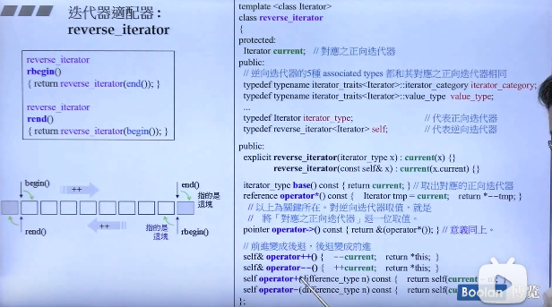

适配器就是将所要修饰、改的东西记起来，然后再看看怎么改造他。

**inserter**

指针加一个数：advance(it,3);迭代器往后加3

copy是assign

inserter是push_back

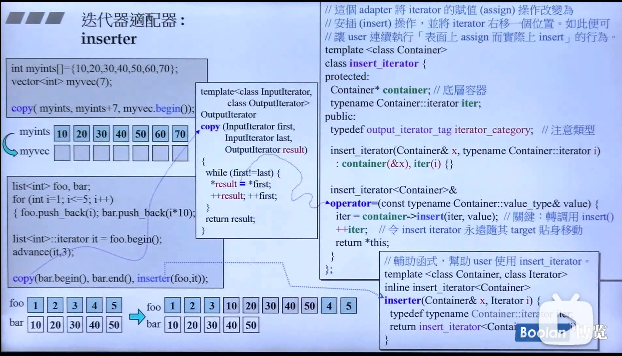

## 5.3 容器适配器

使用deque实现queue和stack

## 5.4 X适配器

**ostream_iterator**

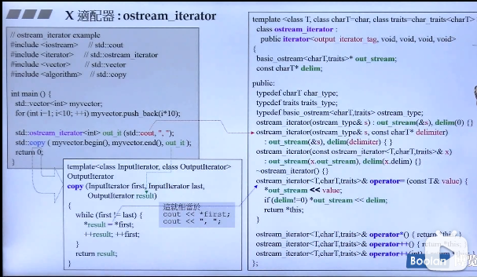

**istream_iterator**

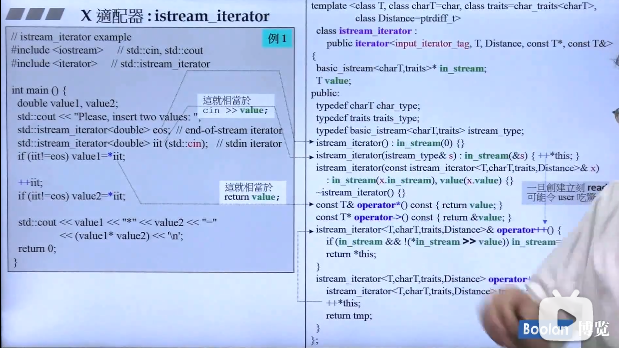

​                      

# 6. 其他

**一个万用的hash function：hash_val();**

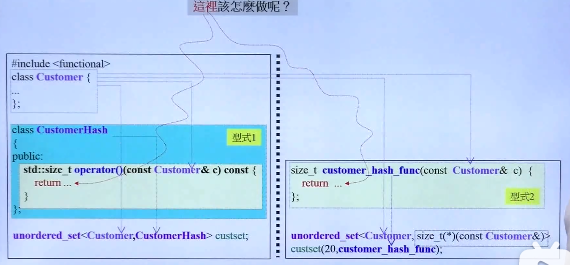

设计一个hash function的规则：设计一个函数、或者设计一个类重载小括号操作符(仿函数)

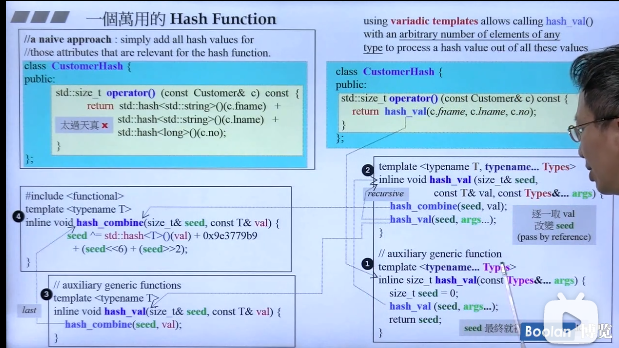


​     set.bucket_count();//篮子的个数，篮子的个数永远大于元素的个数

**tuple：组合**

```cpp
string 的 sizeof  
tuple<int,float,string> t1(1,2.0,"nico");  
cout<< get<0>(t1);//输出第0个元素
tuple可以赋值，比大小，丢给cout（设置操作符重载）;

tuple<int,flloat,string> t3(77,1.1,"more");
int i1;
float f1;
string s1;
tie(i1,f1,s1)=t3;//绑定参数
tuple_size<t3>::value;//得到tuple的参数有几个，也可以一问一答
```

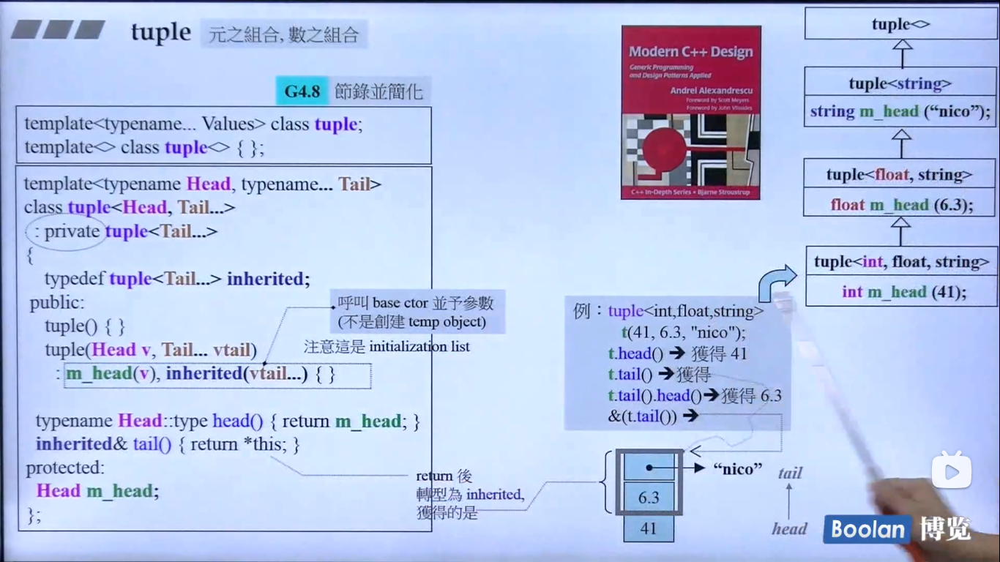

return *this经过转型指向的是上面的那两块

**type traits**

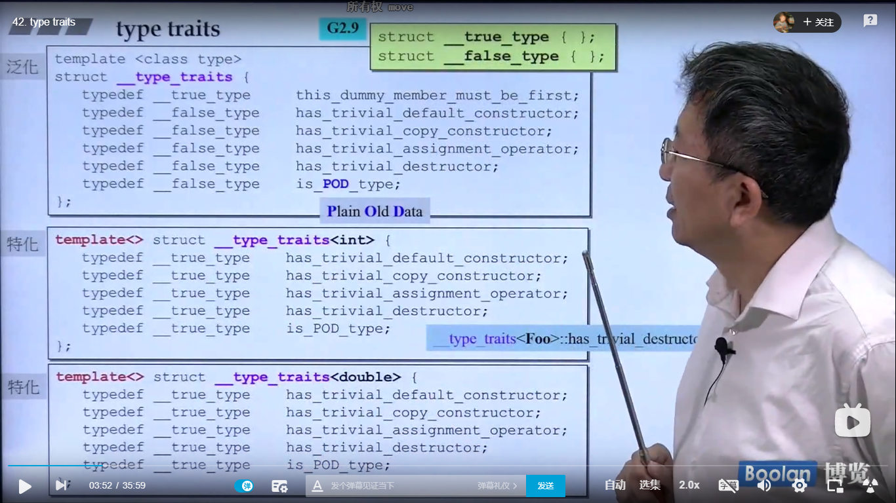

一问一答，是否重要，然后偏特化

 带着指针的类，构造函数、copy构造函数重要

POD：平淡的旧格式，就是C的struct

**type traits实现**

1. is_void

   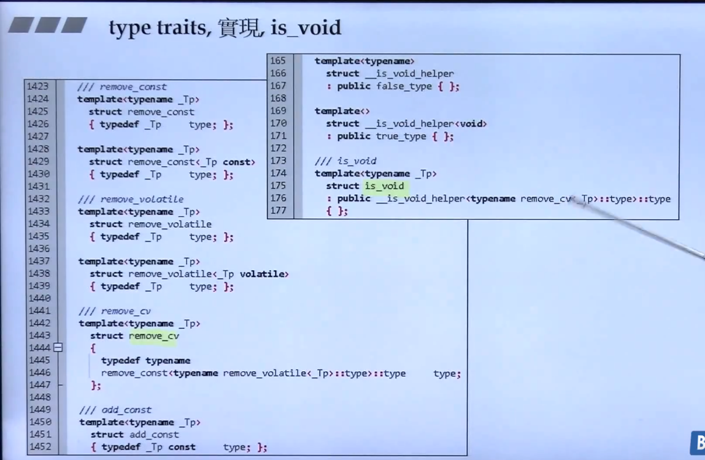

   先拿掉cv，const、volatile ，然后使用泛化和偏特化实现是不是void

2. is_integral

   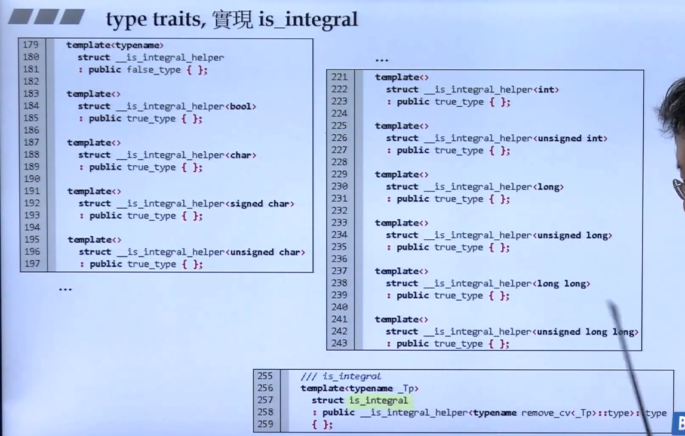

3. 其他

   

   编译器暗中帮助标准库

   grep 全文检索

**cout输出其他对象需要定义重载**

**moveable元素对于vector速度的影响**

vector两倍扩张，调用的拷贝构造函数可能会多余push_back的元素数目。

类内是静态的，要在类外定义

move之后的东西不能再被使用。

vector的深拷贝：使用copy（）函数

vector的浅拷贝：将三个指针start、finish、end_of_storage交换

string有使用move版本