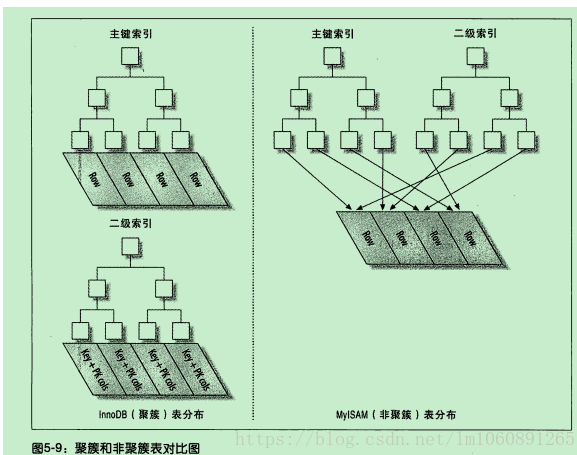

# 0.使用流程

root hli   

创建数据库 CREATE DATABASE mytest;

使用数据库 use mytest;

创建表格 CREATE TABLE student{ id int,name varcahr(255),address varchar(255),city varchar(255)};

插入数据 INSERT INFO student VALUES (1,"张三","山东","济南");

操作数据库

查找数据 select * from student 

# 1. mysql基本命令

## 开启和关闭mysql

管理员cmd：

net start mysql

net stop mysql


## 登录命令

```mysql
mysql -h ip -P 端口 -u 用户名 -p #异地登陆
mysql -u 用户名 -p #本地登录 
```


## 查看数据库版本

```mysql
mysql --version
```


## 显示所有数据库

```mysql
show dattabases;
```


## 进入指定库

```mysql
use 库名;
use seata;
```

## 显示当前库中的所有表

```mysql
show tables;
```

## 查看其他库中所有表

```mysql
show tables from 库名;
show tables from seata;
```

## 查看表的创建语句

```mysql
show create table 表名;
show create table biz_tags;
```

## 查看表的结构

```mysql
desc 表明;
desc biz_tags;
```

## 查看当前所在库

```mysql
select database();
```

## 查看mysql支持的存储引擎

```mysql
SHOW ENGINES;
```

## 查看系统变量及其值

```mysql
SHOW VARIABLES;
```

## 查看某个系统变量

```mysql
SHOW VARIABLES like '变量名';
SHOW VARIABLES like 'wait_timeout';

```

## mysql语法规范

- 不区分大小写，但建议关键字大写，表明、列名小写
- 每条命令最好用英文分号结尾
- 每条命令根据需要，可以进行缩进或换行
- 注释
  - 单行注释：#注释文字
  - 单行注释：-- 注释文字，注意，这里需要加空格
  - 多行注释：/\*注释文字\*/

## SQL的语言分类

- DQL：数据查询语言，select相关语句
- DML：数据操作语言，insert、update、delete语句
- DDL：数据定义语言，create、drop、alter语句
- TCL：事务控制语言，set autocommit=0、start transaction、savepoint、commit、rollback

# 2.mysql中数据类型介绍

整数类型：bit、bool、tinyint、smallint、mediumint、int、bigint

浮点数类型：float、doule、decimal

字符串类型：char、carchar、tinyblob、blob、mediunblob、longblob、tinytext、text、mediumtext、longtext

日期类型：Date、DateTime、TimeStamp、Time、Year


## 整数类型

| 类型      | 字节数 | 有符号范围     | 无符号范围 |
| --------- | ------ | -------------- | ---------- |
| tinyint   | 1      | [-2^7,2^7-1]   | [0,2^8-1]  |
| smallint  | 2      | [-2^15,2^15-1] | [0,2^16-1] |
| mediumint | 3      | [-2^23,2^23-1] | [0,2^24-1] |
| int       | 4      | [-2^31,2^31-1] | [0,2^32-1] |
| bigint    | 8      | [-2^63,2^63-1] | [0,2^64-1] |

默认是有符号类型的，无符号类型需要在类型后面加上unsigned

## 数据类型选择建议

选小不选大：使用尽量小的数据

简单就好：简单的数据类型使用更少的CPU周期，比如使用整数比字符串代价小得多。因为字符串比较起来麻烦。

尽量避免NULL：尽量执行列为NOT NULL，除非真的需要NULL类型的值，有NULL的列值会使得索引、索引统计和值比较更加复杂。

浮点类型的建议统一选择decimal

记录时间的建议使用int或者bigint类型，然后将时间转换为时间戳格式，如将时间转换成秒、毫秒进行存储，方便走索引。


# 3. DDL常见操作汇总

DDL对数据库、表进行管理

## 创建库

```mysql
create database if not exists 库名;
```

## 删除库

```mysql
drop databases if exists 库名;
```

## 创建表

```mysql
create table 表明(
	字段名1 类型[(宽度)] [约束条件] [comment '字段说明']，
	字段名2 类型[(宽度)] [约束条件] [comment '字段说明']，
	字段名3 类型[(宽度)] [约束条件] [comment '字段说明']
)[表的一些设置];
```

### 约束条件

not null，表示该字段不能为空

### default value

为该字段设置默认值，默认值为value

```mysql
create table test(
	a int not null default 0 comment '字段a'
);
```

## 主键

表示该字段为该表的主键，可以唯一的标识记录，插入重复的会报错。

定义方式：

- 在列后定义

  ```mysql
  create table test(
  	a int not null comment '字段a' primary key,
  	b int not null comment '字段b'
  );
  ```

- 在所有列后定义，支持多字段作为逐渐

  ```mysql
  create table test(
  	a int not null comment '字段a',
  	b int not null comment '字段b'，
  	primary key(a)
  );
  insert into test(a,b) values(1,2);
  ```

## 外键

foreign key :为表中的字段设置外键

foreign key (当前表的列名) references 引用的外键表(外键表中字段名称)

```mysql
create table test1(
    a int not null primary key
);
create table test2(
    b int not null,
    ts1_a int not null,
    foreign key(ts1_a) reference test1(a)
);
```

作用：使得两张表具有关联性，保持数据的一致和实现一些级联操作。

主表删除某条记录时，从表中与之对应的记录也必须有相应的改变。

## unique key

标识该字段的值是唯一的，插入重复的值会插入失败。

跟在列之后约束，或者在所有列定义之后约束（支持多个字段）。

## auto_increment

标识该字段的值自动增长，整数类型，而且为主键

## 删除表中的元素

```mysql
delete from table1
```

## 删除表

```mysql
drop table 表明
```

## 修改表名

```mysql
alter table 表名 rename [to] 新表名;
```

## 设置备注

```mysql
alter table 表明 comment ’备注信息‘
```

## 复制表

```mysql
create table 表明 like 被复制的表名;
```

## 复制表的结构+数据

```mysql
create table 表名 [as] select 字段1，字段2 from 被复制的表 [where 条件];
```

## 添加列

```mysql
alter table 表名 add column 列名 类型 [列约束];
```

## 修改列

```mysql
alter table 表名 modify column 列名 新类型 [约束];
或者
alter table 表名 change column 列名 新列名 新类型 [约束];

区别：modify 不能修改列名，change可以修改列名
```

## 删除列

```mysql
alter table 表名 drop column 列名;
```

# 4. DML常见操作

数据操作语言：insert、update、delete三种指令为核心

## 插入操作

```mysql
insert into 表名[(字段1，字段2)] values (值1，值2);
```

注意：值与字段是一 一对应的

```mysql
insert into 表名[(字段1，字段2)] values (值，值) (值，值)
insert into 表名[(字段1，字段2)] 数据来源select语句。
```

## 数据更新

```mysql
update 表名 [[as] 别名] set [别名.]字段=值 [别名.]字段=值 [where 条件];
或者同时更新多个表
update 表名1 [[as] 别名]，表2[[as] 别名] set [别名.]字段=值，[别名.]字段=值 [where 条件]
```

## 删除数据

```mysql
delete [别名] from 表名 [[as] 别名] [where 条件];
truncate 表名;
```

### drop、truncate、delete区别

- drop，删除表，删除整个表。
- truncate，清空表的数据。
- delete，清除表的某行。

# 5. select查询

select 是数据查询语言

- 基本语法

```mysql
select 查询的列 from 表名;
```

不区分大小写，查询的结果放在一个表中，第一行是列头，从第二行开始是数据。

- 查询常量

```mysql
select 常量值1，常量值2，常量值3
如： select 1,'b'
```

- 查询表达式

```mysql
select 表达式；
如
select 1+2，3*10，10/3
```

- 查询函数

```mysql
select 函数;
如 select mod(10,4),isnull(null),ifnull(null,'第一个参数为空返回这个')，ifnull(1,'第个参数为空返回这个值，否则返回第一个参数')

```

- 查询某个列

```mysql
select 字段1，字段2 from 表名
```

- 查询所有列

```mysql
select * from 表名
```

- 列别名

```mysql
select 列字段 [as] 别名 from 表名;
如 select a '列1'，b '列2' from test1；
结果将a替换为列1
```

# 6. select条件查询

```mysql
select 列名 from 表名 where 列 运算符 值

操作符：等于（=），不等于（<>或者!=），大于(>)，小于（<），大于等于（>=），小于等于（<=）

逻辑查询运算符：and or

模糊查询：like，格式： select 列名 from 表名 where 列 like pattern；

pattern可以包含通配符，看一下通配符：%表示匹配任意0个或多个字符，_表示匹配任意一个字符。

between and，表示一个区间
select 列名 from 表名 where id between 值1 and 值2；

in查询：在一个括号里的数字
select * from mytable where id in (2,3,5);

not in 查询，不在这个括号里
select * from mytable where is not in (2,4,6);
```

- NULL存在的坑

结论：操作符、like、between and、in、not in对NULL值查询不起效。

查询 NULL 只能用IS NULL / IS NOT NULL

<=>安全等于，既可以判断null，也可以判断普通的数值，但是可读性较低，用的较少。

# 7.排序和分页

## 排序查询 order by

排序语法

```mysql
select 字段名 from order by 字段1 [desc|asc] 字段2[desc|asc];
```

多个字段排序用逗号分隔开。默认asc即升序排列。

where之后进行排序

```mysql
select * from mytable order by a where a>=100
```

## limit介绍

limit用来限制select查询返回的行数，常用于分页操作

```mysql
select 列名 from 表名 limit [offset] count;
```

limit放在最后

offset是偏移量，就是跳过多少行，offset可以省略，默认为0，表示跳过0行。

count是跳过offset行之后开始取数据，取count行记录。

limit中offset和count不能用表达式。

## 获取排名第n到m的记录

排序后需要跳过n-1行，然后取m-n+1条记录。

```mysql
select * from mytable limit n-1 m-n-1;
```

## 分页查询

查询参数

page：第几页

pageSize：每页多少数据

```mysql
select * from mytable limit (page-1)*pageSize,pageSize;
```

避免踩坑；limit中不能使用表达式，limit后面的两个数字不能为负数。

排序中存在相同的值的时候，需要在指定一个排序规则

# 8. 分组查询

语法

```mysql
select column，group_function，... from table [where condition] group by group_by_expression [having group_condition];
group_function：聚合函数
group_by_expression：分组表达式，多个之间用都喊隔开
group_condition：分组之后对数据进行过滤
分组之后，select后面只能由两种类型的列：1.出现在group by 后的列，2.或者使用聚合函数的列
聚合函数：max，min，count，sum，avg
```

- 单字段分组

  ```mysql
  select id 用户id，count(id) 下单数量
  form t_order
  group by id
  ```

  where是在分组前对数据进行筛选，having是分组后对数据进行筛选。

  聚合函数，就是group by 字段1，将字段1相同的所有数据聚合在一起

where & group by & having & order by &limit一起协作

```mysql
select 列名 from 表名
where [查询条件]
group by [分组表达式]
having [分组后的过滤条件]
order by [排序条件]
limit [offset,] count;
```

注意：写法只能按上面的来

##  9.mysql函数

- abs：绝对值
- mod：求余数
- sqrt：求二次方根
- ceil和ceiling：向上取整
- floor：向下取整
- rand：生成0~1之间的一个随机数
- round，对所传参数四舍五入
- sign：返回参数的符号
- pow和power：返回所传参数次方的结果
- sin：正弦
- asin：反正弦
- cos：余弦
- acos：反余弦
- tan：正切
- atan：反正切
- cot：余切

## 字符串函数

- length：计算字符长度函数，返回字符串的字节长度
- concat：合并字符串函数，返回结果为连接参数产生的字符串
- insert：替换字符串函数
- lower：字符串字母全部转为小写
- upper：字符串字母全部转为大写
- left：从左侧截取若干个字符
- right：从右侧截取若干个字符
- trim：删除字符串左右两侧的空格
- replace：字符串替换函数，返回替换后的新的字符串
- substr和substring：截取字符串
- reverse：反转字符串

# 10. 深入连接连接查询和原理

笛卡尔积：所有的行的组合式m*n

- 内连接

  ```mysql
  select 字段 from 表1 inner join 表2 on 连接条件.
  或
  select 字段 from 表1 join 表2 on 连接条件按；
  或
  select 字段 from 表1，表2 [where 关联条件]
  ```

  

有条件内连接：两个集合的交集

无条件内连接：上升为笛卡尔积

# 11. 子查询

暂无

# 12. 事务

## 事务的定义

事务：事务时对数据库执行的一系列操作，这些操作要么全部执行，要么换全部失败，不存在部分失败部分成功的情况。

## 事务的特性（ACID）

原子性（Atomicity）：要么全部成功，要么全部失败，最终的结果像原子一样不可分割。

一致性（Consistency）：一个事务必须使数据库从一个一致性状态转换到另一个一致性状态。一致性状态就是一种有意义的状态，比如说A给B转账，A的钱少了，B的钱没有增加，这就是不一致的状态。

隔离性：一个事务的执行不能被其他事务干扰。

持久性：一个事务一旦提交，他对数据库中数据的改变是永久性的。

## 事务操作

mysql中事务默认是隐式事务，执行insert、update、delete操作的时候，数据库自动开启事务，提交或回滚事务。

是否开启隐式事务是由变量autocommit控制的。

- 隐式事务

  事务自动开启、提交或回滚。使用show variables like ’autocommit‘查看

- 显示事务

  事务需要手动开启、提交或回滚，由开发者自己控制。

  方式1：set autocommit=0; commit|rollback;

  ```mysql
  如：
  insert into table values(12,2);
  rollback;#回滚
  insert into table values(12,2);
  commit;#提交
  ```

  方式2:start transaction;rollback|commit;

  ```mysql
  如：
  start transaction;
  insert into table values(1,1);
  insert into table values(2,2);
  commit;
  ```

  ### savepoint关键字

  回滚部分数据

  ```mysql
  start transaction;
  insert into table values(1);
  savepoint part1;#设置一个保存点
  insert into table values(2);
  rollback to part1;
  commit;
  #只增加了一个数据
  ```

## 只读事务

事务中只执行一些只读操作，如查询，但是不会insert、update、delete操作，数据库内部会对只读事务做一些性能上的优化。

```mysql
start transaction read only;
```

## 事务中的问题

1. 脏读，事务A读取了事务B未提交的数据，并且B回滚了。
2. 不可重复读，在一次事务中两次读取的不一样。
3. 幻读，后一次查询查询到了前一次查询没有看到的行，像发生幻觉一样。

## 事务的隔离级别

mysql默认的隔离级别时可重复读。

1. 读未提交，可以读取没有被提交的数据。不能解决脏读、不可重复读、幻读。
2. 读已提交，能够读取已提交的数据。能解决脏读，不能解决不可重复度，幻读。
3. 可重复读，数据读取出来之后加锁，该事务结束之前，别人无法修改它。解决了脏读、不可重复读，不能解决幻读。
4. 串行化，事务串行执行，肯定不会相互影响，可以解决脏读、不可重复读、幻读，但是效率低。

解决幻读的其他办法：间隙锁+行锁的next-key lock解决。

查看隔离级别

```mysql
show variables like 'transaction_isolation'
```

## 查看索引

```mysql
show index from mytable;
```

## explain

explain可以查看SQL的执行计划，比如说有没有使用索引，有没有做全表扫描。

# 问题

## 1.说一说mysql的锁机制（行锁、表锁、间隙锁、next-key锁）

Mysql常用的引擎由myisam和innodb，myisam不支持行锁，innodb支持行锁和表锁。

读锁：共享锁，多个读操作可以同时进行。lock in share mode

写锁：排他锁，写操作完成之前，会阻止其他的写操作和读操作。for update

全局锁：对整个数据库实例加锁。

表锁：对表上锁，不会出现死锁，发生锁冲突率高，并发低。

行锁：对行上锁，会出现死锁，发生锁冲突率低，并发高。

行锁时加载索引上实现的，要是对应的sql语句没有走索引，行锁就会失效，取而代之的就是表锁。

间隙锁：查询语句时，条件为查询范围时，InnoDB不管这个区间是否有数据，都会将其锁住，像这个区间的的“间隙”（不存在的行）插入或删除数据都会阻塞。

next-key lock=记录锁+间隙锁。对已存在的记录加记录锁，再对区间的间隙加上间隙锁。从而解决幻读的问题。

## 2. mysql的索引原理

索引是依靠某些数据结构，最终引导用户快速检索出所需要的数据。

mysql数据库中常见的所以用结构由多种，常用hash、B-树、B+树等数据结构来进行数据存储。

B树是平衡多叉树。

B+树：命中节点后不算完，还需要继续往下找，找到对应的叶子节点，叶子节点由记录所在的位置。因为B+树的结点没有存放信息，所以占用的磁盘小，磁盘读取次数少，并且查询速度稳定，都要找到叶子结点才能找到对应的记录。

B树和B+树的区别：1.B+树中一个结点如果由k个关键字，最多可以包含k+1个子节点；而B树对应k+1个结点。2. B+树除叶子结点之外，其他节点只存储关键字和指向子节点的指针，而B树还存储了数据，那么同样大小的空间，B+树存储的关键字多。3. B+树叶子节点存储着关键字和data，并且多个节点用链表连接，并且是有序的，可以快速支撑查找范围（先确定大范围，在靠链表遍历范围数据）。

## 3. 磁盘

**扇区：**磁盘存储的最小单位，大小未512byte

**磁盘块：**文件系统与磁盘交互的最小单位，一个磁盘块由连续几个（2^n）个扇区组成，快一般大小未4b。

**磁盘读取数据：**磁盘读取数据是机械运动，每次读取数据花费的时间可以分为：**寻道时间、旋转延迟、传输时间**三部分。寻道时间是磁盘臂移动到指定磁盘所需要的时间，旋转延迟是磁盘的磁盘转速，传输延迟是从磁盘读出或写入磁盘的时间。

mysql与磁盘交互的最小单位是页。大小默认是16Kb，相当于4个磁盘块。页相当于B+树的一个节点。

## 4.存储引擎和索引

存储引擎有：InnoDB、MyISAM




### InnoDB的中的索引，使用的聚簇索引

InnoDB里有两种索引：主键索引、辅助索引

主键索引：每个表中只有一个主键索引，使用B+树结构，叶子节点保存主键的值和数据，其他节点只存储主键的值。<font color=red>使用主键进行索引</font>

辅助索引：可以有多个辅助索引，叶子节点存储的是主键的值。<font color=red>使用非主键进行索引。</font>问题：为什么辅助索引不向myisam那样存储记录的地址。数据发生变更时，会影响其他其他记录的地址，如果辅助索引中记录地址，会受到影响，但是主键一般时很少更新的，当记录发生地址变更时，对辅助索引没有影响。 

优缺点：表中存储的数据按照索引的顺序存储，检索效率比普通索引高，但是对新增、修改、删除数据的影响比较大。

### MyISAM中的索引，使用的是非聚簇索引

主键索引和二级索引的节点结构一样，只是存储的内容不同，主键索引B+树的节点存储了主键，辅助索引的节点存储了辅助键。表数据存储在独立的地方。两颗B+树的叶子节点都是使用一个地址指向真正的数据。

优缺点：检索效率比聚簇索引低，对数据的新增、修改、删除的影响比较小。

