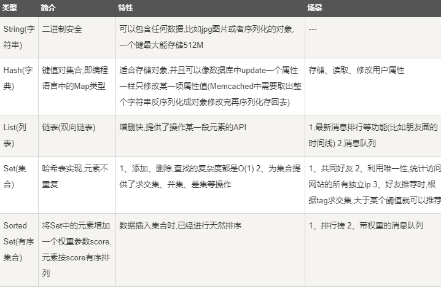

redis默认采用LZF压缩，可以取消这个选项，就是不压缩

# 1.redis数据类型

## 1. String（字符串）

string是二进制安全的，可以包含任何数据，比如jpg图像、序列化的对象等。

string类型是redis最基本的类型，最大能存储512MB。

```redis
set key value
get key
```

## 2. Hash（哈希）

Redis hash是一个键值对集合。

Redis hash是一个string类型的filed和value的映射表，hash特别适用于存储对象。

```redis
hmset key filed1 value1 filed2 value2
hget key filed1 
```

每个hash可以存储2^32-1个键值对（40多亿），一个key相当于一个hash

## 3. List（列表）

redis列表是简单的字符串列表，按照插入顺序排列， 可以添加一个元素到列表的头部或者尾部

```redis
lpush key value
lrange key 0 10
```

可以存储40多亿个元素，一个key相当于一个list

## 4. Set（集合）

Redis的Set是String类型元素的无序集合，且不重复

集合是通过哈希表实现的，所以添加、删除、查找的复杂度都是O(1)

```redis
sadd key member 添加一个元素，成功返回1，失败返回0。失败的情况是重复插入
smembers key
sinter key [key...]
```

最大成员是是40多亿

## 5. ZSet（sorted set：有序集合）

Redis的ZSet是string类型元素的有序集合，且不重复

每个元素都会关联一个double类型的分数，redis正是通过这个分数实现为集合中的成员进行从小到大的排序。

ZSet的成员是唯一的，但是分数可以重复

```redis
zadd key score member
zrangebyscore key 0 1000
```



# 2.Redis命令

## 1. 客户端连接

```redis
本地连接：redis-cli
远程连接：redis-cli -h host -p port -a password
避免中文乱码：redis-cli --raw
```

## 2. 键

语法

```redis
COMMNND KEY_NAME
```

实例

```shell
SET NAME redis
DEL NAME
#成功返回1，失败返回0
```

Redis keys命令

```shell
DEL key #在key存在时删除key
DUMP key #序列化给定key，并返回被序列化的值
EXISTS key #检查key是否存在
EXPIRE key seconds #为key设置过期时间，时间以秒计
EXPIREAT key timestampj #EXPIREAT和EXPIRE类似，不同的是EXPIREAT命令接受的参数是UNIX时间戳
PEXPIRE key milliseconds #为key设置过期时间，时间以毫秒计
PEXPIREAT key milliseconds-timestamp #设置key过期时间的时间戳，以毫秒计
KEYS pattern #找出符合pattern模式的key
MOVE key db #将档期那数据库的key移动到给定数据库db中
PERSIST key #移除key的过期时间，key将保持到永久
PTTL key #以毫秒返回key的剩余过期时间
TTL key #以秒为单位返回key的剩余过期时间
RANDOMKEY #从当前数据库中随机返回一个key
RENAME key newkey #将key重命名为newkey
RENAMEX key newkey #如果newkey不存在时，将key的名称修改为newkey
SCAN cursor [MATCH pattern] [COUNT count] #迭代数据库中的数据库键
TYPE key #查看key所存储值的类型
```

## 3. 字符串

```shell
set key value
get key
getrange key start end
getset key value #将key的值设为value，并返回key的旧值
getbit key offset #对key所存储的字符串值，获取指定偏移量上的位，string以二进制的形式
MGET key1 [key2...] #获取多个key对应的字符串
setbit key offset values #设置某个位的值
setex key seconds value #将值value关联到key，并将key的过期时间设为seconds
setnx key valu #只有在key不存在时设置value
setrange key offset value #将value指定偏移量的值覆盖为value
strlen key #返回key所存储的字符串的长度
mset key value [key value] #同时设置多个键值对
msetnx key value [key value] #只有在所有key不存在的时候，是指多个键值对
psetex key milliseconds values # 与setex类似，这个时以毫秒为单位
incr key #将key中存储的数值加1，需要是整数
incrby key increment
incrbyfloat key increment #给key增加浮点数增加量
decr key #将key中存储的数值减1，需要是整数
decrby key decrement #将key的数值减去一个量
append key value #将value增加到key-value的末尾
```

## 4. 哈希（Hash）

Redis是一个string类型的filed（字段）和value（值）的映射表，hash特别适合存储对象。

每个hash可以存储2^32-1个键值对

```shell
HMSET key name "redis tutorial" descroption "redis basic commands for caching" likes 20 visitors 23000
```

hash 命令

```shell
hdel key filed1 [filed2..] #删除1个或者多个哈希字段
hexists key field #查看哈细胞key中，指定字段是否存在
hget key field #获取存储在哈希表中指定字段的值
hgetall key #获取在哈希表中指定key的所有字段和值
hincrby key field increment #为哈希表key中的指定字段的整数值加上增量increment
hincrbyfloat key field increment #为哈希表key的指定字段的浮点数值加上增量increment
hkeys key #获取所有哈希表中的字段
hmget key field1 [field2..] #获取所有给定字段的值
hlen key #获取哈希表中字段的数量
hmget key field1 [field2...] #获取所有给定字段的值
hmset key field1 [field2...] #同时将多个field-value对设置到哈希表key中
hset key field value #将哈希表key中的字段field的值设为value
hsetnx key field value #只有在字段field不存在时，设置哈希字段的值
hvals key# 获取哈希表中所有的值
hscan key cursor [MATCH pattern].[COUNT count]
```

## 5. 列表（List）

简单的字符串列表，按照插入顺序排序，可以添加一个元素到列表的头部或者尾部

一个列表最多可以包含2^32-1个元素

```SHELL
lpush key value1
lpush key value2
lrange key 0 10
```

```shell
blpop key1 [key2..] timeout #移除并获取第一个元素，列表中没有元素会阻塞等待超时或发现可弹出元素为止
brpop key1 [key2..] timeout #移除并获取最后一个元素，列表中没有元素会则色等待超时或发现可弹出元素为止
brpoplpsh source destinantion timeout #从列表中弹出一个元素，将弹出的元素插入另一个列表并返回它，如果列表中没有元素，阻塞直到有元素或超时
LINDEX key index #通过索引获取列表中的元素
linsert key before|after pivot value #在列表的元素前或者后插入元素
llen key #获取列表的长度
lpop key #移除并获取列表的第一个元素
lpush key value1 [value2] #将一个或多个值插入元素头部
lpushx key value #将一个值插入已存在的列表头部
lrange key start stop #获取列表指定范围内的元素
lrem key count value #移除列表元素
lset key index value #通过索引设置列表元素的值
lterim key start stop #对一个列表进行修剪，就是说，让列表只保留指定区间内的元素，不在指定区间内的元素都将被删除
rpop key #移除列表的最后一个元素，返回值为移除的元素
rpoplpush source destination #移除列表的最后一个元素，并将该元素添加到另一个列表并返回
rpush key value1 [value2] #在列表中添加一个或多个值
rpushx key value #为已存在的列表插入值		
```


## 6. 集合

Redis的set时string的无序集合。集合成员是唯一的，这就意味着集合中不能出现重复的数据。

Redis中集合是通过哈希表实现的，所以添加、删除、查找的复杂度都是O(1)

集合中最大的成员是为2^32-1，即40多亿个

```SHELL
sadd key value1 
sadd key value2
smembers key
```

```shell
sadd key member1 [member2] #向集合中添加一个或多个成员
scard key #获取集合的成员数
sdiff key1 [key2] #返回第一个集合和其他集合之间的差异
sdiffstore destination key1 [key2] #返回给定所有集合的差集并存储在destination中
sinter key1 [key2] #返回给定所有集合的交集
sinterstore destination key1 [key2] #返回给定所有集合的交集并存储在destination中
sismemeber key member #判断member元素是否是集合key的成员
smemebers key #返回集合中所有的成员
smove source destinanton member #将member元素从soruce 集合移动到destination中
spop key #移除并返回集合中的一个随机元素
srandmemeber key [count] #返回集合中一个或多个随机数
srem key member1 [member] #移除集合中一个或多个成员
sunion key1 [key2] #返回所有给定集合的并集
sunionstore destination key1 [key2] #所有给定金ieh的丙级存储在destination红
sscan key cursor [MATCH patter] [COUNT count] #迭代集合中的元素
```

## 7.有序集合

redis有序集合和几何一样也是string类型元素的集合，且不允许右重复的元素

不同的是每个元素都会关联一个double类型的分数，redis正式通过这个分数来为集合中的成员进行从小到大的排序

有序集合的成员是唯一的，但是分数是可以重复的

集合是哦通过哈希表实现的，所以添加、删除、查找的复杂度都是O(1)。集合中最大的成员是2^32-1，40个亿个元素

```shell
zadd key score value
zadd key 1 redis
zadd key 2 memcahed
zrange key 0 10 withscores
```

```shell
zadd key score1 member1 [score2 member2] #向集合中添加元素
zcard key #获取有序集合的成元素
zcount key min max #计算在有序集合中指定区间分数的成员数
zincrby key increment member #有序集合中对指定成员的分数加上增量increment
zinterstore destination numkeys key [key...] #计算给定的一个或多个有序集的交集并将结果存储在destination中	
zlexcount key min max #计算指定字段区间内的成员数量
zrange key start stop #通过索引区间返回有序集合指定区间内的成员
zrangebykex key min max #通过字段区间返回有序集合的成员
rangebyscore key min max #通过分数返回有序集合指定区间的成员
zrank key member #返回有续集和中指定成员的索引
zrem key member [member...] #移除有序集合的一个或者多个成员		
zremrangebylex key min max #移除有序集合中给定字典区间的所有成员
zrenrabgebyrank key start stop #移除有序集合中给定排名区间的所有成员
zremrangebyscore key min max #移除有序集合中给定的分数区间的所有成员
zrevrange key start stop [withscores] #返回偶徐集合中指定区间的成员，通过索引，分数从高到低
zrevrangebyscore key max min [withscores] #返回有序集合指定分数区间内的成员，分数从高到低
zrevrank key member #返回有序集合中指定成员的排名，有序成员按分数从大到小排序
zscore key member #返回有序集合中，成员的分数值
zunionstore destionnation numkey key [key...] #计算给定的一个或多个有序集的并集，并存储在新key中
ascan key cursor [MATCH pattern] [COUNT count] #迭代有序集合中的元素
```

## 8. HyperLogLog

Redis HyperLogLog是用来做基数统计的算法，其优点是：在输入元素的数量或者体积非常非常大时，计算基数所需的空间总是固定的、并且是很小的。

在Redis里面，每个HyperLogLog键只需要花费12kB的内存，就可以计算接近2^64个不同元素的基数，这和计算基数是，元素越多耗费内存就越多的集合形成鲜明的对比。

但是，因为HyperLogLog只会根据输入元素来计算基数，而不会存储输入元素本身，所以HyperLogLog不能像集合那样，返回输入的各个元素。

**什么是基数：**比如数据集{1、3、5、7、5、7、8}，那么这个数据集的技术及就是{1、3、5、7、8}，基数（不重复元素）为5。基数估计就是在误差可接受的范围内，快速计算基数。

工作过程

```shell
PFADD key "redis"
PFADD key "mongodb"
PFADD key "mysql0"
PFCOUNT key
返回3
```

```shell
pfadd key element [element...] #添加指定元素到HyperLogLog中
pfcount key [key...] #返回给定HyperLogLog的基数估计值
pfmerge destkey sourcekey [sourkey...] #将多个HyperLogLog合并为一个HyperLogLog
```

## 9.Redis发布订阅

Redis发布订阅是一种消息通信方式：发送着（pub）发送消息，订阅者（sub）接收消息

Redis客户端可以订阅任意数量的频道

实例：

第一个redis-cli客户端

```shell
subscribe channel1		
```

第二个客户端

```shell
publish channel1 "test"
```

**相关命令**

```shell
psubscribe pattern #订阅一个或多个符合给定模式的频道
pubsub subcommand [argument[argument...]] #查看订阅和发布系统状态
publish channel message #将消息发送到指定的频道
punsubscribe [pattern[pattern...]] #推定所有给定模式的频道
subscribe channel [channel...] #订阅给定的一个或多个频道的信息
unsubscribe [channel[channel...]] #退订频道
```

## 10.事务

redis事务可以一次执行多个命令，并且带有以下三个重要的保证：

- 批量操作在发送exec命令前被放入队列缓存
- 收到exec命令后进入事务执行，事务任意命令执行失败，其余的命令依然被执行
- 在事务执行过程，其他客户端提交的命令请求不会插入到事务执行命令序列中

一个事务从开始到执行会经历以下三个阶段

- 开始事务
- 命令入队
- 执行事务

实例：

```shell
MULTI #开始一个事务
set name1 "redis1"
set test2 "redis2" #多个命令入队到事务中
EXEC #触发事务 
```

单个redis命令执行时原子性的，但redis没有在事务上增加任何维持原子性的机制，所以事务不是原子性的。可以看成是批量的脚本，一个失败，不会回滚，会继续往下执行。

命令：

```shell
DISCARD #取消事务，放弃执行事务块内的所有命令
EXEC #执行事务块内的命令
MULTI #标记一个事务块的开始
UNWATCH #取消WATCH命令对所有key的监视
WATCH key [key] #监视一个或多个key，如果事务执行之前这个或这些key被其他命令所改动，那么事务被打断。
```

## 11. Redis脚本

redis脚本使用Lua解释器来执行脚本

```shell
EVAL script numkeys key [key...] arg [arg..]#执行Lua脚本
EVALSHA sha1 numkeys key [key...] arg [arg...]#执行Lua脚本
SCROPT EXISTS script[script]#查看指定的脚本是否已经被保存在缓存当中
SCRIPT FLUSH#从脚本缓存中移除所有脚本
SCROPT KILL#杀死当前正在运行的Lua脚本
SCROPT LOAD script#将脚本script添加到脚本缓存中，但并不立即执行这个脚本
```

## 12.redis连接

```shell
auth password #验证密码是否正确
ECHO message #打印字符串
ping #查看服务是否运行
quit #关闭当前连接
select index #切换到指定的数据库
```

## 13.redis服务器

```shell
bgrewriteaof #异步执行一个AOF（AppendOnly File）文件重写操作
bgsave #在后台异步保存当前数据库的数据到磁盘
client kill [ip:port] [id clientid] #关闭客户端
client list# 获取连接到服务器的客户端连接列表
client getname #获取连接的名称
client pause timeout#在指定时间内终止运行来自客户端的命令
client setname connection-name #设置当前连接的名称
cluster slots #获取集群节点的映射数组
command #获取redis命令详情数组
command count#获取redis命令总数
command getkeys #获取给定命令的所有键
time #返回当前服务器时间
command info command-name [command-name...]#获取指定redis命令描述的数组
config get parameter #获取指定配置参数的值
config rewrite #对启动redis服务器所指定的redis.config配置文件进行改写
config set parameter value #修改redis配置参数，无需重启
config resetstat #充值info命令中的某些冲击数据
dbsize #返回当前数据库的key的数量
debug object key #获取key的调试信息
debug segfault #让redis服务崩溃
flushall #删除所有数据库的所有key
flushdb #删除当前数据库的所有key
info [section] #获取redis服务器的各种信息和统计数据
lastsave #返回最近一次redis成功将数据保存到磁盘上的时间，以unix时间戳格式表示
monitor#实时打印出redis服务器接收到的指令，调试用
role #返回主从实例所属的角色
save #同步保存数据到磁盘
shutdown [nosave] [save] #异步保存数据到硬盘，并关闭服务器
slaveof host port#将当前服务器转变为指定服务器的从属服务器
slowlog subcommand [argument] #管理redis的慢日志
sync #用于复制功能replication的内部命令
```

## 14. redis stream

**redis stream主要用于消息队列**（MQ，message queue），redis本身是有一个redis发布订阅（pub/sub）来实现消息队列的功能。但他有个缺点就是无法持久化，如果网络断开、redis宕机等，消息就会被丢弃。

简单来说，发布订阅（pub/sub）可以分发消息，但无法记录历史消息。

redis stream提供了雄安锡的持久化和主备复制功能，可以让任何客户端访问任何时刻的数据，并且能记录每一个客户端的访问位置，还能保证消息不丢失。

redis stream有一个消息链表，将所有加入的消息都串起来，每个消息都有一个唯一的ID和对应的内容。

每个stream都有唯一的名称，他就是redis的key，首次使用xadd指令追加消息时自动创建。

每个stream有若干个 消费端。

# 3.高级教程

## 1. redis数据备份和恢复

```shell
save #在安装目录创建dump.rdb文件
```

恢复数据

```shell
config get dir #获取redis目录可以使用config命令
```

bgsave

创建redis备份文件也可以使用bgsave，该命令在后台执行。

## 2. redis安全

可以通过redis的配置文件设置密码参数，这样客户端连接到redis服务就需要密码验证，这样可以让你的redis服务更安全。

查看是否设置了密码验证：

```shell
config get requirpass # 查看是否设置了密码
config set requirpass "password" #设置密码为password
auth "password" #客户端登录服务端时使用密码进行授权
```

## 3.reids性能测试

性能测试基本命令

```shell
redis-benchmark [option] [option value] #在redis的目录下执行，而不幸客户端

```

## 4.redis客户端连接

redis通过监听一个TCP端口或者unix socket的方式来监听客户端的连接，当一个连接建立后，redis内部会进行以下一些操作

- 首先，客户端socket会被设置为非阻塞模式，因为redis在网络事件处理上采用的时非阻塞IO多路服用模型
- 然后为这个socket设置TCO_NODELAY属性，禁用nagle算法
- 然后创建一个可读的文件事件用于监听这个客户端socket的数据发送

最大连接数直接被硬编译在代码中，maxclients的值默认时10000，可以在redis.config中对这个值进行修改。

客户端命令

```shell
client list #返回连接到redis服务的客户端列表
client setname #设置当前连接的名称
client getname #获取通过client setname命令设置的服务名称
client pause #挂起客户端连接，指定挂起的时间以毫秒计
client kill #关闭客户端连接
```

## 5.redis管道技术

C/S、请求/响应式模型，一个请求遵循以下步骤：

- 客户端向服务端发送一个查询请求，并监听socket返回，通常是以阻塞模式，等待服务端响应
- 服务端处理名命令，并将结果返回给客户端

redis管道技术可以在服务端未响应时，客户端可与i继续向服务端发送请求，并最终一次性读取所有服务端的请求。

即好几条命令一次性写进去，最终一次获得全部的响应

## 6.redis分区

分区是分割数据到多个redis实例的处理过程，因此每个实例只保存key的一个子集。

**分区的优势：**

- 通过利用多台计算机内存的和值，允许我们构造更大的数据库
- 通过多个和多台计算机，允许我们扩展计算能力；通过多台计算机和网络适配器，允许我们扩展网络带宽。

**分区的不足：**

- 涉及多个key的操作通常是不被支持的。比如说当两个set映射到不同的redis实力上，你就不能对这两个set执行交集操作。
- 涉及多个key的redis事务不能使用。
- 当使用分区时，数据处理较为复杂，比如你要处理多个rdb/aof文件，并且从多个实例和主机备份持久化文件。
- 增加和删除容量也比较复杂，redis集群大多数支持在运行时增加、删除节点的透明数据平衡的能力，但是列斯与客户端分区、代理和其他系统则不支持这项功能。然后，一种叫做presharding的技术对此是有帮助的。

**分区的类型：**

redis有两种类型分区。假设有4个redis实例（服务），和类似user1、usr2这样表示用户的多个key，对给定的key有多种方式来选择这个key存放在哪个实例里。也就是说，有不同的系统来映射某个key到某个redis服务中。

**范围分区：**

最简单的分区方式是范围分区，就是映射一定范围的对象到特定的redis实例。

比如，ID从0到10000的用户会被保存到R0，10001保存到R1，以此类推

需要一个区间范围到实例的映射表，管理这个表。

**哈希分区：**

- 用一个哈希函数将key转化为一个数字，比如使用crc32hash函数，对key foobar执行crcr32函数，会输出类似93024922的整数。
- 对这个整数取模，将其转化为0到3之间的数字，就可以将这个整数映射到4个redis示例中的一个了。

# 4.redis实现原理概要

## 4.1 剖析数据结构实现原理

redis数据库里面的每个键值对都是由对象组成的。其中：

- key总是一个字符串对象
- value则可以实字符串对象、列表对象、哈希对象、集合对象、有序集合对象这五种对象中的一种

## 4.2单机数据库的方法

- “数据库”对redis数据库的实现原理
  - 服务器保存键值对的方法
  - 服务器保存键值对过期的方法
  - 服务器自动删除过期键值对的方法

- RDB持久化和AOF持久化

  说明服务器根据数据库来生成持久化文件的方法、服务器根据持久化来还原数据库的方法、BGSAVE和BGREWRITEAOF的原理

- 事件

  文件事件：连接请求、客户端的命令请求、向客户端返回命令回复

  时间事件：执行redis.c/serverCron函数，这个函数通过执行常规的维护和管理操作来保持Redis服务器的正常运作，一些重要的定时操作也是由这个函数负责触发的。

- 介绍客户端对redis服务器维护和管理客户端状态的方法

  - 客户端状态包含的各个属性
  - 客户端的输入输出缓冲区的实现方法
  - redis服务器创建和销毁客户端状态的条件

- 介绍服务器对单机redis的运行机制

  - 说明地说明了服务器处理命令请求的步骤
  - 解释了serverCron函数所做的工作
  - 讲了Redis服务器的初始化过程

## 4.3 "多机数据库的实现"

对redis的sentinel、复制、集群三个多机功能进行了介绍。

- “复制”对redis的主从复制功能的实现原理进行了介绍。说明了当用户指定一个服务器（从服务器）去复制另一个服务器（主服务器）时，主从服务器执行了什么操作，进行了什么数据交互。
- "Sentinel"对redis Sentinel的实现原理进行了介绍，说明了Sentinel监视服务器的方法，Sentinel判断服务器是否下线的方法，以及Sentinel对下线服务器进行故障转移的方法等。
- "集群"对Redis集群的实现原理进行了介绍，说明节点的构建方法，节点处理命令请求的方法，转发错误的实现方法，以及各个节点之间进行通信的方法。

## 4.4独立功能的实现

说明以下原理

- 发布订阅，PUBLISH、SUBSCRIBE、PUBSUB原理
- 事务，MULTI、EXEC、WATCH。说明Redis事务是如何实现的，并说明了Redis的事务对ACID性质的支持程度。
- Lua脚本。对EVAL、EVALSHA、SCRIPT LOAD等命令的实现原理。解释了Redis服务器是如何执行和管理用户传入的Lua脚本；对Redis服务器构建Lua环境；以及主从服务器之间复制Lua脚本的方法。
- 排序，介绍SORT命令及其选项，说明了不同选项的执行顺序。
- 二进制位数组，对redis保存二进制位数组的方法进行了介绍，并说明了GETBIT、SETBIT、BITCOUNT、BITOP这几个二进制位数组操作命令的实现原理。
- 慢查询日志，对redis创建和保存慢查询日志的方法进行了介绍，并说明了SLOWLOG GET、SLOWLOG LEN、SLOWLOG RESET等慢查询日志操作命令的实现原理。
- 监视器介绍了将客户端变为监视器的方法，以及服务器在处理命令请求时，向监视器发送命令消息的方法。

# 5.第一部分 数据结构与对象

