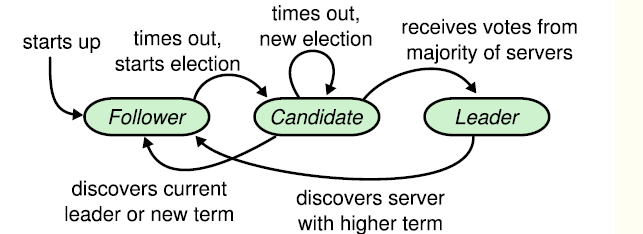

# 1 C++

## 1.1 声明和定义

## 1.2 申请二维数组

## 1.3 深拷贝和浅拷贝

- 深拷贝会申请新的内存空间，浅拷贝是将当前指针指向被拷贝对象的内存空间，不会申请新的内存空间。

## 1.4 STL中的vector，list，set，map

- vector的底层实现结构是数组，如果空间不够的话可以成倍地增加空间，如果要在前面的某个位置插入或者删除某个元素会需要很长的操作事件。
- list的底层结构是链表，对于添加元素和删除元素比较方便。
- set和map的底层结构式红黑树，都不允许插入重复元素，map是key--value式的，set的key和value是一个。

## 1.5 std::move的作用

将对象的状态或者所有权从一个对象转移到另一个对象，没有对象内存的拷贝。用途：像C++标准库vector::push_back操作，会对对象进行复制和内存拷贝，通过std::move，可以避免不必要的拷贝操作。

## 1.6 strlen和sizeof的区别

strlen是库函数；sizeof是运算符，在编译时就知道大小。

strlen取决于字符串的长短，sizeof取决于分配空间的大小。

char *s;是指针，sizeof()结果是4，因为指针的大小是5

char s[]；是字符串，sizeof()结果取决于存储字符的数量，即需要分配的空间大小

## 1.7 申请二维数组

先申请指针数组，再对指针数组的每个指针申请内存空间。

## 1.8 虚成员函数

每个声明了虚函数或者继承了有虚=虚函数的类，都会有一个虚函数表，每个实例都会有一个虚函数指针指向这个虚函数表。虚函数表中的每个元素都是函数指针，如果子类覆盖了父类中的虚函数，就会在虚函数表中替代这个虚函数指针。

调用一个虚函数实际上会使用虚函数表中保存的函数地址找到函数后二次调用。如下：

```cpp
class D{
  virtual void f1(){this->fun();}
  void fun(){cout<<"123"<<endl;}
};
D *p=new D();
p->f1();
编译器编译后是这样的：
void f1(D* this){
    (*this->vptr[2])(this);
}
但是不管是在基类还是在父类中，进入这个函数肯定是调用这个类的函数，所以需要压制一下虚拟机制，不通过虚函数表调用虚函数，节省系统开销。如下：
virtual void f1(){D::fun();}
```

### 纯虚函数

virtual void show()=0;

含有纯虚函数的类叫做抽象类，只能被继承，不能生成对象。抽象类不实现纯虚函数，提供一个接口，等待派生类去实现。

### 虚函数的继承

调用一个虚函数需要知道类型、位置。因此每个多肽类上增加两个数据成员：表示class类型的字符串或者数字、执行虚函数表的指针。在编译器，每个对象被放在虚函数表，可以通过索引找到该虚函数；在执行期，传入使用虚函数的对象，通过对象的虚函数指针和索引找到特定的虚函数。

虚函数表中存储的类型：重写的虚函数、继承的虚函数、纯虚函数。

运行时多态的原理：通过对象指针可以找到真正对象的虚函数表，虽然不知道调用父类的虚函数，还是子类的虚函数，但是直到这个虚函数在虚函数表中的某个位置，所以就可以确定调用的是真正对象的虚函数。

### 问题

#### 内联函数、构造函数、静态成员函数、模板函数可以是虚函数吗

inline：内联函数需要在编译器就确定类的信息，但是虚函数实在动态运行时确定的。

static：静态函数没有this指针，虚函数需要依靠this和虚函数表指针来实现。

constructor：虚函数等到运行时才知道调用了哪个对象的虚函数，构造函数时虚函数的话，没有办法构造。在构造函数中调用虚函数，实际执行的时父类的虚函数，因为自己的还没有构造好。

模板函数：类会在虚函数表中存放类中所有虚函数的指针，模板函数如果设计成虚函数，不能到这个模板函数实例了几个虚函数。

#### 为什么需要虚析构函数，什么时候不需要？	父类的析构函数为什么定义为虚函数

一般析构函数时释放内存资源的，析构函数不被调用的话会造成内存泄漏，这样做是为了当用一个基类的指针删除一个派生类的对象时，派生类的析构函数被调用（同时基类的析构函数也会被调用）。

不是要把所有的析构函数写成虚函数，因为当类中有虚函数时，编译器会给类添加一个虚函数表，里面用来存放虚函数指针，这样会增加类的存储空间。<font color=red> 所以，当只有把一个类作为基类的时候，才把析构函数写成虚函数。</font>

```cpp
Base base=new Derived();
delete base;//如果析构函数时虚函数，调用的时Derieved的虚函数，否则调用的是Base的虚函数
```


## 1.9 静态成员函数

静态成员函数不包含这个类的信息，这也就是为什么不能在静态成员函数调用普通类成员。

静态成员函数的主要特征是没有this指针。次要特征为：

- 不能够直接存取所属类的非静态成员函数
- 不能被声明为const、virtual、volatile
- 不需要通过类对象来调用

如果获取静态成员函数的地址，就是获取的他在内存中的地址，因为没有this指针，所以他获取的是“指向非成员函数的指针”，而不是“指向成员函数的指针”。缺乏this指针的静态成员函数，很大程度上等于非成员函数。

## 1.10智能指针

- shared_ptr：使用引用计数实现，内部的引用计数是线程安全的，但是使用对象需要加锁。
  - get：获得原始指针
  - *：解引用
  - reset，参数为空，减少计数；参数不为空，减少原计数，添加新指向。
  - ->：指针方法
  - operator bool，检查是否有效，if(p) ...。等价于return this->get()!=NULL;
  - swap()，交换内部对象
  - unique：return use_count==1；use_count该对象的引用计数；operateor = ，赋值操作增加计数。
  
- weak_ptr

  解决shared_ptr引用成环的问题

  ```cpp
  //实例
  class A{
  public:
      shared_ptr<B> m_ptr_b;
  };
  class B{
      shared_ptr<A> m_ptr_a;
  };
  void test_refer(){
      shared_ptr<A> ptr_a=new A();
      shared_ptr<B> ptr_b=new B();
      ptr_a->m_ptr_b=pb;
      ptr_b->m_ptr_a=pa;
  }
  在执行完test_refer之后，ptr_a和ptr_b析构了，但是CA、CB依旧存在，并且成员m_ptr指向对方，故没办法析构。将其成员改成weak_ptr就不会出现这种情况了。
  ```

  

  - 不能指向原始指针，只能指向shared_ptr指针，也不能将weak对象直接赋值给shared_ptr类型的变量
  - lock：拿到对应的shared_ptr
  - expired：检查指向的对象是否释放
  - swap
  - reset
  - operator=
  - use_count

- unique_ptr：独占资源。

  - get、release、reset、operator*、operator=、operator->、operator bool、swap、get_deleter
  - 跟auto_ptr没什么区别，不能通过拷贝构造和赋值获得所有权，增加了移动语义，std::unique_ptr\<int> p=std::move(p1);
  - 可以作为引用或者指针参数
  - get_deleter：获得unique_ptr对象的删除器
  - unique_ptr可以作为返回值返回，这是因为返回值优化（RVO），就是不返回临时变量，构造返回对象时直接在接收返回对象的空间中构造了。返回有名字的对象叫做具体返回值优化（NRVO）。

## 1.11 函数调用

## 1.12 如果vector为empty的话，begin()和end指向的是哪里

begin()实际上返回的是内存空间的起始点，end()实际上返回的是当前使用内存空间的结束段点。

vector的构造函数时将start和finish设置为0。每次push_back之后，会执行++finish操作。

所以如果vector为空的话，begin()和end()指向的都是内存开始的位置。

## 1.13 执行析构函数的顺序

先构造父类，后构造子类。先析构子类，后析构父类。

## 1.14 new和malloc的区别

0. 属性：new/delete是关键字，需要编译器的支持。malloc/free是库函数，需要头文件支持。

1. 参数：new操作符申请内存时无需指定内存块的大小，编译器会自行计算。malloc则需要显式地指出所需内存的大小。

2. 返回类型：new返回的是对象指针，malloc返回的是void*，需要进行强制转换。

3. 分配失败：new分配失败时，会抛出bac_alloc异常；malloc分配失败会返回NULL。

4. 自定义类型：new会先调用operator new函数，申请足够多的内存（底层通常是malloc实现），然后调用类型的构造函数；delete先调用析构函数，然后调用operator delete函数释放内存（底层通常是free实现）。

   malloc/free是库函数，只能动态的申请和释放内存，无法做构造和析构的操作。

5. 重载：c++允许new/delete重载

6. 内存区域：new申请的区域在自由存储区，malloc申请的区域是堆。自由存储区是C++的一个抽象概念，堆是操作系统的一个概念。

## 1.15 malloc的实现

```cpp
void* malloc(int size);//函数原型
```

**要求：**

- malloc分配的内存大小至少为size参数所指定的字节数
- malloc的返回值是一个指针，指向一段可用内存的起始地址
- 多次调用malloc所分配的地址不能有重叠的位置，除非某次malloc所分配的地址被释放掉
- malloc应该尽快完成内存分配并返回
- 实现malloc应该同时实现调整和释放函数（realloc、free函数）

预备知识：虚拟地址转化为物理地址需要经过内存管理单元MMU实现。MMU映射的不是字节，而是页，这个映射通过一个常驻内存的页表实现（会用TLB缓存和优化）。如果进程的某个内存页不在物理内存中，会触发缺页异常，然后将磁盘的页载入内存中，然后继续执行指令。

**内存分布**

Code：整个用户空间的最低地址部分，存放指令。

Data：存放初始过的全局变量。

BSS：存放未初始化的全局变量。

Heap：堆，地址从低到高增长，brk相关的系统调用就是从这里分配内存。

Mapping Area：mmap系统调用相关的区域，大多数malloc实现会考虑通过mmap分配较大块的内存区域。这个区域自高向低地址增长。

Stack：栈区域，自高地址向低地址增长。


进程面对的是虚拟地址，只有按页映射到物理内存地址，才能真正使用，受物理存储容量的影响，整个堆虚拟内存空间不能全部映射到实际的物理内存中。

linux会维护一个break指针，这个指针指向堆空间的某个地址，从堆起始地址到break之间的地址空间是映射好的，可以供进程访问，而从break向上，是未映射的地址空间，访问会报错。

linux通过brk和sbrk系统调用操作break指针。原型如下：

```cpp
int brk(void* addr);
void* sbrk(intptr_t increament);
```

brk将break指针直接设置为某个地址，sbrk将break从当前位置移动到increment所指定的增量。

brk成功返回0，失败返回-1，并将error设置为ENOMEM。sbrk成功时返回break移动之前所指向的地址，否则返回(void*)-1。

小技巧：如果把increment设置为0，返回当前break对应的指针。


**TLB**

# 2 计算机网络
## 2.1 HTTP

### 讲一下HTTP协议

- HTTP协议是一种超文本传输协议，是一种基于TCP的应用层协议，简单来说就是客户端和服务端进行数据传输的一种规则。
- HTTP是无状态的，HTTP本身不对发送的请求和相应的通信状态做持久化处理，可以用cookie和session记录客户端的状态。cookie是存储在本地浏览器的，session是存储在服务器端的，session存储的数据安全，但是会占用服务器的资源。可以将cookie和session混合使用，一种方式是通过coolie存储一个session_id，下次请求的时候，会把该session_id携带着，服务器根据session_id在session库中就可以获取用户的session数据。这种方法叫做sever_side session。另一种方法是将session数据加密，然后存储在cookie，这种方式叫做client_side seeion。
- HTTP请求的格式是：请求方法 资源位置 协议版本，然后换行，消息报头部字段，然后有一个空行，然后是请求正文。只有发送POST请求的时候才会有请求正文，GET方法没有请求正文。
- HTTP响应的格式是：协议版本 状态码 对状态码的文本描述，然后行换，消息报头部字段，然后空行，然后是响应正文。
- HTTP的状态码有5大类，1开头的是表示一种提示信息，是协议中间的一种状态。2开头的是表示成功。3开头的是因为服务端的资源被移除或者被永久移除，需要重定向。4开头表示是客户端错误，请求报文错误，服务器无法处理。5开头的是服务器错误，服务器在处理请求时内部发生了错误。
- GET请求时请求从服务器获取资源，这个资源时静态的文本、页面或者视频。POST请求则是向URL指定的资源提交数据，数据就放在body里。GET请求时只读属性，请求内容直接放在请求行里，对用户不安全，但是对服务器时安全的，因为不会修改服务器的内容。POST请求可以修改服务器的数据，内容在body里，对用户时安全的，但是可能会修改服务器的内容。
- HTTP优点：简单，易于扩展。缺点是无状态，明文传输，不安全。
- HTTP实在HTTP基础上加上ssl的应用层协议，增加了安全性和可靠性。ssl/tls协议基本流程：1.客户端向服务器索要并验证服务器的公钥。2.双方协商生产会话密钥。3.双方采用会话密钥进行加密通信。HTTP端口是80端口，HTTPS端口号是443端口；HTTP是明文传输，HTTPS是密文传输；HTTP建立简单，HTTPS在三次握手之后还需进行SSL/TLS握手；HTTPS协议需要向证书权威机构申请数字证书，来保证服务器的身份是可靠的。
- HTTPS采用的是对称加密和非对称加密结合的混合加密方式。
- 对称加密：加密和解密使用的是同一个密钥。对称加密只有一个密钥作为私钥。常见的对称加密算法有DES,AED,3DES。
- 非对称加密：加密和解密使用不同的密钥，一把作为公开的公钥，另一把作为密钥。公钥加密的信息，只有私钥才能解密。私钥加密的信息，只有公钥才能解密。
- 对称加密算法的效率高，但是在非安全信道上，密钥交换的安全性不能保障。
- C/S模型流程：服务端生成一对密钥，把其中的公钥交给客户端。客户端生成一个对称密钥，通过服务端给的公钥加密这个对称密钥，发给服务端。这样服务端和客户端就可以通过这个对称加密的密钥进行加密通信了。
- HTTP/0.9
  - 仅支持GET请求，仅能请求访问HTML资源。
- HTTP/1.0
  - 请求行必须在尾部添加协议版本，必须包含头消息。增加了POST和HEAD请求。可以支持多种数据格式。但是每次TCP连接只能发送一个请求，服务器响应完毕后关闭这次连接，下一次请求需要再次建立TCP连接，不支持keepalive。然后加了一个不标准的字段connection字段:keep-alive。
  - content-type字段：1.0规定，头信息必须是ASCII码，后面的数据可以是任何格式，content-type字段就是说明用的是什么格式。值由text、image、audio、video等。
- HTTP/1.1
  - 最大的变化就是引入了持久连接。就是TCP默认不关闭连接，可以被多个请求复用，不用声明connection:keep-alive。客户端和服务端发现对方一段时间没有活动，就可以主动关闭连接。还可以在客户端发送最后一个请求，发送connection：close，明确要求服务端关闭连接。
  - 加入管道机制：在同一TCP连接里，允许多个请求同时发送，服务器按顺序回应，增加了并发性，进一步改善了HTTP协议的效率。需要由content-length字段，表名数据包是属于哪一个回应的。
  - 分块传输编码：规定可以不适用content-length字段，而是用分块传输编码，只要请求或回应的头信息由Transfer-Encoding字段，就表明回应将由数量未定的数据块组成。每个非空的数据块之前，都有一个16进制的数值，表名这个快的长度。最后是一个块大小为0的快，表示本次回应的数据发送完了。
  - 新增了PUT、PATCH、OPTIONS、DELETE等，另外客户端请求得头信息新增了Host字段，用来指定服务器的域名。因为在1.0认为一个服务器对应一个主机，所以就不用传递主机名，随着虚拟主机技术的发展，一台物理服务器上可以存在多个虚拟主机，并且他们共享一个IP地址。这样客户端就可以向同一个主机的不同网站发送请求。web server上的多个虚拟站点可以共享一个ip和端口，如果请求信息中没有host头域就会出错。
  - 为每个requeest设置优先级，这样重要的请求就会有限获得响应，比如浏览器加载首页，首页的html内容优先被展示，然后是各种静态资源文件、脚本文件等加载。
  - 加入新的状态码，100 continue，可以节约带宽。客户端新发送一个头域，如果因为权限被拒绝了，就给客户端发送一个401，如果被接受了，就发送100，客户端就可以继续发送带尸体的完整请求了。
  - 身份认证机制：提供特殊的状态码和头部来帮助Web站点进行身份认证。
  - 支持文件端点续传、新增了24个错误状态码。比如409表示请求得资源与当前资源状态发生冲突，410表示服务器上的某个资源被永久的删除。
- HTTP/2.0
  - 增加双工模式，即客户端能够同时发送多个请求，服务端也能同时处理多个请求。
  - 服务器推送的功能，即不经过请求服务端主动向客户端发送数据，把客户端所需要的资源随着html一起发送到客户端，省去了客户端重复请求的步骤。
  - HTTP/2.0是个彻底的二进制协议，定义了许多帧，为将来的高级应用打好基础。
  - 为数据包做标记。
  - 引入头信息压缩机制，客户端和服务端都维护一张头信息表，所有的字段都存入这个表生成一个索引号，以后就不发送同样子单元，只发送索引号。
- HTTP使用UDP的场景：HTTP/3.0的底层是UDP，在UDP基础上对TCP重要功能进行实现和优化。

### 其他

 1. http和https的区别
http是传输的是明文，不能传输敏感信息，如银行卡号，密码。端口号一般是80。
htps是SSL+http协议，可以进行加密传输、身份认证。端口号一般是443。
3. HTTP报文 [参考](https://blog.csdn.net/weixin_43327696/article/details/106238866)
 - HTTP的报文格式： **起始行 头部字段** -空行 -**消息正文**
 注：其中**起始行**和**头部字段**称为Header，消息**正文**称为body，Header和body之间一定要有空行隔开。
 -  请求行的格式：请求方法-空格-URL-空格 -版本号-回车换成，请求的头部使用**key:value**更详细的方式说明HTTP报文，我们就是要解析这样的http请求，并发送应答报文给客户端。
 3. HTTP状态码；1.信息，服务器收到请求，需要请求者继续执行。2.成功，操作被成功接收并处理。3.重定向，需要进一步操作以完成请求。4.客户端错误，请求包含语法错误或无法完成请求。5.服务器错误，服务器在处理请求的过程中发生了错误。

请求报文格式：第一行是请求行，格式是请求方法 请求资源的位置 HTTP版本，然后是请求的头部字段


注意：请求应答报文格式的每一个冒号后面都要有一个空格。

POST http://www.baidu.com/index.html HTTP/1.0

user-agent:使用连接的程序

Host：目标主机名

Connection:处理完连接服务器是close还是keep-alive


应答报文格式：第一行是应答行，格式是：HTTP版本 状态码 状态信息。然后是应答的头部字段。然后是空一行的应答信息。

HTTP/1.0 200 OK

Server: 目标web服务器的名字

Content-Length: 目标文档的长度

Content-Type: 表示目标文档的MIME类型

Set-Cookie: 表示服务器传送一个cookie给客户端


cookie：因为HTTP是无状态的，交互式的话需要承上启下，Cookie是服务端发给客户端的特殊信息，用来区分不同的用户。发送的方式是通过HTTP的头部字段Set-Cookie来实现的。基于浏览器的自动登录就是这样实现的。


## 2.2 TCP
 TCP/IP三次握手和四次挥手 [参考](https://zhuanlan.zhihu.com/p/148070654?from_voters_page=true)
<font color=red> **TCP三次握手**</font>：**1.** 客户端向服务端发送seq=x,syn=1的报文，客户端进入SYN_SEND状态，**2.** 服务端向客户端发送ACK=1,ack=x+1,syn
 =1,seq=y的报文，服务端进入SYN_RECIVED状态，**3.** 客户端给服务端发送ACK=1，ack=y+1，seq=x+1的报文，然后客户端和服务端进入ESTABLISED状态。
**<font color=red>为什么要有要有第三次握手?</font>：如果客户端给服务端发送的SYN分节在网络中等了一段时间，这时候客户端又重新发送了一个SYN分节，如果之前那个分节到达了服务端，就会产生一个错误的连接。
<font color=red>**TCP四次挥手** </font>**1.** 客户端给服务端发送FIN=1,seq=x,客户端进入FIN_WAIT-1状态。**2.** 服务端给客户端发送ACK=1，ack=x+1，seq=y的消息报文。服务端进入CLOSE_WAIT状态，客户端进入FIN_WAIT-W状态。**3.** 服务端发送完报文后给客户端发送ACK=1,ack=x+1,FIN=1,seq=z的报文，进入LAST_ACK状态。**4.** 客户端给服务端发送ACK=1,ack=z+1,seq=x+1，客户端进入TIME_WAIT状态，等待2个MSL后进入CLOSED状态，服务端收到消息后进入CLOSED状态。
<font color =red>**问题：为什么客户端最后还要等待2MSL(最长报文寿命)?**</font>
**1.保证客户端发送的最后一个ACK报文到达服务器。** 因为这个ACK报文可能会丢失，站在服务器的角度，已经发了FIN+ACK，然后应该受到ACK报文，如果没有收到，服务器就认为自己发的报文客户端没有收到，就会重新给客户端发送，客户端就能在这个2MSL时间段内收到这个重传报文，然后给出回应报文，并且会重启2MSL计时器。
**2.防止类似于“三次握手”中提到了的“失效的报文”出现在本连接中。** 客户但发送完最后一个报文后，在这个2MSL时间中，就可以保证关于本连接的所有报文段从网络中消失，这样新的连接中就不会旧的请求报文。
<font color =red>**为什么建立连接的时候是三次握手，断开连接的时候是四次握手？**</font>
因为在建立连接受，服务端处在listen状态，收到客户端的SYN后，将SYN和ACK一起发给客户端了。
在断开连接的时候，服务端收到客户端的FIN报文后，只是表示客户不再发送数据了，但是自己的数据可能还没有发送完，需要等自己的数据发送完了再断开连接，就把FIN和ACK分开发了。如果服务端收到FIN报文之前，自己的数据已经发完了，其实也可以把FIN和ACK一起发，成为三次挥手。
<font color=red> **如果建立连接后，客户端出现故障怎么办？**</font>
如果客户端出现状态，服务端肯定不能一直等着，白白浪费资源。TCP还设有一个保活计时器，服务端每次收到客户端的消息后就重置这个定时器，这个定时器的时间通常是两个小时，如果两个小时客户端还没有给服务端发送消息，服务端就会发送一个探测报文段，以后每隔75秒发送一次，一脸发送10个探测报文仍然没有反应，服务端就会认为客户端出了故障，接着关闭连接。

<font color=red>**TCP如何保证可靠传输**</font>

- 分包排序、确认机制。
- 超时重传+接收端丢弃重复数据。
- 校验和：如果接收端的校验和有误，丢弃这个报文段。
- 利用滑动窗口机制进行流量控制，如果接收方来不及处理发送方的数据，就会提示发送方降低发送速率。有停止等待协议（11）：发一个等一个的确认。后退N帧协议（n1）：接收方收到不是期望的帧就丢弃。选择重选协议（mn）：接收方来者不拒，接收方对接受到的乱序帧进行排序，移动到最小未接收到的帧，收到帧就返回一个ACK。
- 拥塞控制：当网络拥塞时，减少数据的发送。

**拥塞控制**
TCP发送方维持一个拥塞窗口，窗口大小取决于网络的拥塞程度，发送方的发送窗口取拥塞窗口和接受方的接受窗口中的较小的那一个。
拥塞控制的四种算法：**慢开始、拥塞避免、快重传和快恢复**。
- 慢开始：发送方将数据缓慢的注入网络，由小到大增加拥塞窗口的数值。cwnd初始值为1，每经过一次往返，cwnd加倍。
- 拥塞避免：让拥塞窗口缓慢增大，每往返一次，cwnd加1。
- 快重传和快恢复：如果接收端接收到不按顺序的包，就会给发送发送一个重复确认，如果发送端接收到三个重复确认，就会立即重传丢失的包。单独包丢失时，FRR能最有效工作，多个包丢失的话就不能很有效的工作了。

**URL请求**
浏览器在和服务器建立一个TCP连接后是否会在HTTP请求完之后断开
答：这个不一定，在HTTP/1.0中，服务器响应完之后，会断开，但是也有一些服务器对connection：keep-alive的Header进行了支持。

<font color=red> TCP和UDP的区别</font>

```cpp
	-在连接方面：TCP是面向连接的，在通信前需要建立连接；UDP是面向无连接的，在通信前不需要建立连接。
	-在可靠行方面：TCP保证信息可靠交付；UDP是尽力交付，不能保证可靠交付。
	-在速度方面：TCP有确认机制，速度慢；UDP只是一直发，不管能不能到，速度快。
	-在连接对象数量方面：TCP只能是一对一；UDP可以一对一，一对多，多对一，多对多服务。
	-在发送QQ消息的时候，使用的是TCP协议；在视频通话的时候用的主要是UDP协议。
```

<font color=red>RST分节 </font>

```cpp
RST表示复位，用来异常的关闭连接。发送RST包关闭连接时，不必等缓冲区都发出，直接丢弃缓冲区的包发送RST包。接收端收到RST包后，也不必发送ACK包来确认。出现RST包的情况：
	-服务器未打开，而客户端来连接。
	-请求超时：比如设置recv的超时时间为100ms，响应超过了100ms就认为接受超时了，就会发送RST拒绝进一步发送数据。
	-提前关闭：数据没读完就关闭连接，就会发送RST分节。
	-向一个关闭的socket上写数据会收到RST分节。比如说服务器关闭了socket，客户端还在向这个socket写数据，就会收到RST分节。
```

<font color=red>SYN攻击</font>

TCP通信需要实现建立连接，第一步就是接受到SYN分节，然后进入SYN_received状态，如果攻击者不停的发送SYN分节并且不确认服务端返回的SYN分节，慢慢的服务端的SYN接收队列就满了，就不能为正常的用户服务了。

### 面试问题

1. 短连接和短链接

   短链接就是一次通信完之后关闭TCP连接，在HTTP/1.0就是仅支持短链接的。优点是管理起来方便。

   长连接就是一次通信玩之后不关闭TCP连接，在HTTP/1.1就是支持持久化连接的，一次请求之后不去关闭这个TCP连接，后面的请求继续用这个连接。优点是减少了建立TCP连接的开销。缺点是增加了管理难度，如果客户端太多会给服务端造成压力。可以使用策略将长时间不用的连接关闭。

2. TCP粘包、拆包及解决办法

   因为TCP是基于字节流的，不想UDP是基于报文的，TCP没有消息的边界。

   **下列情况下会发生粘包和拆包：**

   - 要发送的数据大于TCP发送缓冲区，需要拆包
   - 待发送数据大于最大报文长度，需要拆包
   - 发送的数据小于TCP发送缓冲区的大小，TCP将多次写入缓冲区的数据一次性发送，会发生粘包
   - 接收端的应用层没有及时读取接收缓冲区的数据，会发生粘包

   **解决办法**

   - 使得消息定长
   - 设置消息边界
   - 将消息分为消息头和消息体

3. 下列哪些场景需要使用UDP

   - 多播消息一定要用UDP，以为TCP只支持一对一
   - 如果消息短，适合用UDP
   - 如果场景性能和实时性由于完整性和安全性，适合用UDP，比如说流媒体和游戏，缺一两帧不影响用户体验

4. UDP怎么能做到可靠传输

   - 在头部增加校验和
   - 增加确认、重传机制，给帧编号
   - 增加流量控制、拥塞控制

5. 常见的socket选项

   SO_SNDTIMEO：阻塞模式下，send发不出去的最大阻塞时长

   SO_RCVTIMEO：阻塞模式下，recv收不到的最大阻塞时长

   TCP_NODELAY：禁用nagle算法

   SO_LINER：当需要关闭套接字时，协议栈发送缓冲区中尚有数据未发送时，等待的最大时长。

   SO_REUSEADDR：表示如果TCP状态处于TIME_WAIT状态，可以重用端口，如果服务进程停止后立即重启并绑定这个端口，就得设置这个选项。

   SO_REUSEPORT：此选项允许重复捆绑，但仅在想捆绑的IP地址和端口的套接字都指定了该选项才有效。

   SO_KEEPALIVE：使用心跳包机制保活。默认事件比较长，是两个小时，可以通过选项设置这个时长。

6. 服务端进程终止

   - 服务端终止会给客户端发送一个FIN报文，客户但回应ACK
   - 因为客户端收到FIN表示服务端不写了，如果客户端再往这个socket里写数据时，会受到一个RST分节。在RST之前读数据，会接受到0，表示EOF；在RST之后读数据，会产生ECONNRST错误，表示对方连接错误。

7. SIGPIPE

   针对上面的情况，如果客户端不理会服务端产生的错误，还往socket里面写，会产生SIGPIPE信号，这个信号的默认动作是终止进程，在服务端需要捕捉这个信号，以免因为向一个已经关闭的sokcet里写数据时，导致整个服务进程终止。

   即：服务端进程终止后，第一次写，返回RST分节，第二次写，产生SIGPIPE信号。

8. 服务器主机崩溃

   如果客户端向崩溃的服务器写数据，客户端的TCP试图接收服务端的ACK，但是没有接受到，因为不知道时网络的事情还是服务器主机的事情，经过多次重传，Berkely实现实在尝试12次共9跟中后才放弃重传，会给客户端发送一个错误：ETIMEOUT

   如果是某个中间路由器判断处主机不可达， 从而响应给客户端destination unreadchable的ICMP消息。错误就是EHOSTUNREACH/ENETUNREACHS

9. 服务器主动关机

   UNIX系统关机时，init进程通常给所有进程发送SIGTERM信号（可以被捕获），等待一段时间，然后给所有运行的进程发送SIGKILL信号（不可以被捕获）。当服务器进程接受到信号终止时，它所打开的描述符全部关闭。

10. 网络编程相关的信号

    - SIGPIPE：向关闭的socket写数据，发生SIGPIPE错误，默认行为时终止进程，服务器需要捕获这个信号，以免服务器进程终止。
    - SIGHUP：用户终端连接正常或非正常结束时发出，通常是在终端的控制进程结束时，通知同一会话内的各个作业，这时他们与终端没有关系，系统对SIGHUP信号的默认处理是关闭收到该信号的进程，如果进程没有捕获这个信号，就终止。在关闭终端后，前台进程组和向终端输出的进程组就会收到SIGHUP信号。对于与终端脱离关系的守护进程，这个信号用于通知它重新读取配置文件。
    - SIGURG：linux环境下，内核通知程序带外数据到达，主要时两种方法：IO复用计数、SIGURG信号。

## 2.3 TCP/IP协议簇：

- 数据链路层：实现了网络接口的网络驱动程序，以处理数据在物理媒介上的传输。

  常用协议：ARP协议和RARP协议。

  <font color=red>ARP：地址解析协议，将ip地址解析为MAC地址，因为数据链路层是通过物理地址寻址。原理是广播后目的主机返回一个ARP应答，其中包含自己的物理地址。</font>


- 网络层：实现了数据包的选路和转发。

  主要协议为IP协议、ICMP协议。

  IP协议根据数据报的IP的地址来决定如何投递它。

  ICMP协议：对IP协议的补充，主要用于检测网络连接。ICMP报文格式如下：

  8位类型  8位代码  16位校验和

  报文内容

  8位类型用于区分报文类型，将ICMP报文分为两类：差错报文（主要用来回应网络错误，如目标不可达（类型值3）、重定向（类型值8））、查询报文（查询网络信息，ping程序就是使用ICMP报文来查看目标是否可达）

  

- 传输层：为两台主机的应用程序提供端到端的通信。只关心通信的起始端和目的端，不关心数据报的中转过程。

  主要协议由TCP协、UDP、SCTP协议。

  TCP协议提供可靠的、面向连接和基于流的服务。使用<font color=red>超时重传、数据确认等方式确认数据包被正确地发送到目的端。</font>

  UDP协议提供不可靠、无连接、基于数据报的服务。每个UDP数据报都有一个长度，接收端必须以该长度为最小单位将其所有内容一次性读出，否则数据将被截断。

  

- 应用层：负责处理应用程序的逻辑。主要协议有：telnet协议、OSPF协议、DNS协议。

  telnet协议是一种远程登录协议，它是我们能够在本地完成远程任务。

  OSPF协议是一种动态路由更新协议，用于路由器之间的通信，已告知对方各自的路由信息。

  DNS协议提供及其域名到IP地址的转换。


### 2.3.1 发送一个消息的流程

当发送端使用send函数向一个TCP连接写入数据时，内核中的TCP模块会把这些数据复制到与该连接对应的TCP内核发送缓冲区中，然后TCP模块调用IP模块提供的服务，传递的参数包括TCP头部信息和TCP发送缓冲区的数据。然后依次像底层发送。

### 2.3.2 RST报文段

复位报文段通知对方关闭连接或重新建立连接。

产生RST报文段的情况：

1. 访问端口不存在。
2. 异常终止连接。TCP提供了异常终止一个连接的方式，就是非对方发送一个复位报文段，一旦发送了复位报文段，发送端所有排队等待发送的数据都将被丢弃。
3. 处理半打开连接。半打开连接：服务端掉线后客户端仍然保持着这个连接，但是服务端重启之后就没有这个连接的信息了，如果服务端向一个半打开的连接发送数据，对方会发送一个复位报文段。

### 2.3.3 带外数据

带外数据具有比普通数据更高的优先级，可以把数据直接插在发送缓冲区的头，然后接收端将带外数据放入带外缓存。带外缓存只有一个字节。如果程序没有计时读取出来，就会被后来的带外数据覆盖。

### 2.3.4 拥塞控制

使用慢启动、拥塞避免、快速重传和快恢复

慢启动：拥塞窗口被设置为IW，一般是2倍的TCP报文最大长度，然后指数增加，到达慢启动门限值。实施拥塞避免策略，拥塞窗口加1。

拥塞避免加1

快速重传和快恢复：发送端收到3个重复的确认报文段，就认为拥塞发生了。启动策略：

1. 收到3个重复的确认报文段，立即重传丢失的报文段。并设置拥塞窗口=


## 2.4 输入url，显示主页的过程  

```cpp
	- DNS解析
	- TCP链接
	- 发送HTTP请求
	- 服务器返回HTTP报文
	- 浏览器渲染界面
	- 连接结束
```

 1. dns如何解析出ip
```cpp
	1.查找：浏览器自身-操作系统(hosts)-本地域名服务器(LDNS)-根域名服务器
	2.根域名服务器返回给本地域名服务器LDNS一个主域名服务器的IP地址(gTLD Server如.com,.cn.org等)
	3.本地域名服务器LDNS给返回的主域名服务器gTLD发送请求
	4.主域名服务器根据所给的的域名查找并返回这个域名对应的Name Server，Name Server就是网站注册的域名服务器
	5.Name Server根据映射关系找到目标ip，返回给LDNS
	6.LDNS缓存这个域名和对应的ip地址
	7.LDN把解析的结果返回给用户，用户根据TTL值缓存到本地系统中，解析域名结束
```

2. 两台主机之间如何进行数据传输

   以QQ为例
   	(1)应用层封装，首先应用对消息进行封装：app+消息。识别应用程序。
   	(2)传输层封装：TCP报头+应用数据。
   	(3)网络层封装：IP报头+应用数据。
   	TCP报文包括序号确认号、控制位、校验和等，用来保证可靠传输。
   	TCP报文的源端口号和目的端口号，与源ip地址和目的ip地址唯一确定一条TCP连接。
   	(4)数据链路层：以太网首部+应用数据+以太网尾部。
   	(5)数据到达主机接口，通过网线被传送到另一个主机的接口，然后再一层层的把报头去掉，最后数据到达应用层。

## 2.5 cookie和session

- 因为HTTP协议是无状态的，需要追踪用户的会话，所以就用了cookie和session。不同的是，cookie在客户端，session在服务端。
 - cookie的就是相当于一个身份证，服务端通过response给客户端发一个cookie，客户端每次访问的时候就向服务端提交这个cookie，可以通过javascript:alert(document.cookie)来查看cookie。特征：cookie具有不可跨域名性。
 - session就是服务端把客户端的信息记录在服务期上，每次客户来访问就会查找客户的明细。
 - cookie就是检查cookie的信息来判断客户的身份，session通过检查服务器的客户明细来确定用户的信息。cookie的有效期比较长，但是不安全，session的有效期比较短，但是比session安全。

## 2.6 get请求和post请求的区别

get是申请获取资源，不会对服务器产生影响。post是客户端向服务端提交数据的方法，这种方法会影响服务器。

get是通过url传递。post放在请求体中。

get的请求在url中传递的参数有长度限制， 而post没有。

get比post更不安全，因为参数直接暴露在url中，不能用来传递敏感信息。

get请求发送一个数据包，服务器响应200 OK。post先发送header，服务器响应100 continue ，然后在发送data ，服务器再响应200 OK。

在传输一些秘密信息的时候，最好是用post。在数据查询时，最好用get。

Head：和get方法类似，不过仅要求服务端返回头部信息，而不需要传输任何实际内容。

## 2.7 代理服务器

客户表与目标服务器之间通常存在某些中转代理服务器，他们提供对目标资源的中转访问。 

代理服务器分为：正向代理服务器、反向代理服务器、透明代理服务器

正向代理服务器要求客户端自己设置代理服务器的地址，客户端每次请求都直接发送到该代理服务器上，比如说要访问被屏蔽掉的国外地址，就要使用正向代理服务器。 

反向代理服务器是被设置在服务端，反向代理是用来接收Internet请求，然后将请求转发给内部服务器，并从内部服务器上得到结果返回给客户端。

透明代理服务器智能设置在网关上。客户端不需要直到代理服务器的存在，他会改变客户端的报文，传送真实IP，一般是用在路由的NAT转发中。

# 3 操作系统

## 3.1 进程、线程、协程
- 进程:资源分配的最小单位，也就是一个运行的程序
- 线程:程序执行的最小单位，也就是程序的一个单元执行流
- 协程：用户级线程，能够充分利用单核。进程和线程的切换是要进入内核态的，协程位于线程内，切换只涉及用户态。能用同步的思想，编写异步的代码。协程就像类函数一样，可以在一个线程中创建数十万个协程，就像数十万此函数调用一样，只不过含数只有一个调用入口起始点，返回之后就结束了，而协程入口既可以是起始点，又可以从上一个返回点继续执行，也就是说协程之间可以通过yield方式转移执行权。协程的创建，受栈的影响。

线程安全:每次运行的结果和单线程运行的结果一样，其他比那量的值也和预期的一样，就是线程安全的。

线程访问权限：可以访问进程内存的所有数据，甚至可以访问其他线程的堆栈，但是一般不这样做，实际运行中线程拥有自己的私有存储空间，包括：栈、线程局部存储、寄存器。

线程私有的：局部变量、函数的参数、线程局部寄存器的数据。

线程之间共享的：全局变量、堆上的数据、函数里的静态变量、程序代码、打开的文件。

## 3.2 孤儿进程
一个父进程已经被终止的进程被称为孤儿进程，那么父进程的id就是1，即init进程id。

## 3.3 保证线程安全的方法
**竞争和原子操作、同步和锁、可重入、防过度化**

- **竞争和原子操作**：linux系统可以提供了一些常用操作的原子指令，确保了线程安全。
- **同步和锁**：在程序里面加互斥锁、读写锁、条件变量、屏障来保证线程安全。
- **可重入**：保证函数可重入可以保证线程安全。
- **防过度优化**：可以加volatile，告诉编译器对访问该变量的代码不进行优化，提供对特殊地址的稳定访问。volatile修饰的关键字，系统总是从他所在的内存中读取关键字。如果不加volatile，不同的线程有可能从内存中读取数据，有可能在寄存器中读取数据。
## 3.4 同步和互斥
互斥是通过竞争独占一个资源，彼此之间不知道对方的存在，执行是乱序的。比如说消费者的各个线程就是互斥，可以用互斥锁实现。
同步时建立在互斥之上，协调多个线程完成同一任务，彼此之间知道对方的存在，执行是有序的。比如说生产者和消费者之间就是同步，可以用互斥锁加条件变量实现。

## 3.5 死锁和避免死锁
①死锁的概念：如果试图对一个互斥量加锁两次，或者一个以上的互斥量相互访问，导致进程无法向前运行，这就是死锁。
②避免死锁：方法1：可以通过仔细控制互斥量的加锁顺序来避免死锁的发生，如果所有线程在对B加锁之前锁住A，就不会发生死锁，可能发生死锁只会在一个线程以相反的顺序对互斥量进行加锁。方法2：可以释放占有的锁，过一段时间再试，这种情况下可以使用pthread_mutex_tryunlock接口避免死锁。方法3：使用pthread_mutex_timedlock设置需要允许阻塞的时间，超时就返回EIMEDOUT，并且解开自己的锁。

## 3.6 互斥锁，mutex
①概念：互斥，线程独自占有，其他线程想占有时阻塞
②函数：

```cpp
pthread_mutex mu=PTHREAD_MUTEX_INITIALIZER;
pthread_mutex_init();//两种初始化方式
pthread_mutex_destroy();
pthread_mutex_lock();
pthread_mutex_unlock();
pthread_mutex_trylock();
```

## 3.7 文件系统

## 3.8 读写锁，也叫共享互斥锁，rwlock

①概念：读写锁有三种模式：读状态加锁，写状态加锁，不加锁。写模式的读写锁允许一个线程占用；读模式的读写锁允许多个线程占用。
②工作方式：当读写锁是写加锁状态，所有对这个锁进行加锁的状态都会阻塞；当读写锁是读加锁状态，所有对这个锁进行读加锁状态的线程都可以访问，所有写加锁状态的线程都会阻塞，直到所有线程都是放他们的读加锁。
③函数：

```cpp
pthread_rwlock_init();//初始化
pthread_rwlock_destroy();//销毁
pthread_rwlock_rdlock();//读加锁
pthread_rwlock_wrlock();//写加锁
pthread_rwlock_unlock();//解锁
pthread_rwlock_tryrdlock();//尝试加读锁，加不上返回错误
pthread_rwlock_trywrlock();//尝试加写锁，加不上返回错误
pthread_rwlock_timerdlock();//超时返回ETIMEDOUT
pthread_rwlock_timewrlock();//超时返回ETIMEDOUT
```
## 3.9 自旋锁

①概念：自旋锁和互斥量类似，但是不是通过休眠使进程阻塞，而是在获得锁之前一直自忙等(自旋)操作。
②用处：锁被持有的时间很短，而且线程并不希望在重新调度上花费太多成本。

## 3.10 记录所，应该说是字节范围锁

可以锁住文件的一个区域或者整个文件，保证一个进程读或者修改文件时，阻止其他进程修改同一文件区。多个进程写加锁和读加锁时互斥的，单个进程新锁会替换旧锁。
建议性锁：建议不阻止；强制性锁：阻止。

## 3.11 I/O多路转接、多路复用

先构造一张有文件描述符的列表，然后调用一个函数，在有准备好的I/O操作时，函数返回，并且告诉进程哪些文件描述符已准备好可以进行I/O操作。

## 3.12 条件变量

①概念：互斥量必须在锁定之后才能改变条件
②函数：

```cpp
pthread_cond_t cont=PTHREAD_COND_INITIALIZER;
pthread_cond_init();//两种初始化方式
pthread_cond_destroy();
pthread_cond_wait(cond,mutex);
pthread_cond_timewait(cond,mutex,timesp);
//wait函数的作用：释放mutex，等待cond的信号

pthread_cond_singal(&cond);//唤醒一个进程
pthread_cond_broadcast(&cond);
```

​	③条件变量存在的意义：如果直接使用mutex，除了生产者、消费者之间需要竞争互斥量之外，消费者之间也需要竞争互斥量，如果队列中没有数据，那么消费者之间竞争互斥锁是没有意义的。有了条件变量机制后，只有生产者完成生产吗，才会引起消费者之间的竞争，提高了程序效率。

## 3.13 信号
是一种软件中断。Ctrl+C产生中断信号SIGINT。 
kill 命令是向内核发送SIGTERM信号。

## 3.14 屏障

①概念屏障是用户协调多个线程并行工作的同步机制。屏障允许某个线程等待，知道所有线程都到达某一点，然后从该点执行。pthread_join就是一种屏障，允许一个线程等待，知道另一个线程退出。
②函数

```cpp
pthread_barrier_init(barrier,attr,count);//初始化屏障,可以指定count，表明在允许所有线程继续工作之前，必须到达屏障的线程数目
pthread_barrier_destory(&barrier);//销毁屏障
pthread_barrier_wait(&barrier);
//表明线程已经完成工作，准备等所有的其他线程赶上来。
//调用pthread_barrier_wait()的线程在屏障技术(pthread_barrier_init时设定)未满足条件时，会进入休眠状态，如果该线程是最后一个调用pthread_barrier_wait()的线程，就满足了屏障计数，所有的线程都会被唤醒。
//对于任意一个线程，pthread_barrier_wait的返回结果是PTHREAD_BARRIER_SERIAL_THREAD，其他线程的返回值是0，这就使得一个线程可以作为主线程，处理其他线程的工作结果。
```

## 3.15 使用线程的过程

```cpp
pthread_t tid;
pthread_create(tid,NULL,fun,arg);
void* fun(void* arg);
pthread_join(tid,NULL);
```
## 3.16 散布读(readv)和聚集写(writev)

用于在一次函数调用中读、写多个非连续缓冲区。

```cpp
函数
#include<sys/uio.h>
ssize_t readv(int fd,const struct iovec *iov,int iovent);
ssize_t writev(int fd,cosnt struct iovec *iov,int iovent);
struct iovec{
void *iov_base;//缓冲区的开始地址
size_t iov_len;//缓冲区的长度
}
```
## 3.17 函数readn和writen

本质：调用read和write直至读写了n个字节。

## 3.18 守护进程

守护进程是一种生存期长的进程，通常执行系统的日常事务。比如说系统守护进程：syslogd，login，网络守护进程sendmail，httpd等。

## 3.19 你理解的操作系统

控制计算机硬件的一个软件

##  3.20 用户态和内核态

- 区别：内核态运行操作系统程序，操作硬件；用户态运行用户程序。
- 指令划分：特权指令是只能操作系统使用，用户程序不能使用的指令，如I/O、内存清零；非特权指令是用户程序可以使用的指令，如控制转移，算术运算。
- 特权级别：R0，R1，R2和R3。R0相当于内核态，R3相当于用户态。
- 转换后：用户态->内核态，通过中断、异常、陷入机制(访管指令)；内核态->用户态，通过设置程序状态字PSW。
- 联系：一个进程在执行用户自己的代码的时候处于用户态。如果执行文件的读写操作、网络数据的收发，这些系统调用会调用内核的代码，就会处于内核态。
- 用户态切换到内核态的三种方式：1.系统调用，这是用户态主动切换到内核态的方式，比如说fork()执行了个创建新进程的系统调用，malloc执行了sbrk的系统调用。2.异常，CPU在执行用户态下的程序是，发生了一些一场，会触发当前运行进程到处理此异常的内核相关进程中，比如说缺页异常。3.外围设备的中断。
## 3.21 什么是系统调用

系统调用是应用程序和系统间的接口。比如说malloc调用了sbrk来申请内存，printf会调用write系统调用以输出一个字符串。

## 3.22 malloc和free的原理
malloc先遍历堆中的内存是否可用，如果可用并且大小符合就直接用，如果不能用的话就向操作系统中申请新的内存。
free把内存归还给操作系统。

## 3.23 系统调用和库函数的区别：

系统调用是由内核实现的，库函数是从用户角度实现的，有时候库函数会调用系统调用。

## 3.24 进程和线程区别

- 进程是资源分配的最小单位，线程是cpu调度的最小单位。
- 线程必须在进程先运行；一个进程可以包含多个进程。
- 不同进程之间很难共享数据；同一进程下的不同线程很容易共享数据，当线程共享一个内存时，可以加互斥锁。

## 3.25 什么是协程

协程是用户级线程，不需要操作系统管理，减少了系统开销

## 3.27 阻塞I/O、非阻塞I/O

阻塞I/O：每个用户一个线程，线程会等待用户I/O操作，I/O操作完之后才会继续执行。
非阻塞I/O：一个线程服务多个用户，线程给用户注册一个回调函数，用户完成I/O操作后执行回调函数。

## 3.28 对于I/O密集型程序

最佳线程数=cpu核数\*（1/cpu利用率）=cpu核数*（1+i/o耗时/cpu耗时）

## 3.29 操作系统由哪些构成

操作系统由内核、驱动程序、接口库、文件系统、外围组成。其中最重要的内核由进程调度、内存管理、网络接口、虚拟文件系统、进程间通讯五部分组成。

## 3.30 进程的状态、切换、调度

- 状态
	- 就绪：进程具备运行条件，等待系统分配处理器就可以运行。
	- 执行：进程占有处理器正在运行。
	- 阻塞：进程不具备运行条件，正在等待某个事件完成，比如说等待互斥量解锁。
- 状态的切换：
	- 就绪->运行：就绪状态的进程，当进程调度程序分配了处理器后，就变为运行状态。
	- 执行->就绪：处于执行状态的进程，由于分配给他的时间片用完了，必须让出处理器，就变为就绪状态了。
	- 执行->阻塞：处于执行状态的进程因为等待某个事件发生无法继续执行，就变成阻塞状态。
	- 阻塞->就绪：阻塞状态的进程，若其等待的时间已经发生，于是进程由阻塞状态变为就绪状态。
## 3.31 操作系统中的进程调度算法

- 先来先服务调度算法
- 短作业优先调度算法
- 高优先权优先调度算法
- 高响应比优先调度算法
- 时间片轮转法
- 多级反馈队列调度算法：①设置多个就绪队列，第一个优先级最后，然后优先级一次降低。②有新进程来了将新进程放在第一个就绪队列的末尾，如果正在执行的进程能执行完，就撤离系统，如果执行不完就放在下一个就绪队列的末尾。③如果前面的就绪队列为空，并且有新进程来了，那么就将正在这执行的进程放在这个就绪队列的末尾，去执行新的进程。
## 3.33 线程的实现方式（一对一、多对一等）

## 3.34 互斥与同步（信号量、管程、锁）

## 3.35 并发经典的问题：读者写者、哲学家就餐问题

## 3.36 为什么需要虚拟内存，MMU 具体如何做地址转换的

## 3.37 内存为什么分段、分页，在笔记操作系统

## 3.38 页面置换算法

## 3.40 文件系统是如何组织的

## 3.41 虚拟内存

- 虚拟内存
	[参考](https://www.jianshu.com/p/415618863d52)
	- 现代处理器的寻址方式：程序虚拟寻址。CPU生成的虚拟地址在传送给主存之前被翻译成一个物理地址。地址翻译需要CPI硬件和操作系统共同管理，CPU上的叫做内存管理单元，利用查询表翻译虚拟地址，查询表由操作系统管理。
	- 程序和虚拟内存的关系：因为一个程序是逐段执行的，将需要执行的程序从硬盘中复制到内存中，其他不运行的程序保存在硬盘里。经过有目的的换入换出，处理器就可以运行一个大于实际物理内存的程序。也就是说处理器好像拥有了一个大于实际屋内空间内存的内存空间，这个储存空间叫做虚拟内存，真正的内存空间被称为实际物理内存空间。
	- 映射：由于存在两个地址，因此一个应用程序从编写到执行，需要进行两次映射。第一次映射是到虚拟内存空间；第二次映射是到物理内存空间，第二次映射是有硬件和软件共同完成的，硬件部分是储存管理单元，软件部分是操作系统的内存管理模块。
	- 虚拟地址/物理地址表格：用来映射虚拟地址和物理地址，操作系统的内存管理模块建立，以虚拟地址位索引，记录了程序段所占用的物理地址，是硬件的存储管理单元将虚拟地址转换为实际物理地址的依据。
	- 技术关键：程序映射表
- linux的虚拟内存技术
	- 页和页框：linux将虚拟空间分为若干个大小相等的存储分区，成为页；然后按页的大小划分为若干块。物理内存中的块叫做页框。页与页块是linux实现虚拟内存技术的基础。页和页框的带下一般是4kB，根据系统和应用的不同，也和页框页可能会变化。高位段是页和页框的编码，低位段时页和页框的偏移量。
	- 在将一个页映射到某个页框上的同时必须将页码和对应的页框码填入映射记录表中。
	- 进程和虚拟空间：每个进程都有自己的4G空间，新进程建立的时候会建立自己的内存空间，进程的数据、代码等会从磁盘拷贝到自己的进程中间，每个进程分配的内存空间都会与对应的磁盘空间映射。每个进程的4G空间实际上时虚拟内存空间，每次访问内存空间的地址都需要将地址翻译为实际物理内存地址。
	- 页表：所有进程共享同意物理内存，每个进程只把自己目前所需的虚拟内存空间映射到物理内存上。进程需要知道那些内存地址上的数据在物理内存上，哪些不在，在物理内存上的哪里，因此需要页表来记录。页表中的每一个表项分为两部分，第一部分记录此页是否在物理内存上，第二部分记录物理内存页的地址。
	- 缺页异常：当进程访问某个虚拟地址时会去查看页表，如果发现对应的数据不在物理内存上则出现缺页异常。缺页异常的处理过程是将进程所需要的数据从磁盘拷贝到物理内存中，如果内存已满没有空余位置，就回去找一个页进行覆盖，如果覆盖过的页曾经被修改过，需要将此页写回磁盘。
- 优点：利用碎片，使用库文件的代码，可以只储存一份这样的代码
- 进程加载时，内核只是位进程创建了虚拟内存的布局，具体是初始化进程控制表中内存相关的链表，不直接拷贝到物理内存，只建立虚拟内存和物理内存的映射，等运行相关程序时，才会通过缺页异常来拷贝数据，进程运行过程中需要动态分配内存，比如malloc也只是分配了虚拟内存，也就是虚拟内存对应的也白哦项的相关设置，进程真正访问到此数据时才引发缺页异常。
## 3.42 虚拟文件系统

- 引论：虚拟文件系统屏蔽了不同文件系统的操作差异和实现细节，提供了统一的实现框架和操作接口，降低了操作文件和接入新文件系统的难度。
- 虚拟文件系统是内核的一个软件层，给用户的程序提供文件系统接口；同时它也提供了内核中一个抽象的功能，允许不同的文件系统共存。借用虚拟文件系统可以是应用open、read、write这些系统调用操作文件。
- 比如说ret=write(fd,buf,len);首先会调用虚拟文件系统的通用系统调用sys_write()；接着sys_write()会根据fd找到所在文件系统提供的写操作函数op_write()，最后调用文件系统的写操作函数op_write()。
- 四种对象类型：①超级块对象：代表一个已安装的文件系统；②索引节点对象：代表具体文件；③目录项对象，代表哦一个目录项，是文件路径的一个组成部分；④文件对象：代表进程打开的文件。

## 3.43 exit和_exit

exit先执行一些清理，返回后返回内核:_exit直接返回内核。

## 3.44 为什么有了close之后，还是用shutdown呢？

- 首先，只有最后一个活动引用关闭时，close才释放网络端点。这意味着如果复制一个套接字，要直到关闭了最后一个引用他的文件描述符才释放这个套接字。而shutdown允许一个套接字处于不活动状态，和引用它的文件描述符数目无关。
- 其次，游客可以很方便地关闭一个套接字传输中的一个方向。例如，如果想让所通信端的进程能够确定数据传输何时结束，可以关闭该套接字的写端然后通过该套接字的读端仍可以继续接受数据。
## 3.45 进程标识

网络地址：端口号

## 3.46 字节序

处理器架构特征，用来指示像整数这样的大数据类型内部是如何排序的。分为：大端字节序：就是高位放在低地址上；小端字节序，低位放在低地址上。TCP/IP协议栈是使用的大端字节序。

## 3.47 指数补偿

在客户端connect服务端的时候，如果出现错误，进程会休眠一段时间，这个时间是指数级别的增加，直到到达一个阈值，关闭连接的套接字。

## 3.48 IO模型

同步IO，异步IO，阻塞IO，非阻塞IO(以下都使用linux下的recv作为例子) [参考知识](https://www.cnblogs.com/felixzh/p/10345929.html)

- **阻塞IO模型**：使用recv的默认参数一直等数据，直到拷贝到用户空间。**这种IO模型是同步的。** like：水龙头没有水，A同学需要等水装满杯子才能去做其他的事情。
- **非阻塞IO模型**：使用recv，改变flags，不管有没有获取到数据都返回。**这种IO模型也是同步的。** 水龙头没水，B同学等一会儿再过来看。这种情况下离开了装水现场(回到了用户空间)。
- **IO复用模型**：调用recv前调用select或者epoll，网络数据到达内核后，内后告诉用户进程。**期间阻塞与select或者epoll，没有阻塞于recv，也可以叫做非阻塞IO，同步IO。** C同学告诉阿姨看水龙头，水龙头有水了，阿姨告诉C同学，C同学去接水。
-  **信号驱动IO模型**：通过调用sigaction注册信号函数，等内核数据准备好的时候系统中断当前程序，执行信号函数。D同学让舍管阿姨等有水的时候取通知他接水(注册信号函数)，D同学得知有水了，去接水(执行信号函数)。
- **异步IO模型**：调用aio_read，让内核等数据准备好，并且复制到用户进程空间后执行实现制定好的函数。E同学让舍管阿姨将杯子装满水后通知他，整个过程E同学都可以做别的事情，**这是真正的异步IO。**[参考异步IO实现](https://blog.csdn.net/zhxue123/article/details/21087165)
- 总结：

## 3.49 进程间通信的方式

- 无名管道：速度慢、容量有限，并且只能在有关系的进程间通信。**本质是内核管理的一个环形队列。**
- 命名管道：命名管道可以在任何进程间通信，但是速度满。**本质是内核管理的一个有名字的环形队列。**
- 消息队列：消息队列就是一个链接表，一个消息由一个标识符来标识。**本质是内核维护的一个链表。**
- 信号量：不能传递复杂消息，只能用于同步。**本质是内核维护的一个计数器。**
- 共享内存：速度快，但是要保持同步，比如一个写的时候，另一个要注意读写的问题，相当于线程间的线程安全。**本质是内核维护的一个内存。**

### 在进程间传递文件描述符

传递一个文件描述符不是传递文件描述符的值，而是在接收进程中创建一个新的文件描述符，并且该文件描述符和发送进程中被传递的文件描述符指向内核中相同的文件表项。

## 3.50 协程

协程是比线程更加轻量级的存在。一个线程可以有多个协程，实现方式是线程创建几个执行体，给他们各自指定执行入口，申请一些内存给他们作为执行栈，那么线程就可以按需调度这几个执行体了，同时线程会记录执行体的ID、栈的位置、执行入口地址、执行现场等。协程是程序控制的，不用操作系统去管理，也被称为用户态线程，不会像线程切换那样消耗资源。

## 3.52 创建进程的一个流程

1. 申请空白PCB。
2. 为进程分配资源。
3. 初始化PCB。
4. 将新进程插入就绪队列。

## 3.53 函数调用的过程

栈帧：栈帧可以认为是程序栈的一段，有两个端点，一个表示着起始地址，一个标识着结束地址。起始地址存在%edp寄存器中，结束地址存在%esp寄存器当中。栈指针向下移动相当于分配了内存，栈指针向上移动相当于释放了内存。

过程的实现主要就是数据如何在调用者和被调用者之间的传递，以及被调用者局部变量内存的分配和释放。

过程调用大概是以下几个步骤：

1. 备份原来的帧指针，调整当前的帧指针到栈指针的位置。
2. 将栈指针下移，给被调用者的临时变量预留内存。
3. 备份被调用者保存的寄存器当中的值，如果有值得话，备份的方式就是压入栈顶。
4. 使用建立好的栈帧，比如读取和写入，一般使用mov，push以及pop指令等等
5. 恢复被调用者寄存器的值。
6. 释放被调用者的栈帧，加大栈指针。
7. 恢复调用者的栈帧，将帧指针放到原来的位置。
8. 弹出返回地址，跳出当前过程，继续执行调用者代码。

## 3.54 软中断和硬中断

中断是一种电信号，当设备有某种事件发生时，就会产生中断，通过总线把电信号发送给中断控制器。

硬中断是由系统外设（网卡、磁盘之类的硬件）产生的。

软中断是由当前正在运行的进程产生的，这种中断时需要CPU为进程做一些事情，比如说IO请求。这种特殊的软中断时Yield调用，作用是请求内核调度器去查看是否有一些其他的进程可以运行。

软中断不会抢占另一个软中断，唯一可以抢占软中断的是硬中断。因为要保证硬件中断处理程序要快速的完成任务。

## 3.55 进程组、会话

每个进程都隶属于一个进程组，每个进程组都有一个首领进程，进程组ID和首领进程ID相同。

一些有关联的进程组将形成一个会话。进程组的首领进程不能创建会话，非首领进程的进程，可以创建一个会话，同时调用进程称为会话的首领，新建一个进程组，其进程组ID就是调用进程的ID，如果有终端的话调用进程将甩开终端。

## 3.56 Reactor模型和Proactor模型

### Reactor模型

Reactor模型是这样一种模型，它要求主线程只负责监听文件描述符上是否有事件发生，有的话立即将事件通知工作线程。除此之外，主线程不做任何其他任何实质性的工作。读写数据、接收新的连接，以及处理客户请求均在工作线程中完成。

工作流程是：

1. 主线程往epoll内核时间表注册socket上的读就绪事件
2. 主线程调用epoll_wait等待socket上有数据可读
3. 当socket上有数据可读时，epoll_wait通知主线程，主线程则将sokcet可读事件放入请求队列
4. 工作线程被唤醒，从socket读取数据，并处理客户请求，然后往epoll内核事件表中注册该socket的写就绪事件
5. 主线程调用epoll_wait等待socket可写
6. 当socket可写时，epoll_wait通知主线程，主线程将socket可写事件放入请求队列
7. 工作线程被唤醒，往socket上写入服务器处理客户请求的结果。

### Poractor模型

Proactor模型将所有的I/O操作都交给主线程和内核来处理，工作线程只负责业务逻辑。

使用异步I/O模型实现Proactor模型的工作流程是：

1. 主线程调用aio_read函数向内核注册socket上的读写事件，并告诉内核用户读缓冲区的位置，以及读操作完成时如何溶质应用程序。
2. 主线程继续处理其他逻辑
3. 当socket上的数据被写入用户缓冲区后，内核向应用程序发送一个信号，以通知应用程序数据已经可用
4. 应用程序预先定义好信号处理函数，选择一个工作进程来处理客户请求。工作线程处理完用户请求之后，调用aio_write函数向内核注册socket上的写事件，并告诉内核用户写缓冲区的位置，以及写操作完成时如何通知应用程序。
5. 主线程继续处理其他逻辑
6. 当用户缓冲区的数据被写入socket之后，内核向应用程序发送一个信号，以通知应用程序数据已经发送完毕。
7. 应用程序预先定义好的信号处理函数选择一个工作线程来做善后处理，比如决定是否关闭该socket。

### 模拟Proactor模式

模拟Proactor模式是主线程执行数据读写操作，读写完成后，主线程向工作线程通知这一完成事件，那么从工作线程的角度来看，他们就直接获得了数据读写的结果，接下来就是对读写结果的逻辑处理。

使用同步I/O模拟出的Proactor模式的工作流程：

1. 主线程往epoll内核事件表中注册socket上的读就绪事件
2. 主线程调用epoll_wair等待socket上有数据可读，有数据可读时，主线程读取到没有数据可读，并将数据封装好放入请求队列中。
3. 工作线程被唤醒拿到请求队列的数据进行逻辑处理，然后向epoll内核事件表中注册写就绪事件。
4. socket可写时，主线程往socket中写如服务器处理客户请求的结果。

## 3.56 两种并发编程模型

半同步/半异步、领导者/追随者模式

### 半同步/半异步模型

这里的同步是程序完全按照代码序列的顺序执行，异步是程序的执行需要有系统事件驱动，如终端、信号等。

同步线程用于处理客户逻辑，异步线程用于处理I/O事件。

异步线程监听到客户请求后，就将其封装成请求对象插入请求队列中，请求队列将同步某个处于同步模式的工作线程来读取并处理该对象。可以以Round Robin的方式轮流使用工作线程，也可以使用条件变量或信号量随机选取一个。

然后有多种变体，比如半同步/半反应堆模型。即主线程调用epoll_wait来监听是否有新的连接，如果有新的而连接就将新连接的socket的都就绪事件注册到epoll内核事件表中，有事件发生时就将这个sokcet封装成请求对象放入请求队列中，然后工作线程通过竞争互斥锁来来处理这个请求。

缺点是主线程和工作线程共享请求队列，主线程往里面插入，工作线程消耗。需要堆请求队列加锁，浪费CPU。每个工作线程同一时间只能处理一个客户请求，如果客户数量多，工作线程少，请求队列就会堆积许多任务对象。如果通过增加工作线程来解决这一问题，工作线程的切换也会浪费CPU。

 ### 领导者/追随者模式

领导者模式是多个工作线程轮流获得事件源的集合，轮流监听、分发并处理事件的一种模式。在程序的任何一个时间点，只有一个领导者，其他的工作线程在线程池中等成为新的领导者，当领导者检测到有I/O事件，首先在线程池中推选出新的领导者，然后去处理事件。此时新的领导者等待I/O事件的发生，原来的领导者去处理I/O事件。

## 3.57 有限状态机

状态机就是执行完某个任务转移到另一个状态。

有限状态机解析HTTP请求头部：判断HTTP头部结束的一句是遇到一个空行。该空行仅包含一对回车换行符，如果依次读操作没有读入HTTP请求的整个头部，即没有遇到空行，就必须等待用户继续写数据并读入。在寻找空行的时候对HTTP头部进行解析。

## 3.58 信号处理函数

要为一个信号设置一个处理函数，可以使用signal系统调用。

## 3.59 高性能定时器

### 时间轮

时间就像一个轮子，在转动的时候外界会指向轮子的不同区域，该区域就可以被利用。因此只要将不同时间的定时器按照一定的方法散列到时间轮的不同槽之中，就可以实现在转动某个槽时，进行判断该定时器是否已经到达运行时间。

### 时间堆

使用二叉堆实现最小堆，通过上浮和下沉实现节点的增加和删除，保持二叉树有序，根节点最小。删除的时间复杂读为O(logn)

## 3.60 高性能I/O框架库 libevent

 linux服务器程序必须处理的三类时间：I/O时间、信号、定时事件。

组件：句柄、时间多路分发器、事件处理器和具体的事件处理器、Reactor。

句柄：要处理的对象。

时间多路分发器：在事件循环中使用I/O复用技术，内部使用select、poll、epoll_wait等系统调用

事件处理器和具体的事件处理器：通常包含一个或多个hand_event回调函数，这些回调函数在事件循环中被执行。

Reactor：Reactor是I/O框架的核心：提供的几个主要方法：

handle_events：执行事件循环 。重复如下过程：等待事件，然后依次处理所有就绪时间对应的事件处理器。

register_handler：该方法调用事件多路分发器的register_event方法来往事件多路分发器中注册一个事件。 

remove_handler：该方法调用事件多路分发器的remove_event方法来删除时间多路分发器中的一个事件。

## 3.61 I/O模型

5种I/O模型

阻塞IO模型：一直等数据，直到拷贝到用户空间。

非阻塞IO模型：不管有没有获取到数据都返回。

IO复用模型：注册得socketfd上网络数据到达后，内核告诉用户线程。

信号驱动IO模型：注册信号函数，等内核数据准备好后，系统中断当前程序，执行信号函数。

异步IO模型：内核将数据复制到用户空间，然后执行制定好的函数。

## 3.62 一个进程里面的多线程，如果一个线程挂掉了，影响其他线程吗

- 如果进程不屏蔽segment fault信号，一个线程崩溃，所有线程中介
- 如果屏蔽segment fault信号，且线程崩溃的位置是线程私有位置，那么线程没有问题；如果崩溃的位置是线程共享位置（堆，全局变量等），那么其他线程也会出现问题。

## 3.63上下文切换

线程的时间片用完了，就会切换到下一个线程，同时需要保留上一个线程的状态，这个状态包括通用寄存器和程序计数器的内容。在切出时，操作系统将状态保存到内存，切入时操作系统从内存中加载现成的状态继续执行。

## 3.64协程的实现

一个程序真正运行起来，需要两个因素：可执行代码段、数据。体现在CPU中，主要包含以下几个方面：

- EIP寄存器：用来存储CPU要读取指令的地址
- ESP寄存器：指向当前线程栈的栈顶位置
- 其他通用寄存器的内容：包括戴白哦函数的rdi、rsi等
- 线程栈中的内存内容

这些数据内容，是上下文。协程的原理，就是从线程的上下文入手，将现成的上下文完全改变，即：改变EIP寄存器的内容，指向其他指令地址；改变线程栈的内存内容等等。这样，当前线程运行的程序也就完全改变了，是一个全新的程序。

协程的实现分为有栈和无栈，有栈的实现方式又是可以分为独立栈和共享栈。

### 共享栈的实现

## 3.65 限制进程使用的系统资源

在程序里面使用#include<sys/resource.h>面的getrlimit、setrlimit函数，或者使用shell里的ulimit。

## 3.66文件权限

owner-group-others

rwx，421


# 4 数据库


# 5 数据结构
## 5.1 解决哈希表冲突

哈希冲突：算出来的哈希值的地址被占了

- 开放寻址法
	- a.线性探测法：插入数据时如果冲突就往后找空闲的位置放；寻找数据时，依次往后对比，如果遍历到空闲位置还没有找到，就说明不在集合里。删除后标记一下deleted。
	- b.二次探测：二次探测的步长标为原来的平方。
- 再哈希法：冲突就再次哈希。
- 链表法：每个桶对应一个链表，插入的时候直接查到表头，插入的实践复杂度时O(1)，查找删除的时间复杂度时O(k)，k表示链表的节点数。如果哈希冲突比较多的话可以利用红黑树代替链表。
- 建立公共溢出区：把和表冲突的元素，一律放到溢出区。
## 5.2  平衡二叉树、B树、B+树、B*树
 [参考博文](https://blog.csdn.net/v_july_v/article/details/6530142)
 - 1.平衡二叉树：二叉树、左孩子<根节点<右孩子、左右子树的高度差小于1、没有重复值
 - 2.B树(B-树)
 	- 特性：B树的分支因子比较大，可以在时间logn的内快速的插入和删除节点，当B树有N个关键字，m阶时，其最大高度是**$log_{m/2}^{(N+1)/2}+1$**
 	- 特点：
	 	- 1.左小右大；
	 	- 2.非叶子节点的子结点树>1，且<=M，并且M>=2，空树除外，M是M个搜索路径
	 	- 3.枝节点的关键字数量大于ceil(M/2)-1个，且小于M-1个
	 	- 4.所有叶子节点均在同一层，叶子节点除了包含了关键字和关键字记录的指针，也有指向其子结点的指针，不过是这项null，对应下一层
- 3.B+树
		- B树的异同点：1.n棵子树对一个n-1个关键字； 2.所有的叶子节点包含了全部关键字的信息；3.所有非终端节点可以索引部分。
		- 为什么用B+树作为索引：1.B+树磁盘读写代价更低，因为他的内部节点没有指向关键字具体信息的指针；2.B+树查询效率更稳定，因为他的非终节点不是指向文件内容的节点，所有的查询都有从根节点走向叶子节点，这样每次查询的效率都相当。
- 4.B\*树		
		- 特点：空间使用率高，要求块的使用率为2/3；增加了指向兄弟节点的指针，
		- B+树的分裂：当一个节点满时，分出1/2到一个新的节点，父节点在增加一个指向这个节点的指针。
		- B\*树的分裂：当一个节点满时，如果下一个兄弟节点没有满，将一部分数据移到兄弟节点中，再在原节点中插入关键字，最后修改父节点的关键字；如果下一个兄弟节点满了，就在中间创建一个新的节点，原节点和兄弟节点各迁出1/3到新节点，最后在父节点中创建指向新节点的指针。
		 注：B*树创建新节点的概率比B+树创建新节点的概率要低，空间使用率要高。
	注：平衡二叉树要尽量避免成为链表，一般用红黑树实现

## 5.3 红黑树的插入

1. 数为空，直接插入

2. 存在该结点，直接更新

3. 父节点为黑，直接插入

4. 父节点为红

   4.1 父红+叔叔红，变色，把爷爷结点当作插入结点

   4.2 父红+叔叔黑或不存在

   ​	4.2.1 父亲是左节点

   ​		4.2.1.1 插入结点时左节点，对爷爷右旋，父变黑，爷爷变红

   ​		4.2.1.1 插入结点时右节点，对父右旋，爷爷右旋，父变黑，爷爷变红（称为对于插入结点来说的）

   ​	4.2.2 父亲是右节点

   ​		类似父亲是左节点 		

   

## 5.4 拓扑排序

某一个活动需要在另一个活动之前，AOV网，用顶点表示活动的网

步骤：

1. 从AOV网选择一个入度为0的顶点并输出
2. 从网中删除该顶点和所有以他为起点的有向边
3. 重复1.2直到AOV网为空。

核心：不断弹出入度为0的结点。

代码实现：一个数组存储入度数量，将入度为0的结点放入栈中，然后弹出并将该节点的下一节点的入度减1，如果下一结点入度为0，压栈。重复至栈为空。

# 6 算法

## 6.1 判断数组是否有三个递增元素(不要求连续)

## 6.2 拓扑排序

依赖关系，如结构体之间的依赖关系。

将入读为0的结点放入队列，然后弹出并将下一个结点放入队列，直到队列为空

# 7. 项目

## 1.详细介绍webserver项目

这是一个使用C++基于Reactor模型的web服务器。使用的技术有非阻塞IO、事件驱动、多缓冲区异步日志、线程池、基于小根堆的定时器、智能指针等RAII机制，使用有限状态机解析post和get请求，然后我用webbench压测一下，吞吐量可以达到4Gb/s。

## 2.非阻塞IO怎么实现的

使用fctl将套接字设置成非阻塞IO，就是执行后立即返回，而不是阻塞。然后将有写请求的套接字注册到epoll中，可以写的时候就调用对channel注册的回调写函数。

## 3.select/poll/epoll的区别和实现原理

IO多路复用：监视多个文件描述，一旦某个文件描述符就绪，就能通知进程执行相关的读写操作。

### 区别

select：本质是通过设置或者检查存放fd标志位的数据结构来进行下一步处理的。每次调用select，都需要把fd集合从用户态拷贝到内核态，开销大；select返回时需要轮询哪些fd有事件；select支持的文件描述符太少，默认是1024。

poll：poll和select相似，但是是由链表存储的，没有连接数的限制。

epoll：epoll每次注册新的事件，都会把fd拷贝到内核，不是在epoll_wait的时候重复拷贝；使用红黑树存储注册事件，就绪链表存储就绪事件，有事件发生时，执行内核向设备驱动程序注册的回调函数，将文件描述符对应的结点从红黑树拷贝到就绪列表上，并告知用户，用户不需要轮询。有LT模式：就绪事件一次没有处理完就会一直就绪。ET模式：就绪事件只能处理一次，若没有处理完会再下次的其他事件就绪时再进行处理，同时为了保持数据的完整性，最好是非阻塞的读写。

### select原理

使用位域表示fd，位域有最大长度，32机器中select监听的最大描述符的数量是1024。

过程是先遍历一遍是否可读，如果有事件就绪就返回就绪的个数，并标记该文件可读。否则就将该进程加入到每个文件对应的设备驱动程序的等待队列种，并进入睡眠状态，有就绪事件发生时设备驱动程序执行回调函数，然后select返回就绪数目。

### poll原理

poll和select的区别不大，但是是用链表存储套接字，没有最大连接数目的限制。

### epoll原理

调用epoll_create时，内核会帮我们再epoll文件系统里创建一个file结点，再内核缓存里创建一个红黑树存储注册的socket和就绪链表存储准备就绪的事件，当epoll_wait调用时，只需要观察这个双向链表就可以。

就绪链表得到就绪事件的方式是将所有添加到epoll的事件与驱动程序建立回调关系，相应的事件发生时会调用这个回调方法，这个回调方法在内核中叫做epoll_callback，这个回调方法会把事件放入就绪链表中。


### 进程的睡眠和唤醒

核心是等待队列。等待队列是通过结构体list_head实现，其包含一个头节点和若干队列元素。头节点包含一个指向第一个队列元素的指针和一个保护队列的自旋锁，当插入和删除元素时，均使用自旋锁保证同步。


## 4.多线程、锁的问题

程序中有一个主线程接收sockfd，然后以round robin的方式分发给子线程，主线程和子线程之间会存在锁的争用，用来维护子线程的任务队列。

## 5.线程池

主线程负责accept新的连接，然后以Round Robin的方式将新的连接分配给线程池里的线程，线程池中的每个线程持有一把锁保护任务队列，主线程会和子线程争夺这把锁，主线程得到锁之后将任务插入任务队列，然后向eventfd执行写操作，唤醒子线程，然后处理活跃事件和任务队列里的任务。

# 8. 实习

封装人脸模型SDK，主要是使用公司提供的底层库将训练好的模型封装起来，包括配置模型处理的图片、定义输入输出，让用户对其进行调用。

linux下测试多线程函数运行速度遇到的困难，1.有一次测试的时候发现多线程的运行时间比单线程慢，这是因为当时服务器运行的程序比较多，线程之间的切换开销比较大，后来服务器空闲的时候，再测试就正常了。2. 有一次测试的时候使用的函数是time，这个测试的是cpu滴答的时间，而不是实际运行的时间，后来改成使用gettimeofday函数，就是程序运行的实际时间了。3. 还有就是一个胜利油田的磕头机项目，在调整方向的时候需要进行进制转换，刚开始的时候没有进行进制转换，不能准确的调整方位，后来又研究了一下说明文档，才发现这个问题。

perf-tools工具的原理：原理是libcmalloc.so重载了libc中的malloc和new方法，可以统计每个函数分配和释放了多少内存。


# 9. linux

## 1.export的作用

设置环境变量

## 2. 查找

find . -name "txt"

grep -r "txt" .

## 3.系统检测工具


tcpdump：查看TCP包

lsof：查看系统打开的文件。

nc：网络测试瑞士军刀。

strace：测试服务器性能的工具，跟踪进程执行的系统调用和接受到的信号，并将系统调用名、参数、返回值及信号名输出到标准输出或者指定的文件。

netstat：打印本地网卡接口上的全部连接、路由信息、网卡接口信息等。

vmstat：实时输出系统的各种资源的使用情况，比如进程信息、内存使用、CPU利用率以及I/O使用情况。

ifstat：网络流量检测工具。、

mpstat：实时检测多处理器系统上每个CPU的使用情况。

df：查看磁盘信息

top：查看系统资源的使用情况

# 10 开源项目

## 1. rpc

开源的rpc框架有阿里的Dubbo、Facebook的Thrif、Google的gRPC、Twitter的Finagle。

实现RPC最简单的方式是实现三个技术点：服务寻址（Call ID映射）、数据流的序列化和反序列、网络传输

# 11 分布式

分布式系统的三个指标：数据一致性、系统可用性、节点连通性和扩展性

数据强一致性：是希望系统只读到最新写入的数据

可用性：如果系统每运行100个时间单位，会有1个时间单位无法提供服务，则说系统的可用性是99%

节点连通性和扩展性：多个节点不是相互独立的，需要相互通信，当节点发生无法联通时，数据能否保持一致。

**CAP原理**

一致性（consistency）、可用性（availability）、分区容忍性（partition tolerance）

## raft算法

raft算法时一种leader-based的共识算法，raft会先选举除leader，leader完全负责replicated log的管理，leader 负责接受所有客户端更新请求，然后复制到follower节点，并在“安全”的时候执行这些请求，如果leader故障，followes会重新选举出新的leader。

在raft协议中，一个节点在任意时刻处于一下三种状态：

leader、follower、candidate




所有节点启动时都是followe状态，如果一段时间没有收到leader的心跳，就从followe状态变为candidate状态，发起选举；如果收到大多数服务器的选票，就变为leader状态；如果发现其他节点比自己更新，则主动切换为follower状态。

总之：系统中最多只有一个leader，如果一段时间内没有发现了leader，大家就投票选出leader，leader会不停的给follower发送心跳，告知自己的存活状态。如果leader故障，follower变为candidate，重新选出leader。

term：任期。

split term：在某个term，因为平票，没有选举出leader就结束了，然后会发生新的选举。

randomized election timeouts：避免平票的出现。

leader调度并发请求的顺序，并且保持leader和followers状态的一致性。raft的做法是，将这些请求以及执行顺序告知followers，leader和followers以相同的顺序来执行这些请求，来保证数据的一致性。

共识算法的实现一般是基于复制状态机，即相同的初始状态+相同的输入=相同的结束状态。不能引入不确定的值，比如本地时间。使用replicated log 可以保证以相同的顺序得到相同的输入，log具有持久化、保序的特点，是大多数分布式系统的基石。

在raft中，leader将客户端请求封装到一个log entry，将这些log entries复制到所有的follower节点，然后大家按照相同顺序执行log entries的命令。

leader只需要大多数节点的回复即可，这样只要超过一半节点处于工作状态，则系统就是可用的。

raft算法为了保证高可用，并不是强一致性的，而是最终一致性，leader会不断尝试给follower发送log entry，直到所有节点的log entries都相同。

safety属性：raft保证被复制到大多数节点的日志都不会回滚。

liveness属性：raft最终会让所有节点状态保持一致。

脑裂brain split：一个任期内由多个leader，会导致数据的覆盖丢失。在raft中，两点保证这个属性：一个节点在某一任期内只能投一票、只有获得majority投票的节点才会成为leader。

当出现leader和follower不一致的情况，leader强迫follower复制自己的log。

# 其他链接
[知乎_腾讯](https://zhuanlan.zhihu.com/p/274473971)
[github_综合](https://github.com/0voice/interview_internal_reference)
[面经+学习路线](https://mp.weixin.qq.com/s/7xANFCFUd528Lch3lqcbRg)


​    


​     