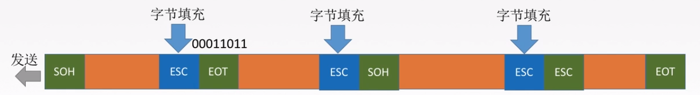
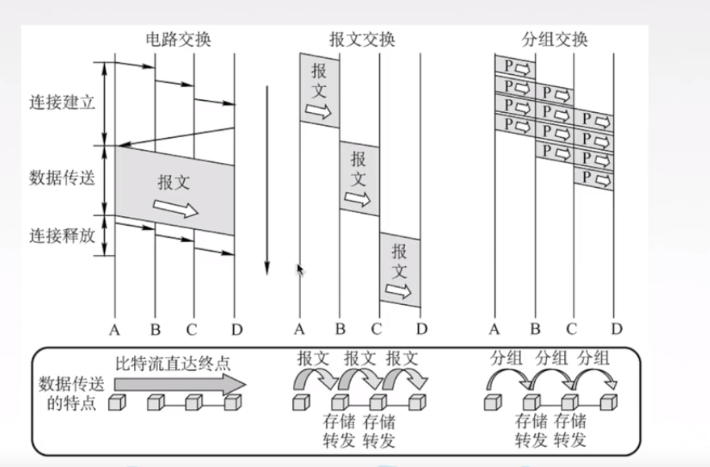
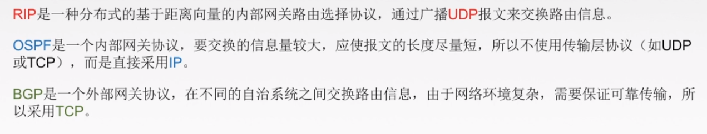
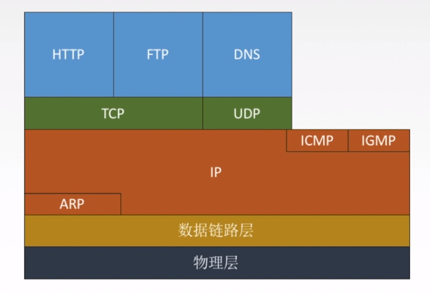
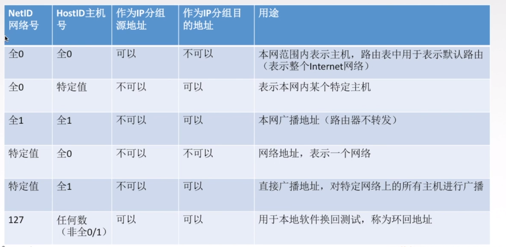
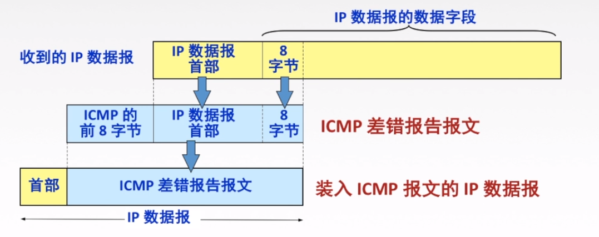
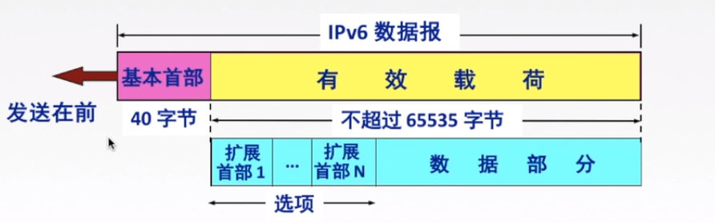
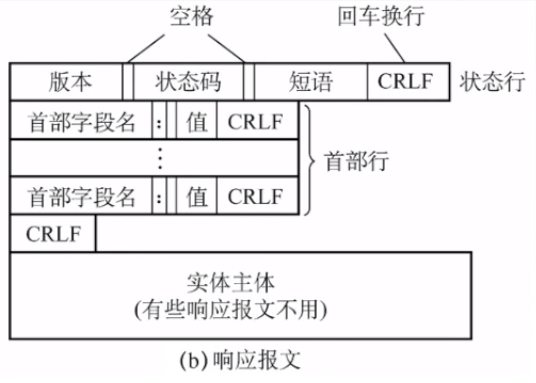
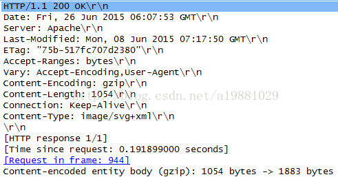

# 1 计算机网络

- 概念：将分散的计算机系统，通过通信设备、线路连接起来，通过完善的软件实现资源共享和资源共享的系统。

  计算机网络是互连的、自治的计算机结合。

- 功能：**数据通信、资源共享**、分布式处理（Hadoop）、提高可靠性、负载均衡

- 组成：

  按组成部分：硬件、软件、协议

  按工作方式：边缘部分（用户使用：C/S、P2P）、核心部分（为边缘部分服务）

  按功能组成：通信子网（实现数据通信）、资源子网（实现资源共享、数据处理）

  ​	资源子网（对数据处理，涵盖应用层、表示层、会话层组成），通信子网（各种传输介质、通信设备、网络协议组成，涵盖网络层、数据链路层、物理层）

- 分类

  按分布范围：广域网（交换技术）、城域网、局域网（广播技术）、个人区域网

  按使用者：公共网、专用网

  按交换技术：电话交换、报文交换、分组交换

  按拓扑结构：总线、星型、环型、网状型

  按传输技术：广播式网络、点对点网络（使用分组存储转发、路由选择机制）

    

## 1.1 术语

- RFC（Request For Comment）：请求响应。
- 速率：b/s,kb/s,Mb/s,Gb/s,Tb/s。速率的单位是10^3，存储单位2^10。
- 带宽：数据最大传输速率，即网络设备所支持的最高速度。单位：b/s...。设备注入数据链路的速率。理想状态。
- 吞吐量：单位时间内通过某个网络（或信道、接口）的数据量。单位b/s。
- 时延：数据从一端到另一端的时间。包括：发送时延（设备注入到链路上花费的时间）、传播时延、排队时延、处理时延。
  - 发送时延=数据长度/信道带宽。
  - 传播时延= 信道长度/电磁波在信道上的速率。
  - 排队时延：等待输出/输入链路可用。
  - 处理时延：路由器检错和找出口。
- 时延带宽积=传播时延*带宽，可以表示某段链路有多少比特。
- 往返时延RTT：发送发送数据开始（第一个比特到链路上），到发送方接受到接收方的确认（发送方收到数据后立即发送确认)，总共经历的时延。
  - RTT包括：①往返传播时延=传播时延*2。②末端处理时间。
- 利用率
  - 信道利用率：看链路多长时间是有数据的。有数据通过的时间/（有+无）数据通过的时间
  - 网络利用率：信道利用率加权平均值。

## 1.2 结构

- 分层：把大问题分解成小问题。

  对等实体：处于同一个层的消息。协议在对等实体中使用。

  下层为上层提供服务。上级使用下级接口。

  各层独立、分层清晰、每层使用最合适的服务、存进标准化工作。

  - 协议
    - 语法：规定传输数据的格式
    - 语义：规定所要完成的功能
    - 同步：规定各个操作的顺序

  SDU：传送的数据。PCI：控制协议操作的信息。PDU：对等层次传送数据的数据单元。SDU+PCI=PDU

- 7层OSI模型模型（法定标准）

  Open System Internet。物联网淑惠使用。

  应用层、表示层、会话层：数据处理

  网络层、数据链路层、物理层：数据通信

  中间系统（路由器）只有物理层、数据链路层、网络层。

  每一层往下加头部、往上去头部。数据链路层加头部和尾部。类似于打包拆包。

  - 应用层： 所有和用户交互产生网络流量的程序。

    如QQ、邮箱。典型应用服务：文件传输（FTP）、电子邮件（SMTP）、万维网（HTTP）

  - 表示层：用于处理在两个通信系统中交换信息的表示方式（语法和语义）。

    功能：①数据格式的变换（翻译官）；②数据进行加密和解密。③数据的压缩和恢复。

  - 会话层：建立一个连接，并在连接上有序地传输数据。也是建立同步（SYN）。一个会话不会影响到其他的会话。

    功能：①建立、管理、终止会话。；②使用校验点使会话在通信失效时从校验点继续恢复通信。适用于传输大文件。

    协议：ADSP、ASP

  - 传输层：负责主机 中两个进程通信，即端到端的通信。传输单位时报文段或用户数据段。

    功能：①可靠传输、不可靠传输；②差错控制；③流量控制；④复用分用。

     复用：多个进程使用这个信息。

    分用：将收到的信息分给相应的进程。

    TCP、UDP

  - 网络层：IP层，把分组从源端传到目的端，为分组交换网上的不同主机提供通信服务。传输单位是数据包，数据包过长就将数据包切割成一个小分组。

    功能：①路由选择；②流量控制；③差错控制；④拥塞控制（针对全局）

    协议：IP

  - 数据链路层：把网络层传下来的数据报组装成帧，数据链路层/链路层的传输单位是帧。

    功能：①成帧（定义帧的开始和结束）；②差错控制（帧错+位错）；③流量控制；④访问（接入）控制，控制对信道的访问

    HDLC、PPP

  - 物理层：光纤、双绞线。在物理媒体上实现比特流的传输。传输单位是比特。将比特信号转化为电信号。

    功能：①定义接口特性；②定义传输模式（单工、半双工、双工）；③定义传输速率；④比特同步；⑤比特编码

- 4层TCP/IP模型（实施标准）

  - 应用层 ：HTTP、FTP、DNS
  - 传输层：端到端、进程到进程的通信。TCP、UDP。
  - 网际层：数据包拆成分组，分给网络，并进行路由选择。IP。
  - 网络接口层。Ethernet 、ATM

- TCP/IP协议和OSI模型的区别：

  TCP/IP考虑了异构网互联问题，将IP作为重要层次。

  OSI的网络层是无连接+面向连接的，TCP/IP的网络层是无连接的。

  OSI的传输层是卖无连接，TCP/IP的传输层是无连接+ 面向连接的。

  IP协议是无连接的。 

- 五层模型：综合了OSI和TCP/IP的优点
  - 应用层：支持各种网络应用，FTP、SMTP、HTTP
  - 传输层：进程-进程的数据传输，TCP、UDP
  - 网络层：源主机目的主机的数据分组路由与转发，IP、ICMP、ISPF
  - 数据链路层：把网络层传下来的数据报组装成帧，Ethernet、PPP
  - 物理层：比特传输 

# 2 物理层

确定与传输媒体接口有关的特性，解决如何传输数据比特流。

特性：机械特性（材料）、电气特性（电）、功能特性（电平含义）、规格特性（规程、时序）

通信的三种方式：单工、半双工、全双工

数据传输方式：串行传输、并行传输。

一个码元可以携带多个比特的信息量。

# 3 数据链路层

## 3.1 链路层的功能

 将网络层的数可靠地传输给相邻节点的网络层。

节点：主机、路由器

链路：物理通道

数据链路：逻辑通道，把控制数据传输协议的硬件和软件加到链路上就构成了数据链路。

帧：链路层的协议数据单元、封装网络层数据报。

- 功能
  1. 为网络层提供服务。无确认无连接服务，有确认无连接服务，有确认面向连接服务。
  2. 链路管理：连接的建立、维持、释放（面向连接的服务）。
  3. 组帧。
  4. 流量控制。限制发送方。
  5. 差错控制（帧错、位错）

### 3.1.2 封装成帧、透明传输

- 封装成帧

  在一段数据的前后部分添加首部和尾部，构成一个帧。可以在一段比特流中找到帧。

  注：这里的数据是IP数据报。

  首部和尾部包含许多控制信息，包括：帧定界、差错控制、流量控制、物理地址。

  帧同步：接收方从一个比特流中识别出帧的开始和结束。 

  

  组帧的四种方法：1. 字符计数法；2. 字符（节）填充发；3. 零比特填充法；4. 违规编码法。

  

- 透明传输

  不管传送数据是什么样的组合，都能传送。当所传数据中的比特组合与某一个控制信息一样，必须采取适当的措施，使收方不会将这样的信息认为是控制信息。

  1. 字符计数法。帧首部使用1个计数字段来表明帧内字符数。

     缺点：错一个全错了。

  2. 字符填充发：开始和结束用特定的字符填充。

     适用于文本传输。文本文件的字符都是键盘上输入的，都是ASCII码，不管从键盘上输入什么字符都可以放在帧里。

     如果传送的帧是由非ASCII码的文本文件组成的（二进制代码的程序或图像等），就要采用 字符填充方法+转义字符 实现透明传输。

     

     

  3.  零比特填充法

     首尾的字符都是01111110。

     编码：如果碰到5个1，就填入一个0。

     译码：找到边界，然后遇到5个1，就扇区后面的那个0。

  4. 违规编码

      用编码中不会用到的当作帧的起始和终止位置。

普遍用零比特填充法、违规编码

### 3.1.3 差错控制

- 噪声

  全局噪声：线路本身电气特性所产生的随机噪声，是信道固有的，随即存在的。解决办法：提高信噪比。

  局部噪声：外界特定的短暂原因所产生的冲击噪声，是产生差错的主要原因。解决办法：利用编码技术。

- 差错

  - 位错：比特位出错，1变成0，0变成1
  - 帧错：丢失【1、3】、重复【1、2、2、3】、失序【1、3、2】

- 链路层为网络层提供的服务：无确认无连接（通信质量好，有线传输线路）、有确认无连接、有确认面向连接（通信质量差的无线传输链路）

- 链路层进行差错控制的好处：及早的发现差错。差错控制的重点是位错，控制方法是检错编码（奇偶校验码、循环冗余码）、纠错编码（海明码）

- 链路层接收到了这个帧，说明这个帧是无差错的。

奇偶校验码：所有的为异或是奇数或者偶数

循环冗余校验码：要发送的数据除以生成多项式再加冗余码。

纠错编码：海明码，可以发现双比特错，纠正单比特错

步骤：确定校验码位数->确定校验码和数据的位置->求出校验码的值->检错并纠错

2^r>k+r+1。r是校验位、k是信息位

校验位放在2^i上，其值=该位为1的值所有的异或。数据依次填入。

译码时：校验码再校验一次与校验码异或，几个校验码组成的数字就是第几位出错了。

### 3.1.4 流量控制与可靠传输机制

核心思想：接收方控制发送方的速度。

数据链路层的流量控制是点到点（相邻节点）的，传输层的流量控制是端到端（源端到目的端）的。

数据链路层流量控制手段：接收方收不下就不回复确认。

传输层流量控制手段：接收端给发送端一个窗口通知。

- 链路层流量控制方法
  - 停止-等待协议：发送方、接收方窗口都为1
  - 滑动窗口协议
    - 后退N帧协议（GBN）：发送端窗口>1，接收方窗口=1
    - 选择重传协议（SR）：发送方窗口>1，接收方窗口>1

可靠传输：发送端发啥，接受端收啥

流量控制：控制发送速率，使接受方有足够的缓冲空间来接受每一个帧

滑动窗口解决了：流量控制（收不下就不给确认，想发也发不了）、可靠传输（发送方自动重传，发送方一段时间没有收到确认帧，就重传一次）

#### 3.1.4.1 停止-等待协议

- 为什么要有停止-等待协议
  1. 除了比特出差错，底层信道还会出现丢包现象。丢包：物理线路故障、设备故障、病毒攻击、路由信息错误等原因，会导致数据包的丢失。
  2. 为了实现流量控制
- 无差错窗口为1；有差错（帧丢失、ACK丢失、ACK迟到）设置超时计时器，计时器的大小比帧平均往返时间长一点。
- 缺点：信道利用率低

#### 3.1.4.2 后退N帧协议（GBN）

- 发送窗口>1，接受窗口=1

-  接收方需要完成的三件事

  1. 上层的调用：网络层要发送数据时，如果窗口未满，直接发送，如果窗口满，缓存等待发送
  2. 收到一个ACK：GBN协议中，对n号帧的确认采用累计确认的方式，表明n号帧和它之前的全部帧。
  3. 超时事件：如果超时，发送方重传所有已发送但未被确认的帧。 

  收到了不是所期待的帧就丢弃。 

发送窗口的要求：采用n个比特**对帧编号（2个比特对帧编号，帧的号码就是0123）**，发送窗口的尺寸W应满足：1<=W<=2^n-1。因为发送窗口过大，就会使得接收方无法区别新帧和旧帧。解释：编号01230123，接收方确认的0123的ACK全部丢失。发送方重传第一个0123，接收方认为这是第二个0123

重点总结：

1. 累计确认（偶尔捎带确认）
2. 接收方只按顺序接受帧，不按序无情丢弃
3. 确认序列号最大的、按序到达的帧。如果到达124，就给发送2，丢弃4。
4. 发送窗口最大为2^n-1，接受窗口为1

#### 3.1.4.3 选择重传协议

GBD的缺点：批量重传。

解决办法：加大接受窗口，设置接收缓存，缓存乱序的帧。

发送发下界确认之后才能移动窗口。

接收方下界收到之后才能移动窗口。

- SR发送方必须响应的三件事
  1. 上层调用：网络层要发送数据，如果窗口未满，直接发送，如果窗口阿玛尼，缓存等待发送。
  2. 收到一个ACK：如果收到ACK，加入该帧序号在窗口内。如果该帧号时窗口的下界，则窗口移动到具有最小序号的未确认帧处。如果窗口移动了，并且有序号在窗口内的未发送帧，则发送这些帧。
  3. 超时事件：每个帧都有自己的定时器，一个超时事件发生后只重传一个帧。

- SR接收方要做的事
  - 窗口内的帧来者不拒，移动到最小未接收的帧。收到已经接受的帧，返回一个ACK。

窗口长度：发送窗口最好等于接受窗口，Wtmax=Wrmax=2^(n-1)。

ST总结：

1. 对数据帧逐一确认，收一个确认一个
2. 只重传出错帧
3. 接收方有缓冲，窗口移动就将数据交付给网络层。

## 3.2 信道划分和访问控制

点对点链路：PPP协议、广域网（电话）。适用于大区域。

广播式链路：所有主机共享通信介质，局域网（大喇叭广播）。适用于小区域。总线型、星型。

- 介质访问控制：采取一定的措施，使得两对节点之间的通信不会发生互相干扰的情况。
  - 静态划分信道--信道划分介质访问控制：频分复用、时分复用、波分复用、码分复用
  - 动态划分信道
    - 轮询访问介质访问控制（令牌传递协议）
    - 随机访问介质访问控制
      - ALOHA协议
      - CSMA协议
      - CSMA/CD协议
      - CSMA/CA协议

### 3.2.1 信道划分介质访问控制

通信信道隔离开。复用技术。

### 3.2.2 动态划分信道

#### 3.2.2.1 ALOHA协议

特点：信道并非再用户通信时固定分配给用户，用户可以占用全部带宽。

- ALOHA协议：不监听信道，不按时间槽发送，随机重发，想发就发。
  - 冲突检测：如果 发生冲突，接收方不予确认，发送方超时即发生冲突。
  - 冲突解决：超时后等一随机事件重传。
- 时隙ALOHA协议
  - 时间分成若干相同的时间片，所有用户同步接入信道，若是冲突，下一个时间片发。
- ALOHA协议比时隙ALOHA协议吞吐量低

#### 3.2.2.2 CSMA协议

CS：载波侦听，发送前检测总线上是否有其他计算机发送数据。

协议思想：发送帧前，监听信道

1-坚持CSMA：对于监听信道忙之后坚持监听，直到空闲传输。有冲突，则等一个随机场长的时间再监听，重复上面。优点：信道利用率高。加入两个或两个以上站点有数据要发送，冲突就不可避免。

非坚持CSMA：忙之后不继续监听，等待一个随机事件再进行监听。优点：采用随机的重发延迟事件可以减少冲突发生的可能。缺点：信道利用率可能会降低。

p-坚持CSMA：空闲以p概率直接传输，以概率1-p等待下一个时间槽再进行传输。信道忙则等待一个随机时间。优点：既能像非坚持算法那样减少冲突，又能像1-坚持算法那样减少媒体空闲时间的这种方案。缺点：发生冲突后还是要坚持把数据帧发送完，造成了资源的浪费。

#### 3.2.2.3 CSMA/CD协议

载波监听多点接入/冲突检测协议，常用于总线式以太网

- 便发送边监听：检测到冲突，就停止发送。 

- 最迟多久才能知道自己发送的数据每和别人发生碰撞：往返时延

- 重传时机：使用截断二进制指数规避算法：
  1. 确定基本推迟时间为2*t。
  2. 定义参数k，等于重传次数，但是k不超过10，即k=min(重传次数，10)。
  3. 从离散的整数集合[0，1，2^k-1]中随机取出一个数r，重传所需要的推迟时间就是r倍的基本推迟时间，即2\*r\*t
  4. 当重传16次仍不能成功，说明网络太拥挤，认为此帧永远不能正确发出，抛弃此帧并向上层报告。
- 最小帧长：帧的传输时延至少要两倍于信号在总线的传播时延 
- 以太网规定的最短帧长是64B，填充短帧。

#### 3.2.2.4 CSMA/CA协议

载波监听多点接入/碰撞避免

CD的缺点：空间无法360°检测碰撞，隐蔽站（不知道别的站点要发数据，自己就发发送了）。 

解决办法：清楚通信双方之外的节点。

CA协议：冲突避免，用于无线局域网。

- 有礼貌的CSMA/CA协议，先听后发，发送每一个数据之前等一小段时间。
- 步骤
  - 发送数据之前，先检测信道是否空闲。空闲则发送RTS（request to send ），RTS包括发送端地址、接收端地址、下一段数据将持续发送的时间等信息。信道忙则等待。
  - 接收端收到RTS后，将响应CTS（clear to send） 。
  - 发送端收到CTS后，开始发送数据帧（同时预约信道，发送方告诉其他站点自己要传多久数据）
  -  接收端接收到数据帧后，用CRC检验，正确则响应ACK。
  - 发送方收到ACK就可以进行下一个数据帧的发送，若没有则一直重传至规定重发次数位置（采用二进制推迟算法来确定推迟时间）

#### 3.2.2.5 轮流协议

既不产生冲突，发送时占有全部带宽

- 轮询协议
  - 主节点轮流邀请从属节点发送数据
  - 有轮询开销、等待延迟、单点故障（老大故障了）
- 令牌传递协议
  - 令牌环网（逻辑环形、硬件星型）
  - 令牌一是个特殊格式的MAC控制帧，不含任何信息。控制信道的使用，确保同一时刻只有一个节点独占信道。 如果有主机要发送信息时向令牌后面接信息，接收方复制一份信息，所有的主机往下传。有一个限定时间，超过这个时间的话，其他的数据就再等下一波。
  - 问题：令牌开销、等待延迟、单点故障
  - 应用于令牌环网，用于负载较大、通信量较大的网络中。 

## 3.3 城域网、广域网

局域网，广播信道，LAN

 决定局域网的主要要素为：网络拓扑、传输介质、介质访问控制方法。

拓扑结构：星型、总线、环形、树形

1. CSMA/CD，常用于总线型局域网
2. 令牌总线，常用于总线型局域网，按照地址形成一个逻辑环
3. 令牌环，常用于环形局域网

局域网分类：以太网（逻辑总线，物理星型）、令牌环网（物理星型，逻辑环形）、FDDI网（光纤，物理双环，逻辑环形）、ATM网（较新型的单元交换技术，使用53字节固定长度的单元进行交换）、无线局域网（采用IEEE 802.11标准，电磁波）

链路层：MAC子层、LLC子层

LLC子层：逻辑链路控制子层，识别网络层协议，对其进行封装。‘

MAC子层：对帧的封装/卸装，帧的寻址和识别，帧的接收和发送。

**PPP协议和HDLC协议（广域网链路层协议）**

- PPP协议

  简单：对于链路层的帧，无序纠错，无需序号，无需流量控制

  封装成帧：帧定界符

  透明传输：遇到与帧界定符一样的比特组合的数据应该如何处理：异步线路用字节填充法，同步线路用比特填充法。

  满足多种网络层协议：封装IP数据包采用多种协议

  差错检测：CRC循环冗余，错就丢弃

  检查连接状态：链路是否正常工作

  最大传送单元：数据部分最大长度MTC

  不需要实现的：纠错、流量控制、序号、不支持多点线路

  - PPP协议的三个组成部分
    1. 一个将IP数据报封装到串行链路（同步串行、异步串行）的方法
    2. 链路控制协议LCP：建立并维护数据链路连接。身份验证。
    3. 网络控制协议NCP：PPP可支持多种网络协议。每个不同的网络层协议都要一个相应的NCP来配置，为网络层建立和配置连接。

- HDLC协议

  高级数据链路控制：面向比特的数据链路层协议

  数据报文可透明传输，用于实现透明传输的”0比特插入法“易于硬件实现。

  HDLC帧的类型：信息帧、监督帧、无编号帧

- PPP和HDLC的相同点和区别

  都是只支持全双工链路

  都可以实现透明传输

  都可以实现差错检测，但不纠正错误。

  PPP协议面向字节、2B协议字段、无需好和确认机制、不可靠

  HDLC面向比特、没有2B协议字段、有编号和确认机制、可靠

### 3.3.1 以太网

Ethernet，采用CSMA/CD技术。

以太网实现无差错接收、不实现可靠传输

无连接：RT之间不握手。

不可靠：R不对帧编号，T不回确认，差错直接丢弃，差错纠正由高层负责。  

ROM只读存储器，有硬件的MAC地址。 

以太网MAC帧：目的地址-源地址-类型-数据(46-1500字节)-FCS。最小帧长是64字节。FCS是CRC。各个帧之间有最小间隔。

MAC帧头格式：

RA、TA是基站的MAC地址

## 3.4 链路层的设备

- 链路层扩展以太网

网桥&交换机

- 网桥

  - 网桥

    网桥根据MAC帧的目的地址对帧进行转发和过滤。当网桥收到一个帧时，并不向所有接口转发此帧，而是先检查此帧目的MAC地址，然后在确定将该帧转发到哪一个接口，或者是把它丢弃（即过滤）。

    网桥优点：1. 过滤通信量，增大吞吐量。2. 扩大了物理范围。3. 提高了可靠性。4. 可互连不同物理层、不同MAC子层和不同速率的以太网。

    透明网桥：以太网上的站点不知道所发送的帧将经过哪几个网桥。是一种即插即用设备--自学习（谁发记录谁的地址端口）。

  - 源路由网桥

    在发送帧时，把详细的最佳路由信息（路由最少/时间最短）放在帧的首部中。

    方法：源站以广播方式向欲通信的目的站发送一个发现帧。

- 多接口网桥--以太网交换帧

  可以独占传输媒体带宽。

  直通式交换机：查完目的地址就立刻转发。延迟小，可靠性低。

  存储转发式交换机：将帧放入高速缓存，并检查是否正确，正确则转发，错误则丢弃。延迟大，可靠性高。

- 冲突域：同一时间只能有一个设备发送信息。

- 广播域：站点发出一个广播信号，所有能接收到这个信号的设备范围称为一个广播域。

物理层设备（中继器、集线器，傻瓜式）不能隔离冲突域和广播域。

链路层设备（网桥、交换机，路人式）可以隔离冲突域，不能隔离广播域

网络层设备（路由器，大佬式）可以隔离冲突域，也可以隔离广播域。

# 4 网络层

提供主机与主机之间的通信。

差错检测（检验头部）。

主要任务是把分组从源端传送到目的端，为分组交换网上的不同主机体提供通信服务。网络层传输单位是数据报。

功能：①路由选择与分组转发；②异构网络互联；③拥塞控制。

解决拥塞的方法：慢开始（窗口加倍）、拥塞避免（窗口加1）、快重传和快恢复（接收端收到不按顺序的包，就会给发送端发送一个重复确认，发送端收到三个重复确认就会立即重传数据包，适用于单个数据包丢失）。

数据报是一个长的数据，分组时把数据包切割。

## 4.1 数据交换方式

- 电路交换

  电话网络：建立连接（呼叫/电路建立）->通信->释放连接（拆除连接）

  特点：独占资源

  优点：通信时延小、有序传输、没有冲突、实时性强。

  缺点：建立连接时间长、线路独占使用效率低、灵活性差、无差错控制能力

- 报文交换

  报文：原应用发送的信息整体

  核心：存储转发

  优点：无需建立连接、存储转发，动态分配线路、线路可靠性高、线路利用率较高、多目标服务。

  缺点：有存储转发时延、报文大小不定，需要网络节点有较大缓存空间

- 分组交换

  分组：把大的数据块分割成小的数据块。

  优点：无需建立连接、存储转发，动态分配线路、线路可靠性较高（分组较短，出错的几率降低）、线路利用率较高、相对于报文交换，存储管理更容易。

  缺点：有存储转发时延、需要传输额外的信息量、乱序到达目的主机时，要对分组排序重组。

数据包方式为网络层提供无连接服务。无连接服务：传输路径可能会变化。类似短信。

虚电路方式为网络层提供有连接服务（分组 +电路交换的优势）。有连接服务：为分组确定传输路径固定，使用完拆除电路。类似打电话。

数据包不需要建立连接，每个分组有完整的目的地址，不保证分组的有序到达。

虚电路需要建立连接，目的地址仅在连接阶段使用，之后每个分组使用长度较短的虚电路号，保证分组的有序到达。

- 传输单位	

  应用层传输单元是报文。

  传输层传输单元是报文段。

  网络层传输单位是分组。

  数据链路层传输单位是帧。

  物理层是比特流。

## 4.2路由算法

路由表转发：目的网络IP地址、子网掩码、吓一跳IP地址、接口

根据路由协议/算法确定最佳路由路径构建路由转发表。

- 静态路由算法

  管理员手工配置路由信息。

  优点：简单可靠，适用于主机网络拓扑各个主机变化不大，广泛用于军事网络和小型商业网络。

  缺点：路由更新慢，不适用大型网络。

- 动态路由算法

  路由器之间彼此交换信息，按照路由算优化出路由表项。

  优点：路由更新快，适用于大型网络，及时响应链路费用或网络拓扑结构。

  缺点：算法复杂，增加网络负担。

  分类：全局性（链路状态路由算法，如OSPF，所有路由器掌握完整的网络拓扑和链路费用信息）、分散性（距离向量路由算法，如RIP，路由器只掌握物理相连的邻居及链路费用）

分层次的路由选择协议，分割成一个个小的自治系统（AS）。

路由选择协议：内部网关协议IGP（一个AS内使用的，协议代表有RIP、OSPF）、外部网关协议EGP（AS之间使用，协议代表有BGP）。

### 4.2.1 RIP协议和距离向量算法

- RIP协议

  应用层协议，使用UDP传送数据

  距离向量，适用于比较小的网络。要求每个路由器维护从自己到每一个目的网络的唯一最佳距离记录。

  距离：跳数。 

  每30s交换一次信息，和相邻路由器交换信息，路由器交换自己的路由表。超过180s，邻居没了，更新自己的路由表，把通过邻居的表项更新掉。

  - 距离向量算法
    1. 修改相邻路由器发来的RIP报文的所有表项。下一跳改为x，距离字段+1。
    2. 对修改的每一个项目，进行以下步骤
       - 如果没有netx，将netx填入路由表
       - 如果有netx，则查看下一跳路由地址
         - 如果下一跳是x，则替换
         - 如果不是x，比较替换
       - 若180s还没收到x的更新路由表，把x记为不可达的路由器，即把距离设置位16
       - 一直更新 

  报文格式：首部+路由部分塞到UDP数据报中。

  一个RIP报文最多包括25个路由，超过多发几次报文

  RIP协议特点：好消息传得快，坏消息传的慢。 网络故障时，要经过比较长的时间才能将此信息传送到所有路由器，慢收敛。

### 4.2.2 OSPF协议及链路状态算法

开放最短路径优先。使用了分布式的链路状态协议。

1. 洪泛算法一次向相邻路由器发送链路信息。当前路由器发送的信息所有的路由器都能收到。（类似广播）
2. 交换与本路由器相邻的所有路由器的链路状态（链路代价：费用、距离、时延或者带宽）。
3. 只有链路状态发生变化是，路由器才向所有路由器洪泛。

最后，所有路由器都能建立一个链路状态数据库，即全网拓扑图。

- 链路状态路由算法：

1. 每个路由器发现他的邻居结点【HELLO问候分组】，并了解邻居结点的网络地址。
2. 设置到它的每个邻居的成本度量metric。
3. 构造【DD数据库描述分组】，向临站给出自己的链路状态数据库中的所有拦路状态项目的摘要信息。
4. 如果DD分组中的摘要自己都有，则临站不做处理；如果有没有的或者是更新的，则发送【LSR链路状态请求分组】，请求自己没有的和比自己更新的信息。
5. 收到邻站的LSR分组后，发送【LSU链路状态更新分组】进行更新。
6. 更新完毕后，邻栈返回一个【LSAck链路状态确认分组】进行确认。

只要一个路由器的链路状态发生变化：

5. 泛洪发送【LSR链路状态更新分组】继续宁更新。
6. 更新完毕后，邻栈返回一个【LSAck链路状态确认分组】进行确认。
7. 使用Dijkstra根据自己的链路状态数据库构造到其他节点间的最短路径。

- 特点
  1. 每隔30min，要刷新一次数据库中的链路状态
  2. 适用于互联网规模大的时候。
  3. 不存在坏消息传的慢的问题，收敛速度快。

链路状态，适用于比较大的网络。	

### 4.2.3 BGP协议（外网）

 与其他AS的邻站BGP发言人交换信息。

和谁交换：BGP发言人：每个AS都要选择一个路由器作为BGP发言人，一般是BGP边界路由器。两个BGP发言人通过一个网络连接在一起。

交换什么：交换到达某个AS的路径。

多久交换：发生变化时更新有变化的部分。

- 四种报文

1. OPEN（打开）报文：用来与相邻的另一个BGP发言人建立关系，并认证发送方。
2. UPDATE（更新）报文：通告新路径或撤销原路径。
3. KEEALIVE（保活）报文：在无UPDATE时，周期性正式邻站的连通性；也作为OPEN的确认
4. NOTIFICATION（通知）报文：报告先前报文的差错；也被用于关闭连接。

## 4.2.4 三种协议的比较

## 4.3 IP数据报格式

TCP/IP协议栈

IP数据包：首部、数据部分（TCP、UDP数据段）

首部分为：固定部分、可变部分

版本：IPV4、IPV6。4位

首部长度：4位，单位是4B，最小是5。大小范围是20B~60B。

区分服务：期望获得那种类型的服务，8位

总长度：单位+数据。16位，单位是1B。

生存时间：TTL，IP分组的保质期，经过一个路由器-1，变成0则 丢弃。

协议：使用的协议值。ICMP-1，IGMP-2，TCP-6，UDP-17。

首部检验和：只检验首部。16位

源地址：32位。

目的地址：32位。

可选字段：用来支持排错、测量以及安全等措施。

填充字段：全0，把首部补充位4B的整数倍

标识：在分片中标识分组是哪一个。同一个标识的分片组合起来。

标志：x_ _。中间为：DF，1禁止分片，0允许分片。最低位MF：1后面还有分片，0代表最后一片/后面没有分片。

片偏移：较长分组分片后，某片的第一个字节在原分组中的位置，以8B为单位。除了最后一个分片，每一个分片都是8B的整数倍。

### 4.3.1 IP数据包分片

最大传送单元MTU：链路层数据帧可封装的上限，以太网的MTU是1500字节。

数据帧：在IP数据包前面加头部，后面加尾部。

如果所传送的长度的数据包长度超过某链路的MTU：分片或返回ICMP的差错报文。

能分片（DF=0）才能分片，不能分片返回ICMP差错报文。 

总长度单位是1B，片偏移单位是8B，首部场部是4B。

## 4.4 IPV4地址

IP地址：全世界唯一的32位/4字节标识符，标识路由器主机的接口。

IP地址=[网络号：主机号]。

A类地址：0x。网络号8位。

B类地址：10x。网络号16位。

C类地址：110x。网络号23位。

D类地址：1110x。多播地址

E类地址：1111x。保留为今后使用

不能作为路由器主机的IP地址：

 如果把私有IP地址放在互联网上，路由器不认。 

IP地址可以使用的个数：

## 4.5 网络地址转换NAT软件

NAT软件位路由器分配一个外部全球IP地址。将内网的IP地址+端口号转化为外部全球IP地址+端口号。

## 4.6 子网划分和子网掩码

分类的IP地址的弱点：1. IP地址空间的利用率有时很低，2. 两级IP地址不够灵活。

子网划分：将主机号高位的字数拿出来作为子网号，剩下的部分作为主机号。成为三级IP地址。主机号最少是两位。

子网掩码：两级IP地址的子网掩码网络号是全1，主机号是全0。三级IP地址的子网掩码网络号是全1，主机号是全0。

子网掩码与IP地址逐位相与，得到子网网络地址。

路由表中包含：目的网络地址、目的网络子网掩码、下一跳地址。

直接交付：目的网络在路由器相连目的主机或子网中。

间接交付：中间转很多路由器。

- 路由器转发分组的算法：
  1. 提取目的ip地址。
  2. 是否直接交付。目的ip地址与子网掩码相与，找到相应的子网，直接交付。
  3. 特定主机路由。看看路由表有没有和目的地址一样的地址，如果有的话就按那一行的路由走。
  4. 检测路由表中有无路径。目的地址与路由表中的每一行子网掩码进行相与，如果得到目的网络，就下一跳。
  5. 默认路由0.0.0.0。将分组交给默认路由，就是发给另外一个路由器。 
  6. 丢弃，报告转发分组错误。

## 4.7 无分类编址CIDR

之前子网划分都是同样的子网掩码

现在实现变长子网掩码

传统的二级IP地址：网络号、主机号

传统的三级IP地址：网络号、子网号、主机号

CIDR：网络前缀、主机号

CIDR记法：IP地址后加上/，然后写上网络前缀的个数

CIDR地址块：网络前缀都相同的IP地址

CIDR的地址掩码（子网掩码）：网络前缀全部写成1，主机号全部位0。

构成超网：将多个子网聚合成一个较大的子网，将网络前缀缩短（前面一样的，后面写为0）

最长前缀匹配：使用CIDR时，查找路由表可能得到几个匹配的结果，选择具有最长网络前缀的路由。前缀越少，地址快越小，路由越具体。

## 4.8 ARP协议

ARP高速缓存：IP地址与MAC地址的映射，局域网内部的主机。

- ARP协议：寻找目的IP的MAC地址

  如果在一个局域网内：

  	1. 1号主机广播ARP请求分组。IP1-IP3-MAC1-FFFFFFFFFF 。
  	2. 3号主机收到这个广播分组，告诉1号主机自己的MAC地址。

  如果不在一个局域网内：

  1. 先用自己的子网掩码和目的IP地址相与，看看目的IP地址是否在这个局域网内。
  2. 广播ARP分组，查询路由器的MAC地址。IP1-IP6-MAC1-FFFFFFFFF。
  3. 1号主机将分组发给路由器。路由器去找目的IP。

- ARP协议总结：

  在实际网络的链路上传送数据帧时，最终必须使用MAC地址。ARP协议完成主机或路由器IP地址到MAC地址的转换。解决下一跳走哪的问题。

  使用过程：检查ARP高速缓存，有对应表项则写入MAC帧，没有则用目的MAC地址位FF-FF-FF-FF-FF-FF-FF的帧封装并广播ARP请求分组，同一局域网内所有主机都能收到该请求。目的主机收到请求后就会向源主机单播一个ARP响应分组，源主机收到后将此映射写入ARP缓存。（10-20min更新一次）

- ARP协议4种典型情况

  1. 主机A发送本网络主机B：用ARP找到主机B的硬件地址。
  2. 主机A发送给另一网络上的主机B：用ARP找到本网络上一个路由器的硬件地址。
  3. 路由器发送给本网络的主机A：用ARP找到主机A的硬件地址。
  4. 路由器发送给另一网络上的主机B：用ARP找到本网络上的一个路由器的硬件地址。

## 4.9 DHCP协议

主机如何获得IP地址：静态配置（IP、子网掩码、默认网关）、动态配置。

默认网络：路由器一个接口的IP地址。

DHCP是应用层协议，使用S/C方式，客户端和服务端通过广播的方式交互，基于UDP。

过程：

1. 主机广播DHCP发现报文（主机询问有没有DHCP服务器，服务器获得主机的一个IP地址）；
2. DHCP服务器广播DHCP提供报文（DHCP服务器说有！有！有！，服务器拟分配给主机一个IP地址及相关配置，先到先得）；
3. 主机广播DHCP请求报文（主机说我用你给我的IP地址啦？主机向服务器请求提供IP地址）；
4. DHCP服务器广播DHCP确认报文（服务器正式将IP地址分配给主机）。

## 4.10 ICMP协议（网络层协议）

作用：为了更有效地转发IP数据报和提高交付的机会

ICMP协议支持主机或路由器发送特定ICMP报文 ，网络探询

ICMP报文装在IP数据报的数据部分

类型：ICMP报文是哪一类的

代码：进一步区分类型中哪一部分

检验和：检验ICMP报文

- 类型（两种）：

  - ICMP差错报文（5种）

    - 终点不可达：当路由器或主机不能交付数据报时就像源点发送“终点不可达”报文。无法交付
    - 源点抑制：当路由器或主机由于拥塞而丢弃数据报时，就像源点发送“源点抑制”报文，使源点知道应当把数据报的发送速率放慢。拥塞丢数据
    - 时间超过：当路由器收到生存时间TTL=0的数据报时，除丢弃该数据外，还要向源点发送“时间超过”报文。当终点在预先设定的时间内不能收到一个数据报的全部数据报片式，就把以收到的所有数据报片都丢弃，并向源点发送“时间超过”报文。路由器收到TTL=0，数据报片没有收完整
    -  参数问题：首部字段有问题
    - 改变路由（重定向）：值得更好的路由

    ICMP差错报文=ICMP的前8个字节+收到的数据报首部和前8个字

    

    不应该发送ICMP差错报文的情况

    1. 对ICMP差错报告报文不在发送ICMP差错报告报文
    2. 对第一个分片的数据报片的所有后续数据报片都不发送ICMP差错报告报文
    3. 对具有组播（一点到多点）地址的数据报都不发送ICMP差错报告报文
    4. 对于特殊地址（如127.0.0.0或0.0.0.0）的数据报不发送ICMP差错报告报文

  - ICMP询问报文（4种）

    1. 回送请求和回答报文。主机或路由器向特定的目的主机发出的询问，收到此保温的主机必须给源地址或路由器发送ICMP回送回答报文。测试目的站是否可以到达，以及了解其相关状态
    2. 时间戳请求和回答报文。请某个主句或路由器回答当前的日期和时间。时钟同步
    3. 掩码地址请求和回答报文。
    4. 路由器询问和通告报文。

    ICMP的应用：ping（测试两个主机的连通性，使用了ICMP回送请求和回答报文）、 Traceroute（跟踪一个分组从源点到中带你的路径，使用了ICMP时间超过差错报告报文）

    Traceroute：发送一连串的数据报，TTL从1递增，知道到达终点。测出两个主机之间的距离。

## 4.11 IPV6

改变首部格式：快速处理/转发数据报

支持QoS服务质量：网络利用基础技术为指定的网络提供更好的服务能力，是网络的一种安全机制，是用来解决网络延迟和阻塞的问题。

- IPV6数据报格式

  

  

  版本：6

  优先级：区分数据报类别和优先级

  流表签：“流”是网络上从特定源点到特定终点的一系列数据报。所有属于同一个流的数据报都具有同样的流标签。

  下一个首部：标识下一个扩展首部或上层协议首部。每一个首部都有下一个首部。

  跳数限制：相当于IPV4的TTL。

- IPV4和IPV6的区别

  1. IPV6将地址从32位（4B）扩大到128位（16B），更大的地址空间。
  2.  IPV6将IPV4的校验和字段彻底移除，以减少没跳的处理时间。
  3. IPV6将IPV4的可选字段移除首部，变成了扩展首部。路由器通常不对扩展首部进行检查。
  4. IPV6支持即插即用（即自动配置），不需要DHCP协议
  5. IPV6的首部长度必须是8B的整数倍，IPV4首部是4B的整数倍。
  6. IPV6只能在主机处分片，IPV4可以在路由器和主机处分片
  7. ICMPV6：附加报文类型“分组过大”
  8. IPV6支持资源的预分配，支持实时视像等要求。保证一定的带宽和时延的应用。
  9. IPV4取消了协议字段，改成了下一个首部字段
  10. IPV6取消了总长度字段，改用有效载荷长度字段。
  11. IPV6取消了服务类型字段。

地址标识形式：冒号十六进制记法、压缩形式，冒号之间空白或者只有一个0就是全0、双冒号标识法。

- IPV6基本地址类型

  单播：一对一

  多播：一对多

  任播：一对多的一个通信，可做目的地址。

- 兼容IPV4和IPV6

  双栈技术：同一设备同时启用IPV4和IPV6的协议栈

  隧道技术：通过使用互联网络的基础设施在网络之间传递数据的方式，隧道传递的数据可以实不同协议的数据帧。对帧进行重新包装然后通过隧道发送。

## 4.12 IP组播

单播：点对点

广播：点对多点，不管需要不需要都发

组播（多播）：给一个组播内（主机需要特定的数据）的主机发送，点对多点。

属于多播组的设备将被分配一个组播组IP地址，组播地址范围时D类地址。一个D类地址标识一个组播组，只能用作分作分组的目的地址，源地址总是为单播地址。

1. 组播数据报也是“尽最大努力交付”，不提供可靠交付，应用于UDP。
2. 对组播数据不产生ICMP差错报文。
3. 并非所有D类地址都可以作为组播地址。

硬件组播：组播地址也需要相应的组播MAC地址在本地网络中实际传送帧。组播MAC地址以十六进制值01-00-5E打头普，余下的6位十六进制位时根据IP组播地址的最后23位转换得到的。

IGMP协议

组播路由协议

## 4.13 移动IP

- 相关术语

  移动IP技术时移动结点（计算机/服务器）以**固定的网络IP地址**，实现跨越不同网段的漫游功能，并保证基于网络IP的网络权限在漫游过程中不发生改变。

  移动结点：具有永久IP地址的移动设备。

  归属代理：一个移动结点有用的居所成为归属网络。在归属网络中代表移动结点执行移动管理功能的实体叫做归属代理。

  外部代理：在外部网络中帮助移动节点完成移动管理功能的实体成为外部代理。

  永久地址：移动站点在归属网络中的原始地址。

  转交地址：移动站点在外部网络使用的临时地址。

- 通信过程

  A刚进入外部网络：

  1. 在外部代理等级获得一个转交地址，离开时注销。
  2. 外地代理向本地代理登记转交地址。

  B给A发送数据报：

  1. 本地代理截获数据报
  2. 本地代理再封装数据段，新的数据段目的地址时转交地址，发给外部代理
  3. 外部代理查封数据报并发给A。

  A给B发送数据报：

  1. A用自己的主地址作为数据报源地址，用B的IP地址作为数据报的目的地址。

  A移动到了下一个网络：

  1. 在新外部代理登记注册一个转交地址
  2. 新外部代理给本地代理发送新的转交地址（覆盖旧的）
  3. 通信。

  A回到归属网络：

  1. A向本地代理注销转交地址。
  2. 按原始方式通信。

## 4.14 网络层设备

- 路由器

  路由器是一种具有多个输入端口和输出端口的专用计算机，其任务时路由选择、分组转发。

- 路由器 VS 网桥 VS 集线器

  - 路由器：可以互联两个不同网络层协议的网段。
  - 网桥：可以互联两个物理层和链路层不同的网络。
  - 集线器：直通式设备。不饿能互联两个物理层不同的网段。

- 路由表与路由转发

  路由表时根据路由算法得出的，主要用途是路由选择，总用软件实现。

  转发表由路由表得来的，可以用软件实现，也可以用硬件实现。

# 5 传输层

只有主机才有的层次，为应用层提供服务

1. 传输层提供进程和进程之间的逻辑通信。
2. 复用（向网络层发）和分用（从网络层区分进程信息）
3. 对收到的报文进行差错检测（检测报文）。
4. 两种协议：UDP 、 TCP

- TCP：面向连接的可靠的传输层协议。提供确认、流量控制、计时器、连接管理等。
- UDP：无连接的不可靠的传输层协议。
- 

传输层的寻址与端口：

- 复用：应用层所有的应用进程都可以通过传输层在传输到网络层。
- 分用：传输层从网络层收到数据后交付给指明的应用进程。

端口唯一标识主机中的一个端口（逻辑端口/软件端口）。端口号长度为16bit，能标识65536个不同的端口号。

- 端口号
  - 服务端使用
    - 熟知端口号：0~1023，给TCP/IP最重要的一些应用程序，让所有用户都知道。
    - 登记端口号：1024~49151，为没有熟知端口号的应用进程使用的。
  - 客户端使用：49152~65535，仅仅在客户进程运行时才动态选择。

重要端口号：21-FTP；23-TELNET；25-SMTP；53-DNS；69-TFTP；80-HTTP；161-SNMP。

套接字socket=（主机IP地址，端口号）

## 5.1 UDP协议

1. 无连接（减少开销和时延）
2. 不可靠（尽力交付，不保证可靠交付）
3. 面向报文（适合一次传输少量数据的网络应用）
4. 没有拥塞控制，适合很多实时应用
5. 首部开销小，8B，TCP是20B

UDP首部格式：

 

UDP长度：UDP数据报的整个长度

UDP校验和：检测整个UDP数据报是否有错。

分用时：找不到对应对应的目的端口号，就丢弃报文，并给发送方发送ICMP“端口不可达”差错报告报文。

IP数据报首部协议字段：17-UDP，

计算校验和的时候出现伪首部，不向下传送也不想上递交。使用伪首部进行UDP校验、

伪首部格式：源IP地址、目的IP地址、0、17（协议字段UDP）、UDP长度

- 在发送端：
  1. 填上伪首部
  2. 全0填充检验和字段
  3. 全0填充数据部分（UDP数据报要看成需要4B的字串接起来）
  4. 为首部+首部+数据部分采用二进制反码求和
  5. 把和求反码填入检验和字段。
  6. 去掉伪首部，发送
- 在接收端：
  1. 填上伪首部
  2. 伪首部+首部+数据部分采用二进制反码求和
  3. 如果全为1则无差错，否则丢弃数据报或者交给应用层附上差错的警告。

## 5.2 TCP协议

1. 面向连接（虚连接）
2. 可靠。可靠有序，不丢不重。
3. 每一个TCP连接只能由两个端点，每一条TCP连接只能是点对点的。
4. TCP提供全双工通信。有发送缓存区（准备发送的数据&已发送但尚未收到确认的数据），接收缓存区（按序到达但尚未被接收应用程序读取的数据&不按序到达的数据）。
5. TCP面向字节流。

### 5.2.1 TCP报文段首部格式

- 序号（32位）：本报文段所发送数据的第一个字节的序号。
- 确认号（32位）：期望收到对方下一个报文段的第一个数据字节的序号。如果是N，表示N-1都收到了。
- 数据偏移（4位）：首部长度。以4B为单位，即1个数值是4B。
- 控制位 
  - 紧急位URG：URG=1，表示报文段是高优先级数据，应该尽快传送，就放在发送缓冲区的最前面。
  - 确认位ACK：ACK=1时确认号有效。在连接建立后所有传输的报文段都必须把ACK置为1。
  - 推送为PUSH，PUSH=1时，接收方尽快交付接收应用进程，不在等到缓冲填满再向上交付。
  - 复位RST：RST=1时，表明TCP连接中出现严重差错，必须释放连接，然后再重新建立传输连接。或者拒绝一个非法的报文段。
  - 同步位SYN：SYN=1时，表明是一个连接请求/连接接受报文。
  - 终止位FIN：FIN=1，表明此报文发送方数据已发完，要求释放连接。
- 窗口：指的是发送本报文段一方的接收窗口，即现在允许对方发送的数据量。2B
- 检验和：检验首部+数据，检验时要加上12B伪首部，第四个字段为6（协议字段6-TCP）
- 紧急指针：URG=1时才有意义，指出本报文段中紧急数据的字节数。（从头到紧急指针的大小）
- 选项：最大报文长度MSS（报文段中数据字段的最大长度）、窗口扩大、时间戳、选择确认。

### 5.2.2 TCP连接管理

- 三次握手

  客户端向服务端发送SYN分节。

  服务端确认这个SYN分节，同时自己也发一个SYN分节。

  客户端收到SYN+ACK，向服务端发送确认分节。

- 为什么不是两次握手

  因为如果请求报文因为网络阻塞或延迟停留再网络结点中，超时了客户端就会重发，然后建立连接，然后之前的请求报文到达了服务端。如果时两次握手，就又建立一个连接，但是这个连接是无效的。如果是三次握手，客户端不会对这个连接进行确认，这个无效的连接就不能建立。

- SYN洪泛攻击

  攻击者发送连接请求报文，但是不对报文进行确认，导致服务器上存在大量的半连接状态。

  解决办法：设置SYN cookie

  

- 四次挥手

  客户端发送FIN分节。客户端进入FIN_WAIT1状态。

  服务端发送ACK分节。服务端进入CLOSE_WAIT状态，客户端进入FIN_WAIT2状态。

  服务端的数据发送完之后，向客户端发送FIN分节。服务端进入LAST_ACK状态。

  客户端发送ACK分节。进入TIME_WAIT状态，等2MSL进入CLOSED状态。服务端收到后进入CLOSED状态。

- 为什么要有TIME_WAIT状态

  保证客户端最后发送的ACK分节可以到达服务端。如果服务端没有收到ACK，会重传FIN分节，客户端就会在2MSL的时间内收到，并重传ACK。

  保证这个TCP连接的所有报文在网络中消失。

- 四次握手可以改为三次握手吗

  如果服务端接收到FIN分节的时候，自己的数据发完了，可以将ACK和FIN一起发，这就成为了三次挥手。

### 5.2.3 TCP可靠传输

传输层：使用TCF实现可靠传输。

网络层：提供尽最大努力交付，不可靠传输。

可靠：保证接收方从缓冲区读出的字节流与发送方发出的字节流是一致的。

**TCP实现可靠传输的机制：校验（伪首部检验）、序号（为每个报文段编号）、确认（收到后确认）、重传（超时重传、或超过3个冗余ACK重传）**

报文段的大小取决于链路层的MTU。

捎带报文：发送数据的时候捎带确认。

累计确认：确认第一个丢失的报文。

超时重传：TCP的发送方在规定时间内没有收到确认就要重传已发送的报文段。

TCP采用自适应算法，动态改变重传时间RTTS（加权平均往返时间）。

超时事件发生之前知道发送方有没有丢失报文段的方法：冗余ACK（冗余确认）

每当比期望序号大的时许报文段到达时，发送一个冗余ACK，指明下一个期待字节的序号。

发送方收到3个对于报文段1的冗余ACK，就认为2报文段丢失，重传2号报文段。快速重传。

### 5.2.4 TCP流量控制

流量控制：让发送方慢点，让接收方来得及接收。使用类似选择重传协议，不过又快重传。

TCP利用滑动窗口机制实现流量控制。

接收方根据自己接收缓存的大小，动态地调整发送方的发送窗口大小。即接收窗口rwnd（接收方设置确认报文段的窗口字段来讲rwnd通知给发送方），发送方的发送窗口取接收窗口rwnd和拥塞窗口cwnd的最小值。

如果接收方的接收缓存区从0变为非0，会给发送端发送一个接收窗口大于0的报文。

如果接收方发送的窗口非0报文段丢失了，就造成了死锁的局面。

解决办法：TCP为每个连接创建一个持续计时器，只要TCP连接的一方收到对方的零窗口通知，就启动持续计时器。持续计时器计时到期之后，就会发送一个零窗口探测报文，接收方收到探测报文段时给出现在的窗口值。如果窗口仍然为0，那么发送方就重新设置持续计时器。期间接收方可以给发送方发送非零窗口报文，告诉发送方可以发送数据了。

### 5.2.5 TCP拥塞控制

出现拥塞的条件：对资源需求的总和>可用资源

网络中又许多资源同时呈现供应不足->网络性能变坏->网络吞吐量将随输入负荷增大而下降

拥塞控制：防止过多的数据注入到网络中。全局性

接收窗口：接收方根据缓存区大小的值，告诉发送方，反应接收方容量。

拥塞窗口：发送方根据自己估算的网络拥塞程度而设置的窗口值，反应网络当前容量。 

- 拥塞控制的算法：
  - 满开始和拥塞避免：拥塞窗口初始为1 ，经过一个传输轮次加倍（慢开始），到达慢开始门限依次加1（拥塞避免），拥塞就将窗口降为1。满开始门限值是遇到网络拥塞时确定，大小等于发生网络拥塞时网络窗口的一半。
  - 快重传和快恢复：收到3个重复的确认，立即重传（快重传），并且将发送窗口降为当前的一半（快恢复），并执行拥塞避免算法。

# 6 应用层

应用层对应用程序的通信提供服务。

功能：文件传输、访问和管理；电子邮件；虚拟终端；查询服务和远程作业登录。

协议：FTP；SMTP.TOP3；HTTP；DNS

网络应用模型：客户/服务端模型、P2P模型

- 客户/服务器模型

  服务器：提供计算服务的设备。

  特点：1. 永久提供服务；2. 永久性访问地址/域名；

  客户端：请求计算服务的主机。

  特点：1. 与服务器通信，使用服务器提供的服务；2. 间歇性接入网络；3. 可能使用动态IP地址；4. 不与其他客户机直接通信。

  应用：Web、文件传输FTP、远程登录、电子邮件

- P2P模型（peer to peer）

  1. 不存在永远在线的服务器；
  2. 每个主机既可以提供服务，也可以请求服务；
  3. 任意端系统/结点之间可以直接通讯；
  4. 结点间歇性接入网络；
  5. 节点可能改变；
  6. 可扩展性号；
  7. 网络健壮性强  

## 6.1 DNS系统

 三级域名.二级域名.顶级域名

根域名服务器： 本地域名服务器求助根域名服务器，查找顶级域名服务器的ip地址（如com域名服务器、org域名服务器、edu域名服务器）

顶级域名服务器：管理二级域名的IP地址。

权限域名服务器：负责一个区的域名服务器

本地域名服务器：当一个主机发出DNS查询请求时，这个查询请求报文就发给本地域名服务器。

查询过程可以分为递归查询和迭代查询

迭代查询是本地没有缓存的话就查询本地域名服务器，本地域名服务器没有的话就查询根域名服务器，再有根域名服务器查询顶级域服务器、权限域名服务器，然后递归查询，递归返回。迭代查询是由本地域名服务器依次访问根域名服务器、顶级域名服务器、权限域名服务器，然后直接返回给本地域名服务器，再返回给主机。

## 6.2 文件传送协议FTP

文件传送协议FTP

简单文件传送协议TFTP

使用TCP 

控制进程：传请求，21端口，始终保持

数据传送进程：传文件，20端口，数据连接保持一会

主动方式（服务端主动告知自己的端口）使用TCP 20端口，被动方式（客户端请求端口号）由服务器和客户端自行协商决定（端口号>1024）。

FTP传输模式：文本模式（ASCII模式）、二进制模式（Binnary模式）

## 6.3 电子邮件系统

- 电子邮件

  - 信封  abc@163.com
  - 内容 
    - 首部 To、Subject
    - 主体

- 电子邮件系统组成结构

  - 用户代理

    电子邮件客户端软件	

    功能：撰写、显示、处理、通信

  - 邮件服务器

    功能：发送&接收邮件、向发件人报告邮件传送结果

  - 协议（SMTP、POP3）

    - SMTP：应用于发送
    - POP3、IMAP：应用于接收

- 简单邮件传送协议 SMTP

  规定两个相互通信的SMTP进程之间如何交换信息。

  SMTP规定了14条命令和21种应答信息

  TCP连接，端口号25，客户端/服务器方式

- SMTP通信的三个阶段 

  - 连接建立
  - 发送邮件
  - 连接释放

- 缺点：不能传送可执行文件和其他二进制对象；仅限于传送7为ASCII码，不能传送其他非英语国家的文字；会拒绝超过一定长度的文件

- 通用因特网邮件扩充MIME，将非ASCII码转化为ASCII码

- 邮局协议 POP3

  - TCP连接，端口号10，C/S
  - 工作方式：下载并保留（在服务器），下载并删除

- 网际报文存取协议IMAP

  - 用户可以看到邮箱的首部，需要打开某个文件该邮件才上传到用户的计算机上。
  - 可以允许只读取邮件中的一部分。

- 基于万维网的电子邮件

  - 用户代理到邮件服务器使用的是HTTP协议
  - 邮件服务器之间的还是SMTP协议

## 6.4 万维网和HTTP

WWW（World Wide Web）是一个大规模的、联机式的信息储藏所/资料空间，是无数网络站点和网页的集合。使用统一资源定位符URL

URL一般形式：<协议>://<主机>:<端口号>/<路径>

协议：http、frtp

主机：域名、IP地址

URL不区分大小写。

HTTP：超文本传输协议，定义了浏览器怎样向万维网服务器请求万维网文档，以及服务器怎样把文档传送给浏览器。

HTTP工作过程：建立TCP连接->客户端请求文档->服务器响应文档->释放TCP连接

- 具体过程
  1. 浏览器分析URL
  2. 浏览器向DNS请求解析IP地址
  3. DNS解析出IP地址
  4. 浏览器与服务器建立TCP连接
  5. 浏览器发出取文件命令
  6. 服务器响应
  7. 释放TCP连接
  8. 浏览器显示

- HTTP特点

  1. HTTP无状态

     识别用户：cookie是存储在用户主机中的文本文件，记录一段时间内用户（使用识别码识别）的访问记录

  2. 采用TCP作为传输层协议，但HTTP协议本身是无连接的。即通信双方在交换HTTP报文之前不需要先建立HTTP连接。

- HTTP的连接方式
  - 持久连接：Keep-alive：传送完数据不立即释放，保持一段时间的连接	
    - 非流水线
    - 流水线
  - 非持久连接Close：连接建立、传送数据、释放连接，耗时2*RTT

- HTTP报文结构

  HTTP报文时面向文本的，因此在报文中的每一个字段都是一些ASCII码串

  

   

- 状态码

  - 1xx表示通知信息的，如请求收到了或正在处理
  - 2xx表示成功，如接受或知道了。202 Accepted 接收
  - 3xx表示重定向，如要完成请求还必须采取下一步的行动。301 Moved Permanently 请求的网页转移到了新的地址
  - 4xx表示客户的差错，如请求中有错误的语法或不能完成
  - 5xx表示服务器的差错，如服务器失效或无法完成。