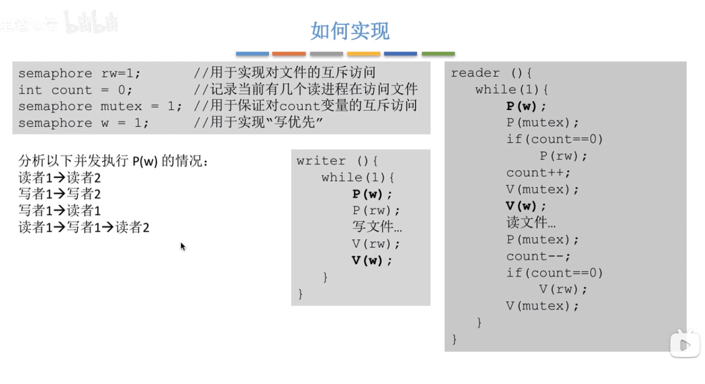
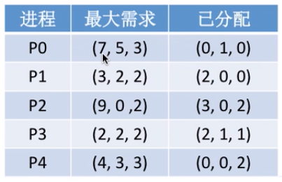
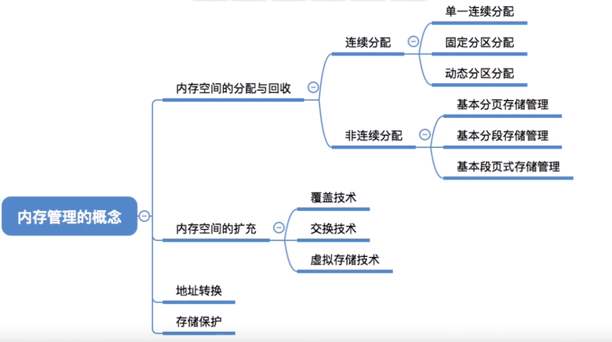
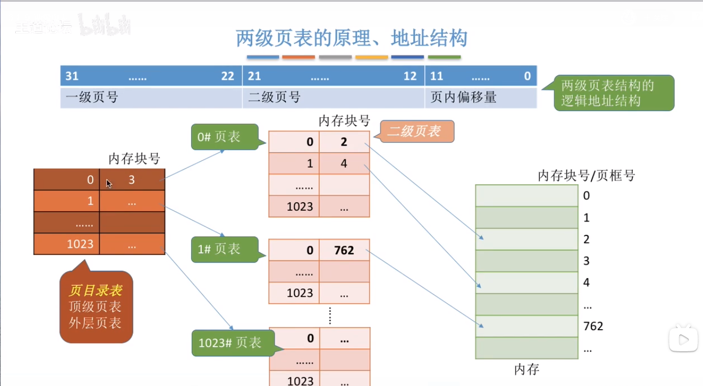
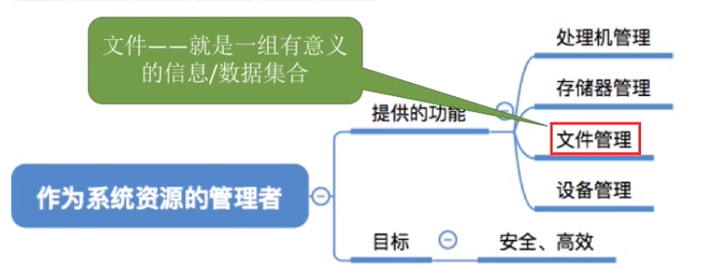
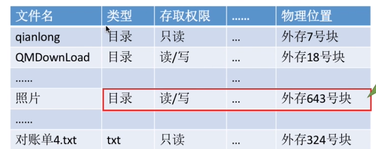
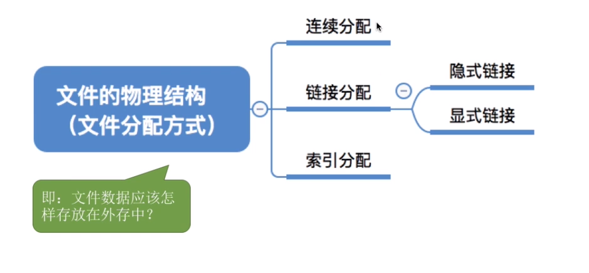
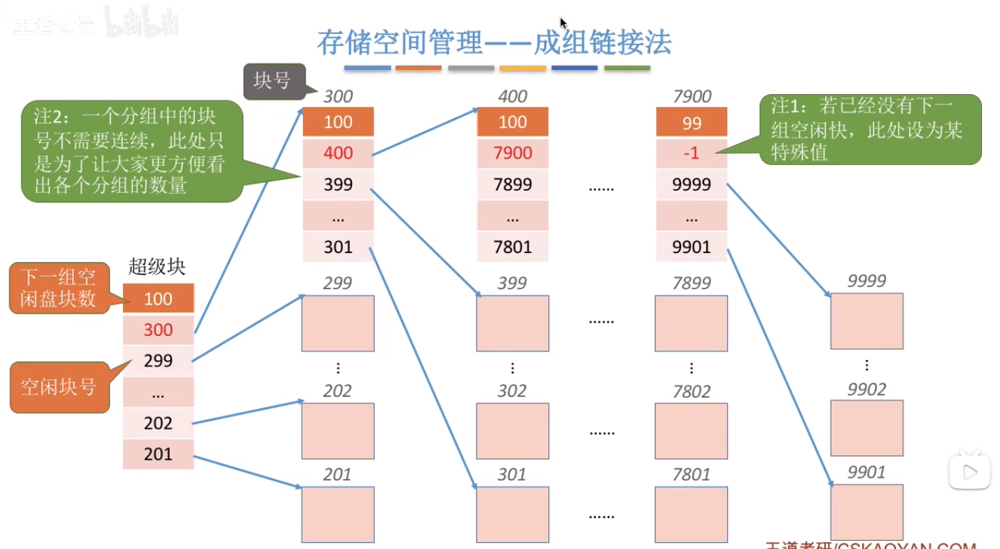
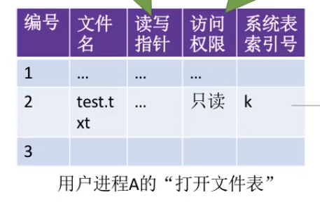

-  操作系统的概念
	
	> 操作系统相当于一个软件，管理计算机资源，提供给用户和程序接口。
	> 进程：一个正在执行的程序，执行前需要将该进程放在内存中，才能被CPU处理。
- 操作系统的特征

	> 并发、共享、虚拟 、异步 
	> 虚拟存储器：逻辑上的内存远远大于物理内存，空分复用。
	> 虚拟处理器： 单核CPU运行多个进程，时分复用。

# 1.操作系统的运行机制和体系结构

- 指令：处理器能识别、执行的最基本命令

  > 特权指令：不允许普通用户程序使用，比如说内存清零
  >
  > 非特权指令：可以被普通用户使用，比如说普通的运算指令

- CPU如可判断是否可以执行特权指令

  > 用户态（目态）：此时CPU只能执行非特权指令。
  >
  > 内核态（管态）：特权指令非特权指令都可以执行。
  >
  > 用户态切换到内核态：中断时用户态进入内核态的唯一途径。进行系统调用或者发生异常的时候会触发中断。
  >
  > 内核态切换到用户态：改变程序状态寄存器PSW 的标志位。
  >
  > 两种处理器状态是通过程序状态字寄存器PSW中的某个标志位来标识当前处理器处于什么状态。

- 内核程序和应用程序

  > 内核程序：系统的管理者，既可以执行特权指令，也可以执行非特权指令，运行在核心态。 
  >
  > 应用程序：只能执行非特权指令，运行在用户态。 

- 操作系统的哪些功能应该在内核程序实现呢

  > 在内核程序中实现的有：时钟管理、中断处理、设备驱动、CPU切换等。

- 原语

  > 原语是一种特殊的程序，是最接近硬件的部分，这种程序的运行具有原子性。

- 内核时计算机的底层软件

  > 时钟管理，中断处理、原语 

- 大内核和微内核

  > 大内核：内核做的事情比较多
  >
  > 微内核：内核只负责一些核心的工作

- 中断

  > 内中断：来自CPU内部(系统调用、缺页、除数为0)
  >
  > 外中断：来自CPU外部 （外设请求、人工干预）

- 系统调用

  > 系统调用：供应用程序调用的接口。 
  >
  > 系统调用的作用：用户进程通过系统调用操作共享资源，操作系统可以对这些进程进行管理，防止用户非法操作。 

- 系统调用和库函数

  >  库函数封装了系统调用，屏蔽具体的实现细节。 

- 系统调用的背后过程

  > 传递系统调用的参数到某个寄存器中，然后执行陷入指令，执行系统调用的相关程序，最后返回用户程序
  >
  > 陷入指令：进程调用内核程序。也叫trap指令、访管指令。 
  >
  > 陷入指令是在用户态执行的，执行完之后会立即引发一个内中断，从而CPU进入核心态。
  >
  > 陷入指令是只能在用户态下执行，不能在内核态下执行的指令。

# 2.进程

## 2.1 进程的概念

- 程序：一个指定序列

- 进程：正在执行的程序。

- 操作系统如何找到进程

  > 系统为每个运行的进程配置一个数据结构，被称为进程控制块(PCB)，用来描述进程的各种信息(比如程序代码存放位置)。
  >
  > PCB的组成：PID、UID、进程状态、进程优先级、程序段、数据段等。

- 进程实体

  > PCB、程序段、数据段构成的进程实体(进程映像)。
  >
  > 创建一个进程就是创建进程实体中的PCB，撤销一个进程就是撤销进程实体中的PCB。PCB是进程存在的唯一标志。

- 进程的定义

  > 进程是一种程序动态执行的过程，是系统进行资源分配和调度的一个独立单位。

- 进程的组织

  > 将PCB挂到队列上
  >
  > 链接方式：按照进程状态把PCB分为多个队列，操作系统持有各个队列的指针
  >
  > 索引方式：根据进程状态不同，建立几张索引表，操作系统持有各个索引表的指针

- 进程的特征：动态性、并发性、独立性、异步性、结构性

  > 异步性：各并发执行的进程以各自独立的、不可预知的速度向前推进。

- 进程的状态和转化

  > 进程的状态：
  >
  > ​	运行态：正在占有CPU
  >
  > ​	就绪态：已经具备运行条件，正在等待CPU
  >
  > ​	阻塞态：因等待某一时间而不能运行
  >
  > ​	其他两种状态：创建态：进程正在被创建	终止态：进程正在从系统中撤销
  >
  > 进程状态的转换：
  >
  > ​	创建态->就绪态，创建态创建完成
  >
  > ​	就绪态->运行态：进程被调度。时间片到，或处理机被抢占，从运行态回到就绪态。需要恢复进程运行环境，修改PCB内容和响应队列。
  >
  > ​	运行态->阻塞态：请求等待某个事件的发生。保存进程环境，修改PCB内容和相应队列。
  >
  > ​	阻塞态->就绪态：某个事件发生。修改PCB内容和相应队列，如果等待的是资源，则还需为进程分配系统资源。
  >
  > ​	运行态-->终止态：需回收进程拥有的资源，撤销PCB。
  >
  > 


- 进程控制

  > 实现进程各种状态之间的转换。
  >
  > 原语实现进程控制，原语的特点是原子性，采用关中断指令和开中断指令实现。在实现的过程中不接受中断。只允许在和心态下执行的特权指令。
  >
  > 原语做的三件事情：更新PCB信息、将PCB插入合适的队列、分配/回收资源。

  - 进程的创建

    状态转换：无-->创建态-->就绪态

    > 创建原语：申请空白PCB、为新进程分配所需资源、初始化PCB、将PCB插入就绪队列。
    >
    > 引起进程创建的事件：用户登录、作业调度、提供服务、应用请求。

  - 进程的终止

    >撤销原语：从PCB集合中道道终止进程的PCB、若进程正在运行，直接剥夺CPU，将CPU分配给其他进程、终止其所有子进程、将该进程拥有的所有资源归还给父进程或操作系统。
    >
    >引起进程终止的事件：正常结束、异常结束、外界干预。

  - 进程的阻塞和唤醒

    > 进程的阻塞：阻塞原语。
    >
    > 进程的唤醒：唤醒原语。

  - 进程的切换

    > 切换原语

- 进程通信

  进程之间的信息交换，各进程拥有的内存空间相互独立。

  - 共享存储

    > 操作系统分配一个共享空间，两个进程互斥访问这个共享空间。
    >
    > 操作系统只负责提供共享空间和同步互斥工具（如P、V操作）
    >
    > 共享存储的分类：基于数据结构的共享(速度慢、格式有限制)、基于存储区的共享（速度快）。

  - 管道通信

    > 内存中开辟一个大小固定的缓冲区。  缓冲区大小和页面一样大，在linux系统中是4K。
    >
    > 管道只能实现半双工通信，某一时间段内只能单向传输，如果双向通信，要设置两个管道。
    >
    > 各个进程对管道的访问也需要互斥进行。读进程 只能有一个。

  - 消息传递

    > 通过发送和接受两个原语实现的。
    >
    > 直接通信方式：将消息体发送大接受进程的消息缓冲区后面。
    >
    > 间接通信方式：将消息体发送到操作系统维护的一个邮箱里去，接受进程去取走邮箱里属于自己的消息体。

- 线程概念和线程模型

  - 进程和线程的区别：

  > ​	线程是程序执行流的最小单位，即CPU调度的最小单位。
  >
  > ​	进程是资源分配的最小单元。

  - 线程机制带来的变化

  > 1）引入线程后，各线程间能并发执行，提高了并发度。2）切换进程系统开销很大（因为需要切换进程的运行环境），同一线程内的进程切换系统开销小（因为不需要切换进程环境）。

  - 线程的属性

  > 1）线程是处理器调度的单位，2）同一进程的不同线程共享进程的资源，3）同一进程的线程切换不会引起进程切换

  - 线程的分类、实现（是通过内核级线程实现的）

  > 用户级线程：  通过线程库实现，所有线程的管理工作都有应用程序负责，运行在用户态。用户级线程是从用户的视角能看到的线程。
  >
  > 内核级线程：线程的管理工作由操作系统完成，运行在内核态。内核级线程是从操作系统内核视角能看到的线程。
  >
  > 因为内核级线程才是操作系统能看见的，所以内核级线程是处理器分配的单位。用户级线程需要映射到内核级线程。

  - 多线程模型

  > 多线程模型：几个用户级线程分配到几个内核级线程的问题。
  >
  > 多对一模型： 多个用户级线程分配到一个内核级线程里面。运行在用户态。一个线程阻塞导致整个进程都被阻塞，并发度不高。
  >
  > 一对一模型：一个用户级线程对应一个内核级模型。一个线程阻塞了，别的线程可以继续执行，并发度高。一个进程会占有多个内核级线程，线程切换由操作系统完成，线程管理成本高，开销大。
  >
  > 多对多模型：n用户级线程对应m个内核级线程，n>=m，类似于线程池。克服了多对一模型并发度不高，又克服了一对一模型一个用户进程占有太多内核级线程、开销太大的缺点。


## 2.2 进程调度

- 处理器调度模型

> 按照一个算法从就绪队列选择一个进程分配给处理器。

- 调度的三个层次

  - 高级调度

  > 高级调度（作业调度）：按照一定的原则从外存上处于后备队列的作业挑选一个或多个作业，为他们分配资源，并建立相应的进程（PCB），使他们获得处理机竞争的权利。
  >
  > 外存和内存的调度。作业调入时建立相应的PCB，作业调出时才撤销PCB。
  >
  > 高级调度主要指调入的问题，因为只有调入的时机需要操作系统确定，调出的时机必然是作业运行结束才调出。

  - 中级调度

  > 引入虚拟存储技术之后，可将暂时不能运行的进程调至外存等待。等他重新具备了运行条件且内存又稍有空闲时，再重新调入内存。
  >
  > 可以提高内存空间利用率，和系统吞吐量。
  >
  > 进程调到外存之后，进程的状态会变为挂起状态。挂起状态分为就绪挂起、阻塞挂起。
  >
  > PCB常驻内存，操作系统通过内存中的PCB对进程进行监督管理。PCB会记录进程数据再外存中的存放位置、进程状态等信息。**被挂起的进程PCB会被放到挂起队列中。**
  >
  > 中级调度：决定将那个处于挂起状态的进程重新调入内存。
  >
  > 中级调度的频率要比高级调度的频率高。

  - 低级调度（进程调度）

  > 进程调度：在就绪队列选择一个进程，将处理及分配给他。（频率很高）


- 进程调度

  - 需要进程调度和切换的情况

    > 当前运行的进程主动放弃处理机：进程正常终止、发生异常终止、进程主动请求阻塞（如等待IO）
    >
    > 当前运行的进程被动放弃处理机：分给进程的时间片用完了、又更紧急的事情（如IO中断）、又更优先级的进程进入就绪队列

  - 不能进行进程调度和切换的情况

    > 在处理中断过程中。
    >
    > 进程在操作系统内核程序临界区中。比如访问就绪队列前需要上锁，如果在解锁之前被切换了，那么别的进程就不能访问就绪队列了。访问内核的东西不能进行进程调度，访问普通临界区可以进行进程调度。
    >
    > 在进行原子操作过程中(原语)，不能中断。

  - 临界资源：一段时间只允许一个进程访问的资源。 

  - 临界区：访问临界资源的那段代码。

  - 内核程序临界区：用来访问某种内核数据结构。比如就绪队列。 

- 进程调度的方式

  - 非剥夺式抢占：只允许进程主动放弃处理器。实现简单，系统开销小，但是不能及时处理紧急任务。
  - 剥夺式抢占：允许进程被动放弃处理器。可以优先处理更紧急的进程，也可以实现让各个进程按时间片轮流执行。适用于分时操作系统、实时操作系统。

- 进程切换的过程：保存原来运行进程的数据、对新的进程进行数据恢复。

  注：进程切换是有代价的，频繁的进程调度、切换，必然会使得系统的效率降低。

- 进程调度算法的评价指标

  - CPU利用率 ：忙碌的时间/总时间
  - 系统吞吐量：总共完成了多少道作业/总时间
  - 周转时间：作业完成时间-作业提交时间。平均周转时间：各作业周转时间之和/作业数。带权周转时间：作业周转时间/作业实际运行时间。平均带权周转时间：各作业带权周转之和/作业数。
  - 等待时间：进程等待处理机时间之和。
  - 响应时间：用户提交请求到首次产生相应所用的时间。

- 调度算法

  先到先服务、短作业优先、高响应比优先

  时间片轮转、优先级调度算法、多级反馈队列

  饥饿：进程长期得不到服务。

  - 先来先服务

    - 公平。先到先得。等的越久越先被服务。
    - 作业/进程先到达后备队列/就绪队列，先服务。
    - 非抢占式。
    - 优点：公平、简单。
    - 缺点：对长作业有利，对短作业不利。不会导致饥饿。

  - 短作业优先

    - 追求最少的平均等待时间、平均周转时间、平均带权周转时间。最短的作业/进程优先得到服务。 
    - 非抢占式SJF、SPF
    - 抢占式SRTN（最短剩余时间优先算法  ）
    - 对短作业有利，对长作业不利。可能会导致饥饿现象。

  - 高响应比优先

    - 平衡作业/进程的等待时间和要求服务的时间。
    - 每次调度时先计算各个作业/进程的相应比，选择相应比最高的作业/进程。
    - 响应比=（等待时间+要求服务时间）/要求服务时间。
    - 非抢占式的 
    - 不会导致饥饿问题。 

  - 时间片轮算法

    - 公平、轮流地为各个进程服务，让每个进程在一定时间间隔内都能得到响应。
    - 让进程轮流执行一个时间片，若进程未执行完，则剥夺处理机，将进程重新放到就绪队列队尾重新排队。
    - 适用于进程调度。
    - 抢占，由时钟中断实现。
    - 用于分时操作系统，更关心响应时间。
    - 时间片太大会增加响应时间。时间片太小会导致进程切换过于频繁。一般来说，设计时间片时要让切换进程的开销占比不超过1%
    - 优点：公平、响应快、适用于分时操作系统。
    - 缺点：高频率切换进程会增加系统开销，不区分任务的紧急程度。

  - 优先级调度算法

    - 设置优先级，调度时选择优先级最高的作业/进程

    - 抢占式、非抢占式

    - 静态优先级：创建进程时确定，优先级不变。动态优先级：创建进程时有一个初始值，之后根据情况动态的调整。 系统进程优先级高于用户进程；前台进程高于后台进程；操作系统更偏好I/O行进程。与I/O型进程相对的是计算型进程（CPU繁忙型进程）。 

      设置优先级的考虑角度：从追求公平、提升资源利用率的角度。

    - 适合实时操作系统，有可能会导致饥饿。

  - 多级反馈队列

    - 对其他调度算法的平衡。
    - 规则：1）设置多级就绪队列，各优先级从高到低，时间片从小到大。2）新进程到达时，先进入第1级队列（优先级最高），按先到先服务的方式分配时间片，若用完时间片还未结束，进入下一级队列的队尾。3）只有k级为空，才会为k+1级分配时间片。4）新进程来了，放入第1级，被强占的进程放入原队列的队尾。5）如果是最后一级的某个进程运行完了，那么这个进程只能放在这个队列的队尾。
    - 用于进程调度
    - 抢占式
    - 优点：对进程相对公平（FCFS）；每个新到达的进程都可以很快得到响应（RR）；段进程只用较少的事件就可以得到响应（SPF）;不必实现估计进程的运行事件（避免用户造假）；可灵活地调整对各类进程的偏好程度，比如CPU密集型、I/O密集型进程（扩展：可以将因I/O而阻塞的进程唤醒后重新放回原队列，这样I/O型进程可以保持较高优先级）
    - 有可能会导致饥饿
    - 适合交互式系统

## 2.3 进程的同步和互斥

- 进程同步。直接制约关系

  > 进程同步也称直接制约关系。对进程保持一定的次序，比如说必须保持 写数据-->读数据 这样的顺序。

- 进程互斥。间接制约关系。

  > 两种资源共享方式：互斥共享、同时共享方式。
  >
  > 临界资源：一个时间段内只允许一个进程使用的资源，对临界资源的访问需要互斥的进行。

- 对临界资源的互斥访问，可以在逻辑上分为如下四部分。

```cpp
do{
    entry section;//进入区，加锁操作
    critical section;//临界区，访问临界资源的代码
    exit section;//退出区，解锁操作
    remainder section;//做其他处理
}while(true)
/*
遵循的原则：
1）空闲让进。临界区空闲时，允许一个请求进入临界区。
2）忙则等待。当已有进程进入临界区时，其他试图进入的进程必须等待。
3）有限等待。对请求访问的进程，应保证能在有限时间内进入临界区（保证不会发生饥饿）。
4）让权等待。当进程不能进入临界区时，应立即释放处理机，防止进程忙等待。	
*/
```

### 2.3.1 进程互斥的软件实现方法

单标志发（一个进程控制其他进程访问临界区）、双标志先检查法（先检查后上锁）、双标志后检查法（先上锁后检查）、peterson法（先上锁，再让梨，最后检查，检查的目的检查是否是自己最后礼让的）

- 单标志法：两个进程在访问临界区后会把使用临界区的权限转交给另一个进程。也就是说每个进程进入临界区的权限只能被另一个进程赋予。

```cpp
int trun=0;//turn表示当前允许进入临界区的进程号
```


可以实现互斥，但是违背了空闲让进的原则。

- 双标志先检查法：设置一个布尔型数据，每个进程在进入临界区之前先检查当前有没有别的进程想进入临界区，如果没有，则把自身对应的标志flag[i]设为true，之后开始访问临界区。


如果进程切换的话会出现问题。比如说P0检查到P1不想进入临界区，也就是flag[1]=false，然后P0进入了临界区，此时发生了进程切换，P1进程也检查到P0进程不想进入临界区，但其实P0是想进入的，由于进程切换，还没有说自己想进入，就被切换出去了，然后P1也进入了临界区。这样违背了忙则等待的原则。

原因在于检查和上锁不是一个原子操作。

- 双标志后检查法：先上锁后检查


原因在于：上锁和检查不是一个原子操作，导致死锁，违背了空闲让进、有限等待的原则。

- Peterson算法：如果双方都争着想进入临界区，那可以让进程尝试先让出临界区。后执行的让梨。


 进入区：1.主动争取；2主动谦让；3.检查对方是否想使用，且最后一次是不是自己说了客气话。

### 2.3.2 进程互斥的硬件实现

中断屏蔽发（执行过程中屏蔽中断）、TestAndSet法（上锁、检查之前是否上锁一气呵成）

- 中断屏蔽法：开/关中断指令 

  优点：简单、高效

  缺点：不适合多处理机，开关中断实在处理机上实现的。只适合操作系统内核进程，不适合用户进程。

- TestAndSet法：TS指令，硬件实现的，在执行过程中不允许被中断，只能一气呵成。


​	对锁进行上锁，并检查

​	false表示未上锁，即临界区未被占用，true表示上锁，即临界区被占用

​	优点：简单，适合多处理器环境。

​	缺点：不允许让权等待的原则，会一直占用处理机

- Swap指令：硬件实现，执行过程中不允许被中断，只能一气呵成。


和TSL指令类似，用变量保存一个之前是否上锁的状态。 

### 2.3.3 信号量机制：实现进程同步和进程互斥的问题

#### 1.通过一对原语来对信号量进行操作。

信号量其实就是一个变量（可以是一个整数，也可以是一个更复杂的记录型的变量），可以用一个信号量来表示系统中某种资源的数量。

wait(S)=P(S)、signal(S)=V(S)原语，PV操作，

- 整形信号量

  > 用一个整数型的变量作为信号量，用来表示系统中某种资源的数量。
  >
  > 可以进行的三种操作：初始化、P操作、V操作。

```cpp
void wait(int S){//wait原语，相当于”进入区“
    while(S<=0);//如果资源不够，就一直循环等待
    S=S-1;//如果资源够，则占用一个资源
}
void signal(int S){//signal 原语，相当于”退出区“
    S=S+1;//使用完资源，在退出区释放资源
}
```


不同于双标志先检查，整型信号量是检查上锁一气呵成的

存在的问题：不满足”让权等待“原则，会发生忙等

- 记录行信号量  

  > 整型信号量的缺陷是忙等问题，因此人们又提出了”记录型信号量“，即用记录型数据结构表示的信号量。

```cpp
/*记录型信号量的定义 */
typedef struct{
    int value;//剩余资源数
    struct process *L;//等待队列
}semaphore;

/*某进程需要使用资源时，通过wait原语申请*/
void wait(semaphore S){
    S.value--;
    if(S.value<0){
        block(S.L);//如果没有资源，阻塞原语
    }
}
void signal(semaphore S){
    S.value++;
    if(S.value<=0)
        wakeup(S.L);//释放资源后，若还有别的进程鞥带这种资源，唤醒等待队列的进程。  
}
```

PV操作中的P操作：申请资源

PV操作中的V操作：释放资源

PV操作都是原子操作。

#### 2.信号量机制实现进程互斥、同步、前驱关系

信号量机制就是对临界资源进行计数。

- 信号量机制实现进程互斥

  1. 划定临界区
  2. 设置互斥信号量mutex，初值为1 ，因为临界区同一时间内只能允许一个进程访问。
  3. 在临界区之前执行P操作，对资源进行申请
  4. 在临界区之后执行V操作，对资源进行释放

- 信号量机制实现进程同步

  进程同步：让各并发进程按要求有序的推进 

  1. 分析什么地方需要实现“同步关系”，必须保证一前一后
  2. 设置同步信号量，初始化为0
  3. 在“前操作”之后执行V(S)
  4. 在“后操作”之前执行P(S)

- 信号量机制实现前驱关系

  多个同步

  1. 每一个前后关系设置一个同步变量
  2. 在前操作之后执行V操作
  3. 在后操作之前执行P操作 

### 2.3.4 生产-消费者模型

#### 单生产者-消费者模型

只有缓冲区没满时，生产者才能把产品放入缓冲区，否则必须等待。缓冲区满时，身缠这要等待消费者取走产品。

只有缓冲区不空，生产者才能取出产品，否则必须等待。缓冲区空时，消费者要等待生产者放入产品。

消费者：占有锁，队列空时，释放锁，等待生产者通知。或者：占有锁、队列不空、消耗队列中的一个元素，释放锁。

生产者：占有锁，添加数据，释放锁，通知消费者。或者：占有锁，队列满时，释放锁，等待消费者通知。

一般情况下，比如线程池，消费者时可以持续的消费的，生产者生产的比较满，所以不需要消费者去通知。

互斥：设置初值为1的信号互斥量

同步：设置初值为0的同步信号量，一前一后

PV操作分析步骤：‘

1. 关系分析。找出题目中描述的各个进程，他们之间的同步、互斥关系。
2. 整理思路。根据各进程的操作流程确定P、V操作的大致顺序。
3. 设置信号量。设置需要的信号量，并根据题目条件确定信号量初值。


实现互斥的P操作，一定要放在同步P操作之后。 

#### 多生产者-消费者问题

如果缓冲区的大小时1，需要设置一个互斥量互斥的访问临界区。

实现互斥的P操作一定要在实现同步的P操作之后。

### 2.3.5 吸烟模型

可以生产多个产品的单生产者。

 假设有三个抽烟者进程和一个供应者进程。抽烟需要三个材料：烟草、纸、胶水。三个抽烟者持有三个材料中的一个，供应者依次将每个抽烟者的另外两种材料放在缓冲区内，对应的抽烟者取走，并抽掉香烟。吸烟者拿走之后发信号，供应者提供另外两种材料。


### 2.3.6 读者-写者问题

读写锁

互斥：写进程-写进程、写进程-读  进程

设计一个都进程count计数，第一个读进程加锁，其他的都进程不需要加锁。

要将count视为临界资源，进行加锁。

- 读写锁-读进程优先


- 读写锁-读写公平法



写进程执行P(w)之后会阻塞其他的读进程和写进程。

避免写进程饥饿。 

读写锁思想：用count检查进入的进程是否时第一个/最后一个读进程。

### 2.3.7 哲学家进餐问题

 核心：避免临界资源的分配不当导致死锁现象。


 

避免死锁：

第一种方案：最多允许四个哲学家并发的拿筷子。

第二种方案：奇数号哲学家先拿左边的筷子，然后再拿右边的筷子。右边的哲学家相反。避免一个进程占有一个资源后等待另一个资源 的现象。

第三种方案：每个哲学家拿筷子都是互斥的进行的。

每个进程都需要同时持有两个临界资源，因此就有死锁问题的隐患。


### 2.3.8 管程

信号量机制存在的问题：编写程序困难、易出错。

管程：一种高级的同步机制。 

管程是一种特殊的软件模块，有这些部分组成：

1. 局部于管程的共享数据结构说明；
2. 对该数据结构进行操作的一组函数；
3. 对局部于莞城的共享数据设置初始值的语句；
4. 管程有一个名字。

有点类似于类。  

管程的基本特征：

1. 局部于管程的数据智能被管程内的函数访问；
2. 一个进程只有通过管程内的函数才能进入管程访问共享数据；
3. **每次仅允许一个进程在管程内执行某个内部函数。**


简述管程

**引入管程的目的是更方便地实现进程互斥和同步。关键是各外部进程只能通过管程提供的函数才能访问共享数据；每次仅允许一个进程在管程内执行某个内部过程。**

1. 需要在管程内部定义共享数据，即缓冲区。
2. 需要在管程中定义用于访问这些共享数据的函数。
3. 只有通过这些特定的入口才能访问共享数据。
4. 每次只能开放其中一个入口，只能让一个进程或者线程进入。这种互斥特性是由编译器实现的。
5. 可在管程中设置条件变量及等待/唤醒操作以解决同步问题。可以让一个进程或线程在条件变量上等待（该进程应先释放管程的所有权，也就是让出入口）；可以通过唤醒操作将等待在条件变量上的进程或线程唤醒。

封装思想。

Java中使用关键字synchronized来描述一个函数，那么这个函数同一时间段只能被一个线程调用。

## 2.4 死锁

死锁：各进程争夺资源而导致都**等待对方**的资源，造成进程无法向前推进。

饥饿：长期得不到想要的资源，某进程无法向前推进。

死循环：一直循环。

- 死锁的必要条件
  1. 资源互斥
  2. 不可剥夺。进程所有的的资源再未使用完之前，不能被抢夺资源，只能主动释放。
  3. 请求和保持条件。保持一个资源不放同时请求新的资源。
  4. 循环等待条件：存在一种进程资源的**循环等待链**。链中的每一个进程已获得的资源同时被下一个资源请求。如果每一个资源都是1个，本条件就是充要条件。
- 什么时候会发生死锁：
  1. 对不可剥夺资源的竞争可能会发生死锁。
  2. 请求和释放资源的顺序不当，也同样会导致死锁。P1申请R1->R2，P2申请R2->R1。
  3. 信号量使用不当。实现互斥的P操作在实现同步的P操作之前，有可能会导致死锁。

总之：对不可剥夺资源的不合理分配，可能会导致死锁。

- 死锁的处理粗略、避免死锁：
  1. 预防死锁。破环死锁产生的四个必要条件中的一个或几个。
  2. 避免死锁。用某种方法防止系统进入不安全状态，从而避免死锁。（银行家算法）
  3. 死锁的检测和解除。允许死锁的发生，不过操作系统会负责检查出死锁的发生，然后采取某种措施解除死锁。

### 2.4.1 预防死锁

- 破坏互斥条件

  把只能互斥使用的资源改造为允许共享使用的资源。比如SPOOLing技术将打印机改造为共享设备。类似于设置一个缓冲区，在各进程看来，自己对打印机资源的使用请求立即就被接受处理了，不需要再阻塞等待了。

  但是很多使用不能破坏互斥条件。

- 破坏不剥夺条件

  方案1. 当某个进程请求新的资源得不到满足时，立即释放保持的所有资源。某些资源未使用完，也需要主动释放，从而破坏了不剥夺条件。

  方案2. 当某个进程需要某个资源时，操作系统帮他去抢夺那个资源，需要考虑各进程之间的优先级。比如剥夺调度方式：将处理机强行剥夺给优先级高的进程用。

  缺点：

  1. 实现起来复杂。
  2. 如果进程被剥夺资源了，那么这个进程之前的工作就失效了。
  3. 反复申请释放资源，增加系统开销。 
  4. 如果采用方案1，只要得不到资源，之前申请的资源就需要放弃，如果一直发生这样的情况，会导致进程饥饿。

- 破坏请求和保持条件

  静态分配法：进程在运行前一次性获得他所需要的全部资源。在他的资源未满足前，不让他投入运行。一旦投入运行，这些资源就一直归他所有，该进程就不会再去请求别的任何资源了。

  缺点：有些资源只是使用很短的时间，但是如果进程整个运行期间都保持着所有资源，会导致资源浪费。

- 破坏循环等待条件

  采用顺序资源分配法。首先给资源中的系统编号，规定每个进程必须按编号递增的顺序请求资源，编号相同的资源依次申请完。

  原理分析：一个进程只有占有小编号的资源时，才有资格申请更大的资源。按此规则，已持有大编号资源的进程不可能逆向回来申请小资源的编号，从而不会产生循环等待条件。

  缺点：不方便增加新的设备，因为需要分配新的编号。使用资源的顺序如果和编号顺序不一致，会导致资源浪费。必须按规定的次序申请资源，用户编程麻烦。

 


### 2.4.2 避免死锁

- 安全序列 

  BAT每个企业约定好最多借多少钱。如果借的钱达不到企业提出的最大要求，那么不管你之前给企业借了多少钱，那些钱都拿不回来了。假设手里有100亿，刚开始BAT各借了20亿、10亿、30亿。

  

  此时手里还有40亿，如果B还想再借30亿，并且答应的话。


​	只剩下10亿，如果BAT提出再借20亿的请求，任何一个企业都得不到满足。所以不能借给B20亿。因为不安全。

​	如果A还想再借20亿，并且答应的话。


​	手里还有20亿，可以先把20亿全部借给T，等T把钱全部还回来手机就会有20+30=50亿，再把这些钱全借给B，B还钱后共有50+20=70亿，最后再借给A。这样是 安全的。


安全序列：系统按照这种序列分配资源，每个进程都顺利完成，只要能找出来一个安全序列，系统就是安全状态。当然，安全序列可能有多个。 

如果系统处于安全状态，就一定不会发生死锁。如果系统进入不安全状态，就可能会发生死锁。

银行家算法：在系统分配资源之前预先判断这次分配是否会导致系统进入不安全状态，依次决定是否答应资源的分配请求。

将单维的数字拓展为多维的向量。比如说：系统有5个进程P0~P4，3种资源R0~R2，初始数量为（10，5，7），则某一个时刻的情况可表示如下：



银行家算法步骤：

1. 检查此次申请是否超过了之前声明的最大需求数。
2. 检查此时系统升序的可用资源是否还能满足此次请求。
3. 试探着分配，更改各数据结构。
4. 用安全算法检查此次分配是否会导致系统进入不安全状态。 

安全性算法步骤：检查当前的剩余可用资源数是否能满足某个进程的最大需求，如果可以，九八该进程加入安全序列，并把该进程持有的资源全部回收。

不断重复上述过程，看最终是否能让所有进程都加入安全序列。

### 2.4.3 死锁的检测和解除

- 死锁的检测：依次消除与不阻塞进程相连的边，知道无边可消。

  为了能对系统是否已发生了死锁进程检测，必须：

  1. 用某种数据结构来保存资源的请求和分配信息。
  2. 提供一种算法，利用上述信息来检测系统是否进入死锁状态。

  数据结构：两个节点（进程节点、资源节点）、两种边（进程节点->资源节点(申请资源)，资源节点->进程节点(分配资源)）。如下如

  

  - 思想：

    可以消除资源请求和分配信息的所有边，就是没有发生死锁，相当于能找到一个安全序列。

    如果不能消除所有边，就是发生了死锁。连着这些边的进程就是死锁进程。

  - 检测死锁的算法：

    - 找到即不阻塞也不是孤点的进行Pi，消去他所有的请求边和分配边，使之成为孤立的节点。
    - 进程Pi释放的资源，可以唤醒其他进程。经过简化后，可以消去全部的边，则称该图是可以简化的。

    死锁定理：如果某时刻系统的资源分配图是不可以简化的，那么此时系统死锁。 

- 解除死锁

  一旦检测出死锁的发生，就应该立即解除死锁。

  简化后还连着的边就是死锁进程。

  - 解除死锁的主要方法
    - 资源剥夺法：挂起（暂存到外存上）某些死锁进程，并抢占他的资源。将这些资源分配给其他的死锁进程。但是应该防止被挂起的进程长时间得不到资源而饥饿。
    - 撤销进程法（终止进程法）：强制撤销部分、甚至全部死锁进程，并剥夺其资源。优点是实现简单，但是代价太大。
    - 进程回退法：让一个或多个死锁进程回退到足以避免死锁的地步。这就要求系统要记录进程信息，设置还原点。
  - 让哪个进程牺牲
    -  进程优先级低的
    - 已执行时间短的
    - 剩余执行时间长的
    - 使用资源多的
    - 牺牲批处理式的，而不是交互式的（不要让用户不爽）

# 3.内存

## 3.1内存的基础知识

外存低速、内存高速、CPU高速

内存：程序执行前需要先放到内存中才能被CPU处理。

存储单元：内存中一个个小房间。如果按字节编址，则每个存储单元大小为1字节，即8个二进制位。如果按字编址，则每个存储单元是一个字，即16个二进制位，跟计算机字长有关系。

2的30次方是1G。

进程的运行原理：指令。编译生成的地址是逻辑地址（相对地址）。

从写程序到程序执行：源代码.c编译形成目标模块.o（使用的逻辑地址），链接成装入模块.exe，装入模块将程序放到内存响应的位置形成物理地址。

- 逻辑地址到物理地址的转换

  1. 绝对装入：编译时产生绝对地址。

     在编译时，如果知道程序将放到内存哪个位置，编译程序将产生绝对地址的代码，装入程序按照装入模块的地址，将程序和数据装入内存。

     比如装入模块的开始位置时100，那么本来要操作80位置的指令，操作100+80=180位置的指 令。

     只适用于单道程序处理环境。

  2. 静态重定位：装入时将逻辑地址转换为物理地址。

     在编译、链接后的装入模块的地址都是从0开始的，地址都是相对地址。可根据内存的当前使用情况，将装入模块撞到内存的合适位置，装入时重定位。

     在装入内存时，必须去分配其要求的全部内存空间，如果没有足够的内存，就不能装入该作业。装入内存后，不能移动。

  3. 动态重定位：装入时将逻辑地址转化为物理地址，需设置逻辑寄存器。

     编译、链接后形成的装入模块地址都是从0开始，装入程序把装入模块装入内存后，并不会立即把逻辑地址转换为物理地址，而是把地址转换推迟到程序真正运行时才进行。因此装入内存后，所有的地址依然是逻辑地址。这种方式需要一个重定位寄存器的支持。

     重定位寄存器：存放装入模块存放的起始位置，比如说开始的位置是100，要操作80位置的数。CPU运行时，将处理100+80的数。

     可以移动，只需要修改寄存器的值就可以了。

     可以将程序分配到不连续的存储区：在程序运行前只需装入它的部分代码即可投入运行，然后在程序运行期间，根据需要动态申请分配内存，便于程序段的共享，可以向用于提供一个比存储空间大得多的地址空间。

- 链接的三种方式
  1. 静态链家：将模块链接成一个完整的可执行文件。
  2. 装入时动态链接：边装入内存边链接。
  3. 运行时动态链接：需要时才装入内存并且链接。

## 3.2内存管理的概念



1. 操作系统负责内存空间的分配和回收。
2. 操作系统需要提供某种技术从逻辑上对内存空间进行扩充（虚拟技术）。
3. 操作系统需要提供地址转换，负责程序逻辑地址和物理地址的转换。 三种装入方式。 
4. 操作系统要保证进程在各自独立的空间内运行，互不干扰。方法1：设置一对上下限寄存器。CPU进行越界检查。方法2：设置一个重定位寄存器（基地址寄存器）和界地址寄存器（限长寄存器），记录起始物理地址和最大逻辑地址。

### 3.2.1 内存空间的分配和回收

内部碎片：分配给进程的内存区域没有用上

外部碎片：内存空闲分区太小而难以利用。可以利用紧凑技术解决。 

- 连续分配管理方式

  - 单一连续分配 ：内存被分为系统区和用户区，内存中只能有一道用户程序，用户程序独占整个用户空间。无外部碎片，但是只能用于单用户、但任务的系统中，容易出现内部碎片。

  - 固定分区分配：将整个用户空间划分为若干个固定大小的分区，在每个分区只装入一道作业。可以划分为分区大小相等、大小不等的分区。大小相等缺乏灵活性，适用于大小相同的程序。大小不等增加灵活性，根据应用程序分区。

    需要建立一个数据结构--分区说明表，来实现各个分区的分配与回收。记录对应分区的大小、起始位置、状态（是否已分配） 

    当用户程序太大，所有的分区都不能满足需求，将不得不采用覆盖技术。会产生内部碎片。

  - 动态分区分配：可变分区分配，不会预先划分内存分区，在装入内存时，根据进程的大小动态地建立分区。

    - 数据结构记录：空闲分区表、空闲分区链
    - 选择哪个分区：动态分配算法
    - 分区的分配和回收：空闲相邻则合并

     动态分区分配算法：多个分区合适，选择哪一个分区

    	- 首次适应算法：从低地址开始查找，找到第一个能满足大小的空闲分区。空闲分区地址递增排序，依次寻找，直到找到第一个。
    	- 最佳适应算法： 优先使用最小的分区。空间分区容量递增，找到第一个分区。缺点：产生很多外部碎片。
    	- 最坏适应算法：优先使用最大的分区。空间分区递减，找到第一个分区。大进程到达就不行了。
    	- 临近适应算法：首次适应算法+起始位置是上次检索到的位置。算法开销小。但是可能会导致最后无大分区可用。

- 非连续分配管理方式

  将进程分散地装入到许多不相邻的分区中，便可充分利用内存，而无需紧凑技术。

  分散的分连续空间，分页。

  - 基本分页存储管理的基本概念：将内存分成一个个大小相等的分区，每个分区就是一个页框。页框号从0开始。

    -  页框不能设置的太大，否则会产生较大的内部碎片。

  - 从逻辑地址到物理地址的转换

    - 算出逻辑地址对应的页号
    - 该页面对应页面在内存中的起始位置时多少
    - 算出逻辑地址在页面中的偏移量
    - 物理地址=起始地址+偏移量

    计算步骤：

    页号=逻辑地址/页面大小

    页内偏移量=逻辑地址%页面大小

    1号页在内存中存放的其实位置时450，实际物理地址=450+页内偏移量

     特点：

    页面大小一般要为2的整数幂 

    如果每个页面的大小是2^k，末尾k位是页内偏移量，其余部分是页号。

    操作系统位每个进程建立一张页表，每一个表项对应一个页面。每个页表项由页号和块号对应，页表记录进程页面和实际存放的内存块之间的对应关系。

    **每个页表项的长度是相同的，页号是隐藏的：只需要知道页表存放的起始位置和页表项长度，就可以找到各个页号对应的页表项存放的位置。比如说起始地址位X，M号页表项一定存放在内存中的X+3*M中。**

    理论上3个字节就可以存储页表项，但是为了方便一个页面存储页表项，实际中时4个字节存储页表项。

  - 基本地址变换机构：实现逻辑地址到物理地址转换的一组硬件机构。

    - 基本地址变换机构可以借助进程的页表将逻辑地址转换为物理地址

      通常会在系统中设置一个页表寄存器（PTR），存放页表在内存中的起始位置F和页表长度M。进程未执行时，页表的起始地址和页表长度房子啊进程控制块中，当进程被调度时，操作系统内核会把他们放到页表寄存器中。

  - 具有块表的地址变换机构

    - 局部性原理

      - 时间局部性：如果执行了程序中的某条指令，那么不久后这条指令很有可能再次执行；如果某个数据被访问过，不久后该数据很有可能再次访问。因为程序中存在大量的循环。
      - 空间局部性原理：一旦程序访问某个存储单元，不久后，其附近的存储单元也很有可能再次被访问。因为很多数据在内存中都是连续存放的。

      每次访问一个逻辑地址，都需要查询内存中的页表，由于局部性原理，可能连续很多次查到的都是同一个页表项。根据这个特性，减少对页表的访问次数。

    - 快表 （联想存储器TLB）：是一种访问速度比内存快很多的高速缓冲存储器。用来存放当前访问的若干页表项，以加速地址变换的过程。 

      - 如果快表中没有目标页表项，则需要查询内存中的页表，记录到快表中。
      - 查询快表的速度比查询内存的速度块。

      快表命中：访存一次（快表访问，临时存储）。

      快表未命中：访存两次（快表访问，慢表访问，快表存储，临时存储）。

      快表满了后需要替换相关页表项 。

      由于快表很快和局部性原理，可以节省很多时间。

  逻辑地址分为若干页，物理地址分为若干页框（也叫块）。
  
- 两级页表

  - 单级页表存在的问题：①页表必须连续存放，因此当页表很大的时候需要占用很多个页框。解决办法：二级页表。②没有必要让页表常驻内存，因为进程在一段时间内可能只需要访问某几个特定的页面。解决办法：在需要访问页面时才把页面调入内存（虚拟存储技术）。可以在页表中增加一个标志位，用于表示该页面是否已经调入内存。乳香访问的页面不在内存中，则产生缺页中断（内中断），然后将目标页面调入内存。

  - 解决：让页表像程序一样分组，使得每个内存块刚好可以放入一个分组。顶级页表。

  - 顶级页表建立了二级页表的页号和二级页表在内存中存放的块号。如下图所示： 

     



查询0000000000  0000000001 111111111111

步骤：①将逻辑地址拆成三部分 ②从PCB读出页目录表的起始地址，在根据一级页号查页目录表，找到下一级页表在内存中的位置 ③根据二级也好查表，找到最终想放问的内存块号 ④根据偏移量得到物理内置

需要注意的细节：各级页表的大小不能超过一个页面。

两级页表访问次数分析：第一次访存顶级页表，第二次访存二级页表，第三次访存目标内存单元。


- 基本分段存储管理技术
  - 分段：每个段内是一个逻辑模块，比如说main函数，每个段连续，各段之间可以不相邻。CPU根据段号区分各个段。段号(31-16位)和段内地址(15-0位)。段号的位数决定了每个进程最多可以分为几个段。段内地址决定了每个段的最大长度是多少。
  - 段表：记录逻辑段在物理内存的位置。记录：段号、段长、基址
  -  段号是隐藏的，不占存储空间
  - 分段和分页的区别：
    - 分页中每个页是相同的。分段每个段是不相同的。
    - 页是信息的物流单位，对用户不可见。段时信息的逻辑单位，对用户时可见的，用户必须显式地给出段名。
    - 页的大小时固定的，段的大小时不固定的，用户定义。
    - 分段比分页更容易实现信息的共享和保护。
  - 分段访存：第一次访存内存中的段表，第二次访存目标内存单元。

- 段页式管理方式

  - 分页优点：不会产生外部碎片，只会产生少量的页内碎片。缺点：不方柏霓按照逻辑模块实现信息的共享和保护。
  - 分段优点：很方方便按照逻辑实现信息的保护和共享。缺点：如果段长很大，为其分配很大的连续空间会很不方便，另外，段式管理会产生外部碎片

  分段+分页=段页式管理：先分段，再将段分页。逻辑地址的组成：段号-页号-页内偏移量。相当于把段内地址拆分成页号和业内偏移量。

  进程中记录一个段表，每个段表项对应一个段，由段号、页面个数 、页表存放块号组成。

  段页式管理方式需要三次访存：访存段表、访存页表、访存目标内存单元。也可引入快表，根据段号和页号作为查询快表的关键字，若命中快表，则仅需一次访存。


### 3.2.2内存的扩充

#### 3.2.2.1 覆盖和交换

- 覆盖技术：程序运行时把需要的段装入，不需要就调出。

  解决程序大小超过物理内存总和的问题。

  思想：将程序分为多个段，常用的段常驻内存，不需要的段在需要时调入内存。

  内存分为一个固定区（常用的段，调入后不再调出，直到程序结束），若干个覆盖区（不常用的段，使用完调出 ）

  缺点：必须由程序员声明覆盖结构，操作系统完成自动覆盖。对用户不透明，增加了用户编程负担。已经推出了历史舞台。

- 交换技术：进程在外存与内存之间调度。

  外存的进程称为挂起状态。进程的PCB常驻内存。

  应该在磁盘的什么位置保存被换出的进程？

  什么时候应该交换？

  应该换出哪些进程？

1. 具有对换功能的操作系统中，通常把磁盘空间分为文件去和对换区两部分。文件去主要用于存放文件，主要追求存储空间的利用率，对文件去空间的管理采用离散分配方法；对换区空间只占磁盘空间的一小部分，被换出的进程数据就存放在对换区。对换区的速度影响系统的整体速度，对换区空间的管理主要准求换入换出速度，通常对换区采用连续分配方式。总之：对换区的IO速度比文件去更快。
2. 交换通常发生在许多进程运行且内存吃紧时。在发现许多进程运行时经常发生缺页，就说明内存紧张，此时可以换出一些进程。如果缺页率明显下降，就可以暂停换出。
3. 优先换出阻塞进程、优先级低的进程、考虑进程在内存中的驻留时间。(注：PCB会常驻内存，因为需要通过PCB去查看进程的信息，包括进程的储存位置，进程的优先级等)

#### 3.2.2.2虚拟存储技术

- 传统存储技术：固定分区、动态分区，分页、分段  

  缺点：一次性：作业必须装入内存。问题：①作业很大时装不下。②作业很多时装不下。驻留性：进程一直在内存，直到进程结束。

- 虚拟内存技术

  - 局部性原理：

    - 时间局部性：访问的指令，不久后很有可能再次访问。
    - 空间局部性原理：访问的存储单元，旁边的存储单元很有可能再次被访问。

  - 高速缓冲技术：将近期访问的数据放到更高速的存储器中。

  - 虚拟内存技术：用到的程序装入内存，暂时用不到的程序放到外存。

  - 虚拟内存的最大容量：CPU寻址范围，如果计算机地址结构式32位的，虚拟内存的容量就是4GB。

  - 虚拟内存的实际容量：min（内存和外存容量之和，CPU寻址范围

  - 虚拟内存的特点：

    - 多次性：程序分成多次调入内存。
    - 对换性：可以将内存换入换出。
    - 虚拟性：逻辑上扩充了容量。 

  - 虚拟内存的实现

    思想：当访问的信息不在内存时，操作系统将程序从外存调入内存。操作系统不够的话，将内存中暂时用不到的信息换出内存。

    - 请求分页存储管理
    - 请求分段存储管理
    - 请求段页式存储管理

- 请求分页存储管理

  请求分页存储管理与基本分页存储管理的区别：①信息调入（检测到页面缺失后将页面调入内存）。②信息调出。（将暂时用不到的信息换出内存）。

  - 请求分页存储管理方式
    - 页表机制：

      页表记录每个页面是否调入内存、存放在外存的位置、某些指标决定哪个页面换出内存、是否需要修改外存中的数据。

      

    - 缺页中断机构

      在虚拟内存技术中，会对进程的信息调入调出内存，在执行某个逻辑地址的时候，如果该地址所在的页没有在内存中，就会产生一个缺页中断。操作系统的中断处理程序就会处理这个中断。然后这个进程进入阻塞状态，等待操作系统完成将页面调入内存后进入就绪状态。内部中断（信号来自CPU内部）。

      如果有空闲的页面，就直接分配。没有的话就根据页面置换算法淘汰某个页面。

    - 地址变换机构

      1. 根据逻辑地址查询页面是否在内存中
      2. 没有在内存中，如果有空闲的地址快，直接分配，没有的话页面置换
      3. 修改请求页表中新增的表项

- 页面置换算法

  缺页率=缺页中断的次数/总页数。

  - 最佳置换算法（OPT）

    淘汰以后永不使用，或者在最长时间内不再被使用的算法。发生缺页中断不一定发生页面置换（有空闲页面）。

  - 先进先出算法（FIFO），可能会产生Belady进程

    淘汰最早进入的页面。 

    Belady异常：为当前进程分配的物理块增大时，缺页次数不增反减的现象。

  - 最久未使用算法（LRU）

    访问（查询、添加）后放入将页面放入队头，淘汰队尾的页面

    需要有专门的硬件支持。性能好，但是实现困难、开销大

  - 时钟置换算法（CLOCK、NRU）

    又称CLOCK算法，或最近未用算法（NRU）

    为每一个页面设置一个访问位，页面链接成一个循环队列。某页被访问时，访问位置为1，当需要淘汰一个页面，检查页的访问位，如果时0，选择该页换出，如果是1，则置为0。最多两轮扫描。

    步骤：

    1. 第一轮扫描，找0，并修改标志位为0
    2. 第二轮扫描，找0，置换

  - 改进型的时钟置换算法

    NRU优先淘汰未被修改的页面。

    找到第一个（0，0）的页面淘汰。（未使用，未被修改） 

    步骤：

    1. 第一轮扫描：找（0，0）,不改变标志位
    2. 第二轮扫描：找（0，1），扫描的使用标志位置未0
    3. 第三轮扫描，找（0，0），不该表标志位
    4. 第三轮扫描：找（0，1），替换

    最多有四轮扫描

- 页面分配策略、

  - 驻留集：请求分页存储管理中给进程分配的物理块的集合。驻留集的大小一般小于进程的总大小。 
  - 驻留集太小，导致缺页频繁，增加系统开销。驻留集太大，资源利用率下降（CPU和IO并行工作的时间少）。

  

  -  固定分配：物理块的数量不变。
  - 动态分配：根据情况调整物理块的数量。

  

  - 局部置换：发生缺页时，进程只能选进程自己的物理块进行之u按
  - 全局置换：发生缺页是，操作系统将保留的空闲物理块分配给缺页进程，也可以将别的持有的物理块置换到外村，再分配给缺页进程。

  

  - 固定分配局部置换：物理块数量固定，缺页异常时只能从进程自己的物理块置换。
  - 可变分配全局置换：只要缺页就给分配新的物理块。
  - 可变分配局部置换：根据缺页的频率来动态增加或者减少进程的物理块。

  

  何时调入页面

  1. 预调入策略：首次调入若干相邻的页面。
  2. 请求调页策略：在运行期间发现缺页时才将所缺页面调入内存。

  

  从何处调入

  外存分为对换区（IO速度快，采用连续分配方式）、文件区（IO速度慢，采用离散分配方式）

  1. 系统拥有足够的对换区空间：页面的调入调出都是内存和对换区之间进行的。
  2. 系统缺少足够的对换区空间：凡是不会修改的数据都直接从文件区调入； 对于可能修改的部分，换出时写出磁盘对换区，下次需要时再从对换区调入。
  3. UNIX方式：未被使用的从文件区调入；被使用过的换出到对换区，并从对换区调入。

  

  抖动（颠簸）现象

  定义：刚换出的页面又要换入内存，刚换入的的页面又要换出内存。

  原因：进程频繁访问的页面数目高于可用的物理块数。（分配的物理块不够）

  工作集：在某段时间间隔里，进程实际访问页面的集合。

  工作集可能小于窗口尺寸，实际应用中，操作系统可以统计进程的工作集大小，根据工作集给进程分配若干内存块。即根据工作集的大小确定驻留集，一般来说，驻留集大小不能小于工作集，狗则进程运行过程中将频繁缺页。

  

 # 4.文件管理



 

文件属性：文件名、标识符（唯一，对用户没有可读性）、类型、文件位置、大小、创建时间、保护信息。ls -l filename

无结构文件：txt，由一系列二进制和字符流

结构文件：excle，记录组织

文件组织：树状的结构 

OS向上提供的几个最基本的功能：create创建文件、delete删除文件、read读文件、write写文件、opne打开文件、cloe关闭文件

外存分为一个个的磁盘块

管理功能：文件共享、文件保护


线性表：顺序表/链表

## 4.1文件 

### 4.1.1文件的逻辑结构

有结构文件、无结构文件

- 无结构文件：二进制流和字符流，又称流式文件
- 有结构文件：记录式文件，每条记录有一个数据项可作为关键字。根据各条记录的长度，可分为定长记录和可变长记录。

#### 有结构文件

分为顺序文件、索引文件、索引顺序文件

- 顺序文件：逻辑相邻

  - 结构分类

    串结构：记录之间的顺序与关键字无关，存入的先后顺序

    顺序结构：记录之间的顺序按关键字顺序排列

  - 假设：已经知道了文件的起始地址

    问题1：能否随机存取

    问题2：能够快速找到某个关键字对应的记录存放的位置。

    

  - 两种通用存储结构

    - 链式存储：无法随机访问
    - 顺序存储：可变长无法随机访问，定长可以实现随机访问。若采用串结构，无法快速找到某关键字对应的记录；若采用顺序结构，可以快速找到某关键字对应的记录（如二分查找）。

- 索引文件：变长变为定长

  思想：建立一张索引表，为每个记录建立一个索引表项。表项的长度是固定的，表项存放内容的位置。可以实现随机访问和快速访问。

- 索引顺序文件：解决表项大，内容少的问题。

  思想：建立一个索引表，为每组记录建立一个索引表项。表项的长度是固定的，表项存放分组的名字、位置。

  特点：不需要按关键字顺序排列，方便新表项的插入。

  索引表的内容很少。

  建立多级索引表。

### 4.1.2文件目录


每个文件对应一个文件控制块（FCB），一个文件就是一个文件目录项。

FCB包含了文件的基本信息（文件名、物理地址、逻辑地址、物理结构等）、存储控制信息（是否可读/可写、禁止访问的用户名单等）、使用信息（如文件的建立时间、修改时间） 

FCB实现了按名存取。

需要对目录进行的操作：搜索、创建（在所属的目录中增加一个文件项）、删除文件、显示目录、修改目录

- 目录结构
  - 单极目录结构：整个系统只有一张目录表，可以实现按名存取，但是不能重名。
  - 两级目录结构：主文件目录（存放用户名、用户文件目录的位置）、用户文件目录（文件名、存放位置）。允许不同用户文件重名，实现访问限制。但是用户不能对自己的文件分类
  -  多级文件目录：树形文件目录。不便于实现文件的共享。
  - 无环图目录结构：在树形文件目录的基础上，增加只想同一节点有向边，实现多个用户间的文件共享。设置一个共享计数器，如果共享计数器为0，直接删除，不是0就先不删除。

索引节点（FCB的改进）

FCB：在查找的时候只需要根据文件名查找其内容。



索引节点：将除文件名以外的信息放在其他地方，即放在索引节点。


增加索引节点的好处：减少磁盘的IO。FCB很大，一个磁盘块存的数量就少，FCB数量多的时候就需要多次读取磁盘。添加索引节点后，表项大小减少，一个磁盘块村的数量就多，读取磁盘的次数就少。

外存中的索引节被称为磁盘索引节点，索引节点放入内存后被称为内存索引节点。内存索引节点需要增加以下信息，如文件是否被修改，此时有几个进程正在访问该节点。

### 4.1.3文件的物理结构


文件的物理结构（文件分配方式）



 

磁盘块与内存块、页面的大小相同，数据交换时方便。

外存的逻辑地址也会被分为文件块。因此逻辑地址可以表示为（逻辑块号，块内地址）的形式。

用户对自己逻辑块存放在什么地方是不可知的，存在一个映射。

- 对非空闲磁盘块的管理---文件的分配方式

  - 连续分配：每个文件在磁盘上占有一组连续的块。 只需要转换块号，块内地址不变。文件目录中记录存放的起始块号和长度。物理块号=起始块号+逻辑块号。支持顺序访问和随机访问。

    读取某个磁盘块是，需要移动磁头，访问的两个磁盘块相隔越远，移动磁头所需要的时间就越长。、

    连续分配的文件在顺序读/写时速度最快。但是不方便扩展，会产生磁盘碎片。

  -   链接分配

    - 隐式链接：文件目录中记录起始块号和逻辑块号。每个块存储指向下一个的指针，最后一个指向空。

      只支持顺序访问。方便扩展文件。读取第i个块，需要进行i+1次磁盘操作。

    - 显示链接： 将用于链接各物理块的指针显式地放在一张表。即文件分配表（FAT）。文件目录中记录文件的起始块号。然后再FAT中查找。FAT记录各磁盘块的下一个块。

      一个磁盘仅设置一张FAT，开机时将FAT读入内存，并常驻内存。查询某个块只需要1次IO操作。

      支持顺序访问和随机访问。

      文件分配表需要占用一定的存储空间。

  - 索引分配：允许给文件分配离散的磁盘块。系统为每个文件建立一张索引表，索引表记录了文件各个逻辑块对应的物理块。类似于页表。

    索引表存放的磁盘称为索引块，文件数据存放的磁盘称为数据块。

    需要在自己的目录下记录索引块。

    操作系统在目录表中找到文件对应的目录项，得到索引块为2，读取磁盘块2的内容，查看索引表的记录的数据块为2、3、5，想读哪个读哪个。

    可以顺序访问和随机访问。

    - 问题：如果一个磁盘块装不下整整索引表。

      - 链接方案：分配多个索引块，用链接的方式连起来。地址转换的过程可能需要很多次IO操作。

      - 多层索引方案：使第一层的索引块指向第二层索引块。还可以根据要求建立第三层、第四层等。

        文件最大长度=磁盘块^多少层。

        要访问1026号逻辑块。则一级索引表：1026/256=4，二级索引表：1026%256=2。找到对应的物理块。k层索引结构，进行k+1次磁盘操作。

      - 混合索引方案：顶级索引（m个直接地址，n个一级间接地址，k个二级间接地址）

        对于小文件来说，只需要较小的读磁盘次数。

- 对空闲磁盘块的管理---文件存储空间

  问题：1.用什么方式记录、组织空闲块；2.如何分配磁盘块；3.如何回收磁盘块

  - 存储空间的划分和初始化

    - 将一个磁盘分为几个文件卷，如文件卷C（C盘），结构是： 目录区、文件区。

    - 将多个磁盘分为一个文件卷，如下：

    

  - 存储空间管理---空闲表法

    - 空闲盘块表：记录空闲块的起始块、空袭盘块数。适用于连续分配方式。同样可以采用首次适应、最佳适应（找适应且最小区间）、最坏适应等算法（找适应且最大适应）来决定为文件分配哪个区间。
    - 如何回收磁盘块：非空闲去合并为空闲区。

  - 存储空间管理---空闲链表法

    - 空闲盘块链：以盘块为单位组成一条空闲链。

      分配：从头开始摘。

      回收：挂到链尾。 

      适用于离散分配的物理结构 

    - 空闲盘区链：以盘区为单位组成一条空闲链。盘区就是多个连续盘块组成的一个区。空闲盘曲中记录第一个盘区的长度、下一个盘曲的指针。

      分配：采用首次适应法、最坏适应法、最佳适应法分配。按算法规则找到一个空闲盘区，如果找不到就将不同盘区同时分配给一个文件。

      回收：注意回收区和空闲盘区合并。若回收区没有相邻的直接挂到队尾。如果由相邻的合并

  - 存储空间管理---位示图法

    用一个个二进制位对应盘区是否已分配。

    如果16个二进制位表示一个字。

    字号就是第几个字（用i表示），位号就是这个字中的第几位（用j表示）。盘块号就是x=n*i+j。n是一个字的位数。字号x/n，位号x%n。

    分配：①顺序扫描位示图，找到k个相邻或者不相邻的”0“；②根据字号、位号算出对应的盘块号，将相应的盘块分配给文件；③将相应位设置位1。 

    回收：①根据回收的盘块号计算出对应的字号；②将相应的二进制位设为0。

- 存储空间管理---成组链接法

  空闲表法、空闲链表法不适用于大型文件系统，因为空闲表或空闲链表可能过大。Unix系统采用成组链接法。

  文件全的目录区专门用一个磁盘块作为超级块，当系统启动时需要将超级块读入内存。并且要保证内存与外存中的超级块数据一致。

  超级块的第一个记录下一组空闲磁盘块的数量，剩下的 记录相应的磁盘块。第一个磁盘块记录下一组的信息。套娃。最后一组的第二个地址记为-1。



分配：

​	分配1个，超级块的最后一个磁盘块分出去。

​	分配100个，①检查第一个分组的块数是否足够，100=100，是足够的。②分配第一个分组中的100个。因为300号块内存放了下一组的信息，故将300号块的数	据复制到超级块中。

回收：

​	超级块没满，直接插到超级块最后。

​	超级块满了，将超级块的数据复制到回收的块中，再更新超级块指向新回收的块。

​	类似向将节点放到链表。

## 4.2文件的基本操作

创建、删除、读、写、打开、关闭

- 创建文件，调用create系统调用

  1. 在外存中找到文件所需要的空间。
  2. 根据文件存放路径的信息找到该目录对应的目录文件，在目录中创建该文件对应的目录项。目录项包含了文件名、文件在外存中的存放位置等。

- 删除文件，调用delete系统调用

  1. 根据文件的存放路径找到对应的目录表，从目录表中找到文件名对应的目录项。
  2. 然后找到存放的外存，将磁盘块回收。
  3. 删除对应的目录表项。

- <font color=red>打开文件，调用open系统调用：提供对文件的操作参数</font>

  文件描述符：打开文件表的索引号。

  1. 根据文件存放路径，找到目录文件，从目录中找到目录表项，并检查该用户是否有指定的操作权限。
  2. 将目录项复制到内存的”打开文件表“中，并将对应表目的编号返回给用户。之后用户使用打开文件表的编号来指明要操作的文件。

  打开文件表分为系统打开文件表（记录文件名、外村地址、打开计数器）、用户进程A的打开文件表（记录文件名、读写指针、访问权限、系统表索引号）。

  操作系统通过系统打开表查询文件是否被打开，如果被打开了就不能被删除。

  


- 关闭文件，调用close系统调用
  1. 进程的打开文件表相应表项删除
  2. 回收分配给该文件的内存空间等资源。
  3. 系统打开文件表的打开计数器count减1，若count=0，删除对应表项。
- 读文件，调用read系统调用
  1. 指明文件、读入多少数据、在内存中的存放位置。
  2. 从读指针指向的外存中，将用户指定大小的数据读入用户指定的内存区域。
- 写文件，调用write系统调用
  1. 指明文件、写入多少数据、在内存中的存放位置。
  2. 从指定的内存中，将指定大小的数据协会写指针指向的外存。

## 4.3文件共享

共享：只有一份文件。复制：有多份文件。

- 基于索引节点的共享方式（硬链接）

  索引节点：文件瘦身策略。

  目录项指向索引节点。索引节点中存放文件物理地址，计数器等信息。

  

  **count=0的时候才真正删除这个文件。否则会造成指针悬空的情况。**

- 基于符号链的共享方式（软链接）

  创建一个link型的文件，记录文件存放路径。类似于Windows系统中的快捷方式。

  如果没有了具体文件，快捷方式就失效了。

## 4.4文件保护

口令保护、加密机制、访问控制

- 口令保护

  口令一般存放在文件对应的FCB或索引节点中。 

  优点：保存口令的空间开销不多，验证口令的时间开销也很小

  缺点：口令保存在系统内部，不够安全。

- 加密保护

  使用某个密码对文件进行加密，在访问文件时需要提供正确的密码才能对文件进行正确的解密

  一个简单的加密算法---异或加密

  假设用于加密/解密的密码时01001。 

  文件的原始数据，与01001依次异或操作，解密时也是异或操作。

  优点：保密性强，不需要再系统中存储密码。

  缺点：编码/译码，花费一定的时间。

- 访问控制

  在每个文件的FCB（或者索引结点）中增加一个访问控制列表，该表中记录了各个用户可以对该文件执行哪些操作。

  精简的访问列表：标记各组用户可以对文件执行哪些操作。

## 4.5文件系统的层次结构


文件系统实例：


