-  操作系统的概念
	
	> 操作系统相当于一个软件，管理计算机资源，提供给用户和程序接口。
	> 进程：一个正在执行的程序，执行前需要将该进程放在内存中，才能被CPU处理。
- 操作系统的特征

	> 并发、共享、虚拟 、异步 
	> 虚拟存储器：逻辑上的内存远远大于物理内存，空分复用。
	> 虚拟处理器： 单核CPU运行多个进程，时分复用。

# 1.操作系统的运行机制和体系结构

- 指令：处理器能识别、执行的最基本命令

  > 特权指令：不允许普通用户程序使用，比如说内存清零
  >
  > 非特权指令：可以被普通用户使用，比如说普通的运算指令

- CPU如可判断是否可以执行特权指令

  > 用户态（目态）：此时CPU只能执行非特权指令。
  >
  > 内核态（管态）：特权指令非特权指令都可以执行。
  >
  > 用户态切换到内核态：中断时用户态进入内核态的唯一途径。进行系统调用或者发生异常的时候会触发中断。
  >
  > 内核态切换到用户态：改变程序状态寄存器PSW 的标志位。
  >
  > 两种处理器状态是通过程序状态字寄存器PSW中的某个标志位来标识当前处理器处于什么状态。

- 内核程序和应用程序

  > 内核程序：系统的管理者，既可以执行特权指令，也可以执行非特权指令，运行在核心态。 
  >
  > 应用程序：只能执行非特权指令，运行在用户态。 

- 操作系统的哪些功能应该在内核程序实现呢

  > 在内核程序中实现的有：时钟管理、中断处理、设备驱动、CPU切换等。

- 原语

  > 原语是一种特殊的程序，是最接近硬件的部分，这种程序的运行具有原子性。

- 内核时计算机的底层软件

  > 时钟管理，中断处理、原语 

- 大内核和微内核

  > 大内核：内核做的事情比较多
  >
  > 微内核：内核只负责一些核心的工作

- 中断

  > 内中断：来自CPU内部(系统调用、缺页、除数为0)
  >
  > 外中断：来自CPU外部 （外设请求、人工干预）

- 系统调用

  > 系统调用：供应用程序调用的接口。 
  >
  > 系统调用的作用：用户进程通过系统调用操作共享资源，操作系统可以对这些进程进行管理，防止用户非法操作。 

- 系统调用和库函数

  >  库函数封装了系统调用，屏蔽具体的实现细节。 

- 系统调用的背后过程

  > 传递系统调用的参数到某个寄存器中，然后执行陷入指令，执行系统调用的相关程序，最后返回用户程序
  >
  > 陷入指令：进程调用内核程序。也叫trap指令、访管指令。 
  >
  > 陷入指令是在用户态执行的，执行完之后会立即引发一个内中断，从而CPU进入核心态。
  >
  > 陷入指令是只能在用户态下执行，不能在内核态下执行的指令。

# 2.进程

## 2.1进程的概念

- 程序：一个指定序列

- 进程：正在执行的程序。

- 操作系统如何找到进程

  > 系统为每个运行的进程配置一个数据结构，被称为进程控制块(PCB)，用来描述进程的各种信息(比如程序代码存放位置)。
  >
  > PCB的组成：PID、UID、进程状态、进程优先级、程序段、数据段等。

- 进程实体

  > PCB、程序段、数据段构成的进程实体(进程映像)。
  >
  > 创建一个进程就是创建进程实体中的PCB，撤销一个进程就是撤销进程实体中的PCB。PCB是进程存在的唯一标志。

- 进程的定义

  > 进程是一种程序动态执行的过程，是系统进行资源分配和调度的一个独立单位。

- 进程的组织

  > 将PCB挂到队列上
  >
  > 链接方式：按照进程状态把PCB分为多个队列，操作系统持有各个队列的指针
  >
  > 索引方式：根据进程状态不同，建立几张索引表，操作系统持有各个索引表的指针

- 进程的特征：动态性、并发性、独立性、异步性、结构性

  > 异步性：各并发执行的进程以各自独立的、不可预知的速度向前推进。

- 进程的状态和转化

  > 进程的状态：
  >
  > ​	运行态：正在占有CPU
  >
  > ​	就绪态：已经具备运行条件，正在等待CPU
  >
  > ​	阻塞态：因等待某一时间而不能运行
  >
  > ​	其他两种状态：创建态：进程正在被创建	终止态：进程正在从系统中撤销
  >
  > 进程状态的转换：
  >
  > ​	创建态->就绪态，创建态创建完成
  >
  > ​	就绪态->运行态：进程被调度。时间片到，或处理机被抢占，从运行态回到就绪态。需要恢复进程运行环境，修改PCB内容和响应队列。
  >
  > ​	运行态->阻塞态：请求等待某个事件的发生。保存进程环境，修改PCB内容和相应队列。
  >
  > ​	阻塞态->就绪态：某个事件发生。修改PCB内容和相应队列，如果等待的是资源，则还需为进程分配系统资源。
  >
  > ​	运行态-->终止态：需回收进程拥有的资源，撤销PCB。
  >
  > 


- 进程控制

  > 实现进程各种状态之间的转换。
  >
  > 原语实现进程控制，原语的特点是原子性，采用关中断指令和开中断指令实现。在实现的过程中不接受中断。只允许在和心态下执行的特权指令。
  >
  > 原语做的三件事情：更新PCB信息、将PCB插入合适的队列、分配/回收资源。

  - 进程的创建

    状态转换：无-->创建态-->就绪态

    > 创建原语：申请空白PCB、为新进程分配所需资源、初始化PCB、将PCB插入就绪队列。
    >
    > 引起进程创建的事件：用户登录、作业调度、提供服务、应用请求。

  - 进程的终止

    >撤销原语：从PCB集合中道道终止进程的PCB、若进程正在运行，直接剥夺CPU，将CPU分配给其他进程、终止其所有子进程、将该进程拥有的所有资源归还给父进程或操作系统。
    >
    >引起进程终止的事件：正常结束、异常结束、外界干预。

  - 进程的阻塞和唤醒

    > 进程的阻塞：阻塞原语。
    >
    > 进程的唤醒：唤醒原语。

  - 进程的切换

    > 切换原语

- 进程通信

  进程之间的信息交换，各进程拥有的内存空间相互独立。

  - 共享存储

    > 操作系统分配一个共享空间，两个进程互斥访问这个共享空间。
    >
    > 操作系统只负责提供共享空间和同步互斥工具（如P、V操作）
    >
    > 共享存储的分类：基于数据结构的共享(速度慢、格式有限制)、基于存储区的共享（速度快）。

  - 管道通信

    > 内存中开辟一个大小固定的缓冲区。  缓冲区大小和页面一样大，在linux系统中是4K。
    >
    > 管道只能实现半双工通信，某一时间段内只能单向传输，如果双向通信，要设置两个管道。
    >
    > 各个进程对管道的访问也需要互斥进行。读进程 只能有一个。

  - 消息传递

    > 通过发送和接受两个原语实现的。
    >
    > 直接通信方式：将消息体发送大接受进程的消息缓冲区后面。
    >
    > 间接通信方式：将消息体发送到操作系统维护的一个邮箱里去，接受进程去取走邮箱里属于自己的消息体。

- 线程概念和线程模型

  - 进程和线程的区别：

  > ​	线程是程序执行流的最小单位，即CPU调度的最小单位。
  >
  > ​	进程是资源分配的最小单元。

  - 线程机制带来的变化

  > 1）引入线程后，各线程间能并发执行，提高了并发度。2）切换进程系统开销很大（因为需要切换进程的运行环境），同一线程内的进程切换系统开销小（因为不需要切换进程环境）。

  - 线程的属性

  > 1）线程是处理器调度的单位，2）同一进程的不同线程共享进程的资源，3）同一进程的线程切换不会引起进程切换

  - 线程的分类、实现（是通过内核级线程实现的）

  > 用户级线程：  通过线程库实现，所有线程的管理工作都有应用程序负责，运行在用户态。用户级线程是从用户的视角能看到的线程。
  >
  > 内核级线程：线程的管理工作由操作系统完成，运行在内核态。内核级线程是从操作系统内核视角能看到的线程。
  >
  > 因为内核级线程才是操作系统能看见的，所以内核级线程是处理器分配的单位。用户级线程需要映射到内核级线程。

  - 多线程模型

  > 多线程模型：几个用户级线程分配到几个内核级线程的问题。
  >
  > 多对一模型： 多个用户级线程分配到一个内核级线程里面。运行在用户态。一个线程阻塞导致整个进程都被阻塞，并发度不高。
  >
  > 一对一模型：一个用户级线程对应一个内核级模型。一个线程阻塞了，别的线程可以继续执行，并发度高。一个进程会占有多个内核级线程，线程切换由操作系统完成，线程管理成本高，开销大。
  >
  > 多对多模型：n用户级线程对应m个内核级线程，n>=m，类似于线程池。克服了多对一模型并发度不高，又克服了一对一模型一个用户进程占有太多内核级线程、开销太大的缺点。


## 2.2进程调度

- 处理器调度模型

> 按照一个算法从就绪队列选择一个进程分配给处理器。

- 调度的三个层次

  - 高级调度

  > 高级调度（作业调度）：按照一定的原则从外存上处于后备队列的作业挑选一个或多个作业，为他们分配资源，并建立相应的进程（PCB），使他们获得处理机竞争的权利。
  >
  > 外存和内存的调度。作业调入时建立相应的PCB，作业调出时才撤销PCB。
  >
  > 高级调度主要指调入的问题，因为只有调入的时机需要操作系统确定，调出的时机必然是作业运行结束才调出。

  - 中级调度

  > 引入虚拟存储技术之后，可将暂时不能运行的进程调至外存等待。等他重新具备了运行条件且内存又稍有空闲时，再重新调入内存。
  >
  > 可以提高内存空间利用率，和系统吞吐量。
  >
  > 进程调到外存之后，进程的状态会变为挂起状态。挂起状态分为就绪挂起、阻塞挂起。
  >
  > PCB常驻内存，操作系统通过内存中的PCB对进程进行监督管理。PCB会记录进程数据再外存中的存放位置、进程状态等信息。**被挂起的进程PCB会被放到挂起队列中。**
  >
  > 中级调度：决定将那个处于挂起状态的进程重新调入内存。
  >
  > 中级调度的频率要比高级调度的频率高。

  - 低级调度（进程调度）

  > 进程调度：在就绪队列选择一个进程，将处理及分配给他。（频率很高）

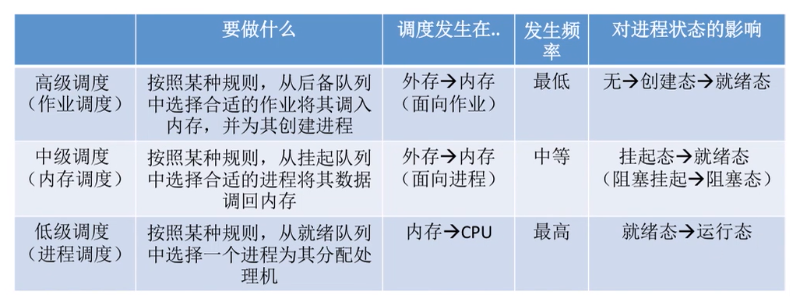


- 进程调度

  - 需要进程调度和切换的情况

    > 当前运行的进程主动放弃处理机：进程正常终止、发生异常终止、进程主动请求阻塞（如等待IO）
    >
    > 当前运行的进程被动放弃处理机：分给进程的时间片用完了、又更紧急的事情（如IO中断）、又更优先级的进程进入就绪队列

  - 不能进行进程调度和切换的情况

    > 在处理中断过程中。
    >
    > 进程在操作系统内核程序临界区中。比如访问就绪队列前需要上锁，如果在解锁之前被切换了，那么别的进程就不能访问就绪队列了。访问内核的东西不能进行进程调度，访问普通临界区可以进行进程调度。
    >
    > 在进行原子操作过程中(原语)，不能中断。

  - 临界资源：一段时间只允许一个进程访问的资源。 

  - 临界区：访问临界资源的那段代码。

  - 内核程序临界区：用来访问某种内核数据结构。比如就绪队列。 

- 进程调度的方式

  - 非剥夺式抢占：只允许进程主动放弃处理器。实现简单，系统开销小，但是不能及时处理紧急任务。
  - 剥夺式抢占：允许进程被动放弃处理器。可以优先处理更紧急的进程，也可以实现让各个进程按时间片轮流执行。适用于分时操作系统、实时操作系统。

- 进程切换的过程：保存原来运行进程的数据、对新的进程进行数据恢复。

  注：进程切换是有代价的，频繁的进程调度、切换，必然会使得系统的效率降低。

- 进程调度算法的评价指标

  - CPU利用率 ：忙碌的时间/总时间
  - 系统吞吐量：总共完成了多少道作业/总时间
  - 周转时间：作业完成时间-作业提交时间。平均周转时间：各作业周转时间之和/作业数。带权周转时间：作业周转时间/作业实际运行时间。平均带权周转时间：各作业带权周转之和/作业数。
  - 等待时间：进程等待处理机时间之和。
  - 响应时间：用户提交请求到首次产生相应所用的时间。

- 调度算法

  先到先服务、短作业优先、高响应比优先

  时间片轮转、优先级调度算法、多级反馈队列

  饥饿：进程长期得不到服务。

  - 先来先服务

    - 公平。先到先得。等的越久越先被服务。
    - 作业/进程先到达后备队列/就绪队列，先服务。
    - 非抢占式。
    - 优点：公平、简单。
    - 缺点：对长作业有利，对短作业不利。不会导致饥饿。

  - 短作业优先

    - 追求最少的平均等待时间、平均周转时间、平均带权周转时间。最短的作业/进程优先得到服务。 
    - 非抢占式SJF、SPF
    - 抢占式SRTN（最短剩余时间优先算法  ）
    - 对短作业有利，对长作业不利。可能会导致饥饿现象。

  - 高响应比优先

    - 平衡作业/进程的等待时间和要求服务的时间。
    - 每次调度时先计算各个作业/进程的相应比，选择相应比最高的作业/进程。
    - 响应比=（等待时间+要求服务时间）/要求服务时间。
    - 非抢占式的 
    - 不会导致饥饿问题。 

  - 时间片轮算法

    - 公平、轮流地为各个进程服务，让每个进程在一定时间间隔内都能得到响应。
    - 让进程轮流执行一个时间片，若进程未执行完，则剥夺处理机，将进程重新放到就绪队列队尾重新排队。
    - 适用于进程调度。
    - 抢占，由时钟中断实现。
    - 用于分时操作系统，更关心响应时间。
    - 时间片太大会增加响应时间。时间片太小会导致进程切换过于频繁。一般来说，设计时间片时要让切换进程的开销占比不超过1%
    - 优点：公平、响应快、适用于分时操作系统。
    - 缺点：高频率切换进程会增加系统开销，不区分任务的紧急程度。

  - 优先级调度算法

    - 设置优先级，调度时选择优先级最高的作业/进程

    - 抢占式、非抢占式

    - 静态优先级：创建进程时确定，优先级不变。动态优先级：创建进程时有一个初始值，之后根据情况动态的调整。 系统进程优先级高于用户进程；前台进程高于后台进程；操作系统更偏好I/O行进程。与I/O型进程相对的是计算型进程（CPU繁忙型进程）。 

      设置优先级的考虑角度：从追求公平、提升资源利用率的角度。

    - 适合实时操作系统，有可能会导致饥饿。

  - 多级反馈队列

    - 对其他调度算法的平衡。
    - 规则：1）设置多级就绪队列，各优先级从高到低，时间片从小到大。2）新进程到达时，先进入第1级队列（优先级最高），按先到先服务的方式分配时间片，若用完时间片还未结束，进入下一级队列的队尾。3）只有k级为空，才会为k+1级分配时间片。4）新进程来了，放入第1级，被强占的进程放入原队列的队尾。5）如果是最后一级的某个进程运行完了，那么这个进程只能放在这个队列的队尾。
    - 用于进程调度
    - 抢占式
    - 优点：对进程相对公平（FCFS）；每个新到达的进程都可以很快得到响应（RR）；段进程只用较少的事件就可以得到响应（SPF）;不必实现估计进程的运行事件（避免用户造假）；可灵活地调整对各类进程的偏好程度，比如CPU密集型、I/O密集型进程（扩展：可以将因I/O而阻塞的进程唤醒后重新放回原队列，这样I/O型进程可以保持较高优先级）
    - 有可能会导致饥饿
    - 适合交互式系统

## 2.3进程的同步和互斥

- 进程同步。直接制约关系

  > 进程同步也称直接制约关系。对进程保持一定的次序，比如说必须保持 写数据-->读数据 这样的顺序。

- 进程互斥。间接制约关系。

  > 两种资源共享方式：互斥共享、同时共享方式。
  >
  > 临界资源：一个时间段内只允许一个进程使用的资源，对临界资源的访问需要互斥的进行。

- 对临界资源的互斥访问，可以在逻辑上分为如下四部分。

```cpp
do{
    entry section;//进入区，加锁操作
    critical section;//临界区，访问临界资源的代码
    exit section;//退出区，解锁操作
    remainder section;//做其他处理
}while(true)
/*
遵循的原则：
1）空闲让进。临界区空闲时，允许一个请求进入临界区。
2）忙则等待。当已有进程进入临界区时，其他试图进入的进程必须等待。
3）有限等待。对请求访问的进程，应保证能在有限时间内进入临界区（保证不会发生饥饿）。
4）让权等待。当进程不能进入临界区时，应立即释放处理机，防止进程忙等待。	
*/
```

### 2.3.1进程互斥的软件实现方法

单标志发（一个进程控制其他进程访问临界区）、双标志先检查法（先检查后上锁）、双标志后检查法（先上锁后检查）、peterson法（先上锁，再让梨，最后检查，检查的目的检查是否是自己最后礼让的）

- 单标志法：两个进程在访问临界区后会把使用临界区的权限转交给另一个进程。也就是说每个进程进入临界区的权限只能被另一个进程赋予。

```cpp
int trun=0;//turn表示当前允许进入临界区的进程号
```

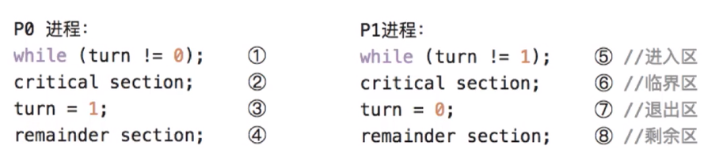

可以实现互斥，但是违背了空闲让进的原则。

- 双标志先检查法：设置一个布尔型数据，每个进程在进入临界区之前先检查当前有没有别的进程想进入临界区，如果没有，则把自身对应的标志flag[i]设为true，之后开始访问临界区。

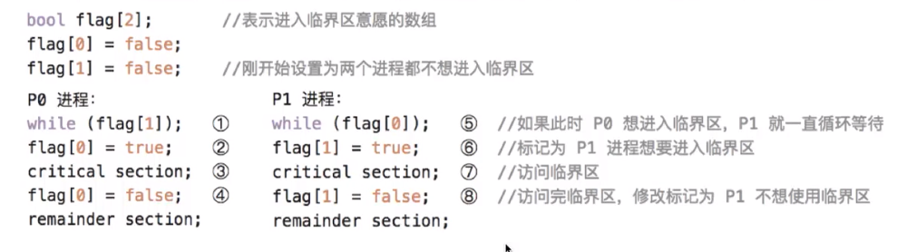

如果进程切换的话会出现问题。比如说P0检查到P1不想进入临界区，也就是flag[1]=false，然后P0进入了临界区，此时发生了进程切换，P1进程也检查到P0进程不想进入临界区，但其实P0是想进入的，由于进程切换，还没有说自己想进入，就被切换出去了，然后P1也进入了临界区。这样违背了忙则等待的原则。

原因在于检查和上锁不是一个原子操作。

- 双标志后检查法：先上锁后检查

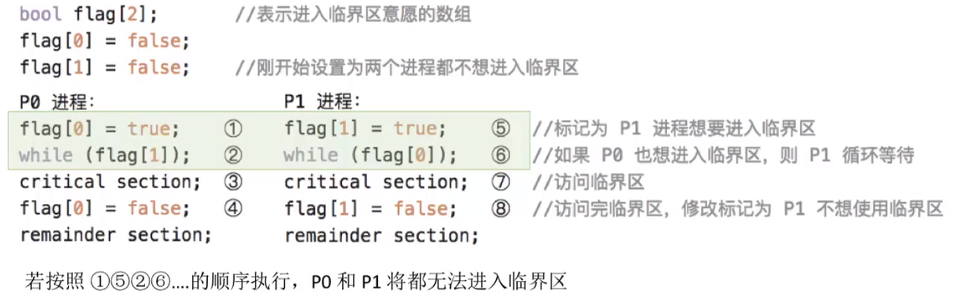

原因在于：上锁和检查不是一个原子操作，导致死锁，违背了空闲让进、有限等待的原则。

- Peterson算法：如果双方都争着想进入临界区，那可以让进程尝试先让出临界区。后执行的让梨。

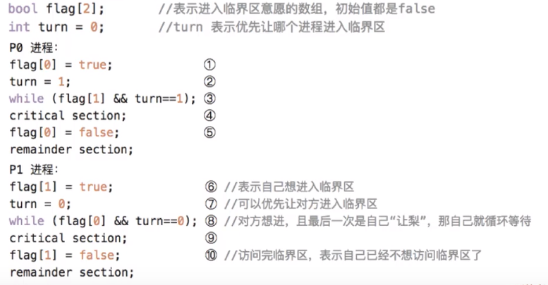

 进入区：1.主动争取；2主动谦让；3.检查对方是否想使用，且最后一次是不是自己说了客气话。

### 2.3.2进程互斥的硬件实现

中断屏蔽发（执行过程中屏蔽中断）、TestAndSet法（上锁、检查之前是否上锁一气呵成）

- 中断屏蔽法：开/关中断指令 

  优点：简单、高效

  缺点：不适合多处理机，开关中断实在处理机上实现的。只适合操作系统内核进程，不适合用户进程。

- TestAndSet法：TS指令，硬件实现的，在执行过程中不允许被中断，只能一气呵成。

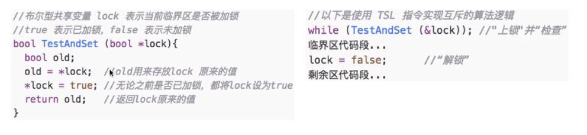

​	对锁进行上锁，并检查

​	false表示未上锁，即临界区未被占用，true表示上锁，即临界区被占用

​	优点：简单，适合多处理器环境。

​	缺点：不允许让权等待的原则，会一直占用处理机

- Swap指令：硬件实现，执行过程中不允许被中断，只能一气呵成。


和TSL指令类似，用变量保存一个之前是否上锁的状态。 

### 2.3.3信号量机制：实现进程同步和进程互斥的问题

#### 1.通过一对原语来对信号量进行操作。

信号量其实就是一个变量（可以是一个整数，也可以是一个更复杂的记录型的变量），可以用一个信号量来表示系统中某种资源的数量。

wait(S)=P(S)、signal(S)=V(S)原语，PV操作，

- 整形信号量

  > 用一个整数型的变量作为信号量，用来表示系统中某种资源的数量。
  >
  > 可以进行的三种操作：初始化、P操作、V操作。

```cpp
void wait(int S){//wait原语，相当于”进入区“
    while(S<=0);//如果资源不够，就一直循环等待
    S=S-1;//如果资源够，则占用一个资源
}
void signal(int S){//signal 原语，相当于”退出区“
    S=S+1;//使用完资源，在退出区释放资源
}
```

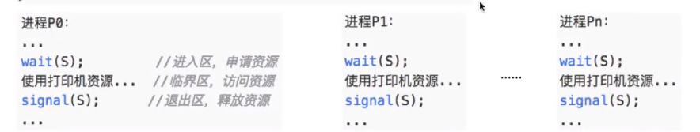

不同于双标志先检查，整型信号量是检查上锁一气呵成的

存在的问题：不满足”让权等待“原则，会发生忙等

- 记录行信号量  

  > 整型信号量的缺陷是忙等问题，因此人们又提出了”记录型信号量“，即用记录型数据结构表示的信号量。

```cpp
/*记录型信号量的定义 */
typedef struct{
    int value;//剩余资源数
    struct process *L;//等待队列
}semaphore;

/*某进程需要使用资源时，通过wait原语申请*/
void wait(semaphore S){
    S.value--;
    if(S.value<0){
        block(S.L);//如果没有资源，阻塞原语
    }
}
void signal(semaphore S){
    S.value++;
    if(S.value<=0)
        wakeup(S.L);//释放资源后，若还有别的进程鞥带这种资源，唤醒等待队列的进程。  
}
```

PV操作中的P操作：申请资源

PV操作中的V操作：释放资源

PV操作都是原子操作。

#### 2.信号量机制实现进程互斥、同步、前驱关系

信号量机制就是对临界资源进行计数。

- 信号量机制实现进程互斥

  1. 划定临界区
  2. 设置互斥信号量mutex，初值为1 ，因为临界区同一时间内只能允许一个进程访问。
  3. 在临界区之前执行P操作，对资源进行申请
  4. 在临界区之后执行V操作，对资源进行释放

- 信号量机制实现进程同步

  进程同步：让各并发进程按要求有序的推进 

  1. 分析什么地方需要实现“同步关系”，必须保证一前一后
  2. 设置同步信号量，初始化为0
  3. 在“前操作”之后执行V(S)
  4. 在“后操作”之前执行P(S)

- 信号量机制实现前驱关系

  多个同步

  1. 每一个前后关系设置一个同步变量
  2. 在前操作之后执行V操作
  3. 在后操作之前执行P操作 

### 2.3.4 生产-消费者模型

#### 单生产者-消费者模型

只有缓冲区没满时，生产者才能把产品放入缓冲区，否则必须等待。缓冲区满时，身缠这要等待消费者取走产品。

只有缓冲区不空，生产者才能取出产品，否则必须等待。缓冲区空时，消费者要等待生产者放入产品。

消费者：占有锁，队列空时，释放锁，等待生产者通知。或者：占有锁、队列不空、消耗队列中的一个元素，释放锁。

生产者：占有锁，添加数据，释放锁，通知消费者。或者：占有锁，队列满时，释放锁，等待消费者通知。

一般情况下，比如线程池，消费者时可以持续的消费的，生产者生产的比较满，所以不需要消费者去通知。

互斥：设置初值为1的信号互斥量

同步：设置初值为0的同步信号量，一前一后

PV操作分析步骤：‘

1. 关系分析。找出题目中描述的各个进程，他们之间的同步、互斥关系。
2. 整理思路。根据各进程的操作流程确定P、V操作的大致顺序。
3. 设置信号量。设置需要的信号量，并根据题目条件确定信号量初值。

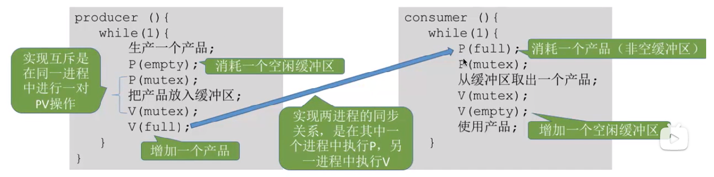

实现互斥的P操作，一定要放在同步P操作之后。 

#### 多生产者-消费者问题

如果缓冲区的大小时1，需要设置一个互斥量互斥的访问临界区。

实现互斥的P操作一定要在实现同步的P操作之后。

### 2.3.5吸烟模型

可以生产多个产品的单生产者。

 假设有三个抽烟者进程和一个供应者进程。抽烟需要三个材料：烟草、纸、胶水。三个抽烟者持有三个材料中的一个，供应者依次将每个抽烟者的另外两种材料放在缓冲区内，对应的抽烟者取走，并抽掉香烟。吸烟者拿走之后发信号，供应者提供另外两种材料。


### 2.3.6读者-写者问题

读写锁

互斥：写进程-写进程、写进程-读  进程

设计一个都进程count计数，第一个读进程加锁，其他的都进程不需要加锁。

要将count视为临界资源，进行加锁。

- 读写锁-读进程优先


- 读写锁-读写公平法


写进程执行P(w)之后会阻塞其他的读进程和写进程。

避免写进程饥饿。 

读写锁思想：用count检查进入的进程是否时第一个/最后一个读进程。

### 2.3.7哲学家进餐问题

 核心：避免临界资源的分配不当导致死锁现象。

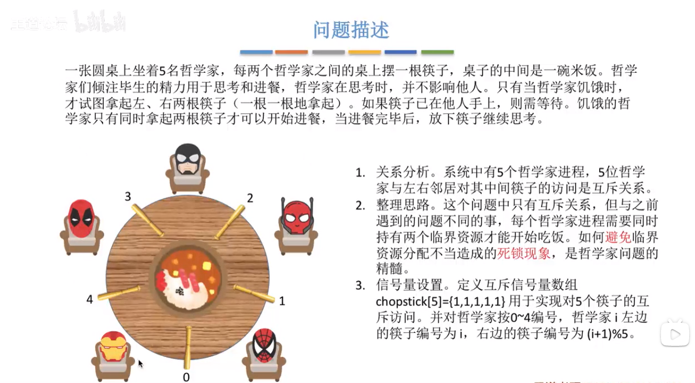

 

避免死锁：

第一种方案：最多允许四个哲学家并发的拿筷子。

第二种方案：奇数号哲学家先拿左边的筷子，然后再拿右边的筷子。右边的哲学家相反。避免一个进程占有一个资源后等待另一个资源 的现象。

第三种方案：每个哲学家拿筷子都是互斥的进行的。

每个进程都需要同时持有两个临界资源，因此就有死锁问题的隐患。


### 2.3.8管程

信号量机制存在的问题：编写程序困难、易出错。

管程：一种高级的同步机制。 

管程是一种特殊的软件模块，有这些部分组成：

1. 局部于管程的共享数据结构说明；
2. 对该数据结构进行操作的一组函数；
3. 对局部于莞城的共享数据设置初始值的语句；
4. 管程有一个名字。

有点类似于类。  

管程的基本特征：

1. 局部于管程的数据智能被管程内的函数访问；
2. 一个进程只有通过管程内的函数才能进入管程访问共享数据；
3. **每次仅允许一个进程在管程内执行某个内部函数。**

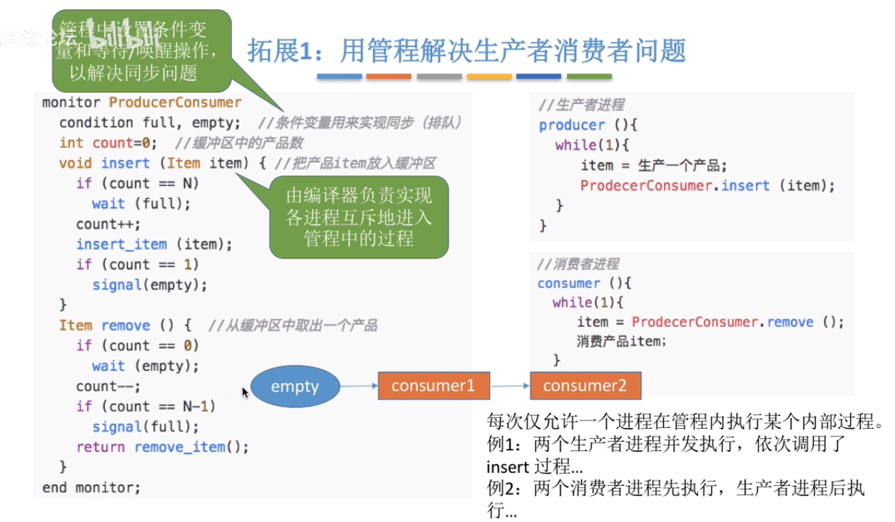

简述管程

**引入管程的目的是更方便地实现进程互斥和同步。关键是各外部进程只能通过管程提供的函数才能访问共享数据；每次仅允许一个进程在管程内执行某个内部过程。**

1. 需要在管程内部定义共享数据，即缓冲区。
2. 需要在管程中定义用于访问这些共享数据的函数。
3. 只有通过这些特定的入口才能访问共享数据。
4. 每次只能开放其中一个入口，只能让一个进程或者线程进入。这种互斥特性是由编译器实现的。
5. 可在管程中设置条件变量及等待/唤醒操作以解决同步问题。可以让一个进程或线程在条件变量上等待（该进程应先释放管程的所有权，也就是让出入口）；可以通过唤醒操作将等待在条件变量上的进程或线程唤醒。

封装思想。

Java中使用关键字synchronized来描述一个函数，那么这个函数同一时间段只能被一个线程调用。

## 2.4 死锁

死锁：各进程争夺资源而导致都**等待对方**的资源，造成进程无法向前推进。

饥饿：长期得不到想要的资源，某进程无法向前推进。

死循环：一直循环。

- 死锁的必要条件
  1. 资源互斥
  2. 不可剥夺。进程所有的的资源再未使用完之前，不能被抢夺资源，只能主动释放。
  3. 请求和保持条件。保持一个资源不放同时请求新的资源。
  4. 循环等待条件：存在一种进程资源的**循环等待链**。链中的每一个进程已获得的资源同时被下一个资源请求。如果每一个资源都是1个，本条件就是充要条件。
- 什么时候会发生死锁：
  1. 对不可剥夺资源的竞争可能会发生死锁。
  2. 请求和释放资源的顺序不当，也同样会导致死锁。P1申请R1->R2，P2申请R2->R1。
  3. 信号量使用不当。实现互斥的P操作在实现同步的P操作之前，有可能会导致死锁。

总之：对不可剥夺资源的不合理分配，可能会导致死锁。

- 死锁的处理粗略、避免死锁：
  1. 预防死锁。破环死锁产生的四个必要条件中的一个或几个。
  2. 避免死锁。用某种方法防止系统进入不安全状态，从而避免死锁。（银行家算法）
  3. 死锁的检测和解除。允许死锁的发生，不过操作系统会负责检查出死锁的发生，然后采取某种措施解除死锁。

### 2.4.1 预防死锁

- 破坏互斥条件

  把只能互斥使用的资源改造为允许共享使用的资源。比如SPOOLing技术将打印机改造为共享设备。类似于设置一个缓冲区，在各进程看来，自己对打印机资源的使用请求立即就被接受处理了，不需要再阻塞等待了。

  但是很多使用不能破坏互斥条件。

- 破坏不剥夺条件

  方案1. 当某个进程请求新的资源得不到满足时，立即释放保持的所有资源。某些资源未使用完，也需要主动释放，从而破坏了不剥夺条件。

  方案2. 当某个进程需要某个资源时，操作系统帮他去抢夺那个资源，需要考虑各进程之间的优先级。比如剥夺调度方式：将处理机强行剥夺给优先级高的进程用。

  缺点：

  1. 实现起来复杂。
  2. 如果进程被剥夺资源了，那么这个进程之前的工作就失效了。
  3. 反复申请释放资源，增加系统开销。 
  4. 如果采用方案1，只要得不到资源，之前申请的资源就需要放弃，如果一直发生这样的情况，会导致进程饥饿。

- 破坏请求和保持条件

  静态分配法：进程在运行前一次性获得他所需要的全部资源。在他的资源未满足前，不让他投入运行。一旦投入运行，这些资源就一直归他所有，该进程就不会再去请求别的任何资源了。

  缺点：有些资源只是使用很短的时间，但是如果进程整个运行期间都保持着所有资源，会导致资源浪费。

- 破坏循环等待条件

  采用顺序资源分配法。首先给资源中的系统编号，规定每个进程必须按编号递增的顺序请求资源，编号相同的资源依次申请完。

  原理分析：一个进程只有占有小编号的资源时，才有资格申请更大的资源。按此规则，已持有大编号资源的进程不可能逆向回来申请小资源的编号，从而不会产生循环等待条件。

  缺点：不方便增加新的设备，因为需要分配新的编号。使用资源的顺序如果和编号顺序不一致，会导致资源浪费。必须按规定的次序申请资源，用户编程麻烦。

 

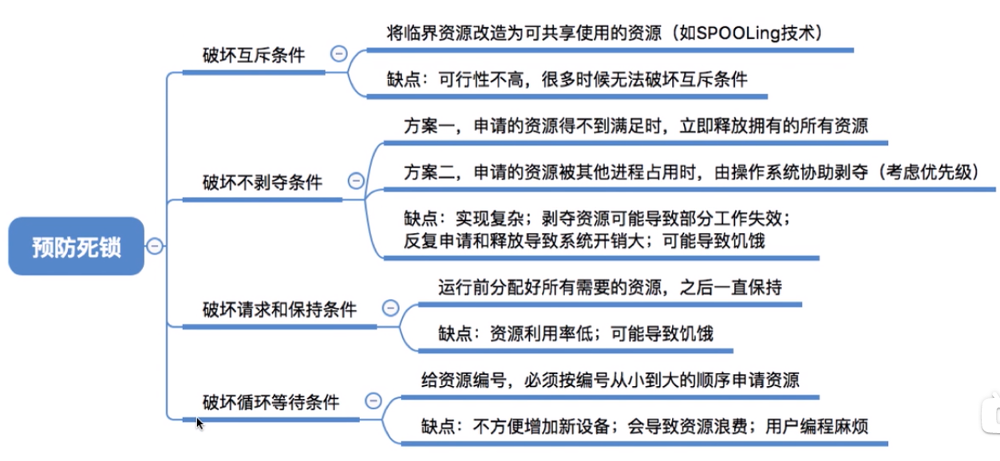

### 2.4.2避免死锁

- 安全序列 

  BAT每个企业约定好最多借多少钱。如果借的钱达不到企业提出的最大要求，那么不管你之前给企业借了多少钱，那些钱都拿不回来了。假设手里有100亿，刚开始BAT各借了20亿、10亿、30亿。

  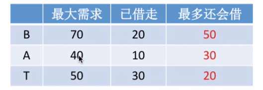

  此时手里还有40亿，如果B还想再借30亿，并且答应的话。


​	只剩下10亿，如果BAT提出再借20亿的请求，任何一个企业都得不到满足。所以不能借给B20亿。因为不安全。

​	如果A还想再借20亿，并且答应的话。

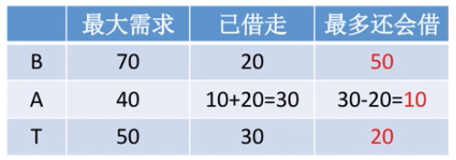

​	手里还有20亿，可以先把20亿全部借给T，等T把钱全部还回来手机就会有20+30=50亿，再把这些钱全借给B，B还钱后共有50+20=70亿，最后再借给A。这样是 安全的。


安全序列：系统按照这种序列分配资源，每个进程都顺利完成，只要能找出来一个安全序列，系统就是安全状态。当然，安全序列可能有多个。 

如果系统处于安全状态，就一定不会发生死锁。如果系统进入不安全状态，就可能会发生死锁。

银行家算法：在系统分配资源之前预先判断这次分配是否会导致系统进入不安全状态，依次决定是否答应资源的分配请求。

将单维的数字拓展为多维的向量。比如说：系统有5个进程P0~P4，3种资源R0~R2，初始数量为（10，5，7），则某一个时刻的情况可表示如下：


银行家算法步骤：

1. 检查此次申请是否超过了之前声明的最大需求数。
2. 检查此时系统升序的可用资源是否还能满足此次请求。
3. 试探着分配，更改各数据结构。
4. 用安全算法检查此次分配是否会导致系统进入不安全状态。 

安全性算法步骤：检查当前的剩余可用资源数是否能满足某个进程的最大需求，如果可以，九八该进程加入安全序列，并把该进程持有的资源全部回收。

不断重复上述过程，看最终是否能让所有进程都加入安全序列。

### 2.4.3死锁的检测和解除

- 死锁的检测：依次消除与不阻塞进程相连的边，知道无边可消。

  为了能对系统是否已发生了死锁进程检测，必须：

  1. 用某种数据结构来保存资源的请求和分配信息。
  2. 提供一种算法，利用上述信息来检测系统是否进入死锁状态。

  数据结构：两个节点（进程节点、资源节点）、两种边（进程节点->资源节点(申请资源)，资源节点->进程节点(分配资源)）。如下如

  

  - 思想：

    可以消除资源请求和分配信息的所有边，就是没有发生死锁，相当于能找到一个安全序列。

    如果不能消除所有边，就是发生了死锁。连着这些边的进程就是死锁进程。

  - 检测死锁的算法：

    - 找到即不阻塞也不是孤点的进行Pi，消去他所有的请求边和分配边，使之成为孤立的节点。
    - 进程Pi释放的资源，可以唤醒其他进程。经过简化后，可以消去全部的边，则称该图是可以简化的。

    死锁定理：如果某时刻系统的资源分配图是不可以简化的，那么此时系统死锁。 

- 解除死锁

  一旦检测出死锁的发生，就应该立即解除死锁。

  简化后还连着的边就是死锁进程。

  - 解除死锁的主要方法
    - 资源剥夺法：挂起（暂存到外存上）某些死锁进程，并抢占他的资源。将这些资源分配给其他的死锁进程。但是应该防止被挂起的进程长时间得不到资源而饥饿。
    - 撤销进程法（终止进程法）：强制撤销部分、甚至全部死锁进程，并剥夺其资源。优点是实现简单，但是代价太大。
    - 进程回退法：让一个或多个死锁进程回退到足以避免死锁的地步。这就要求系统要记录进程信息，设置还原点。
  - 让哪个进程牺牲
    -  进程优先级低的
    - 已执行时间短的
    - 剩余执行时间长的
    - 使用资源多的
    - 牺牲批处理式的，而不是交互式的（不要让用户不爽）

## 2.5内存


